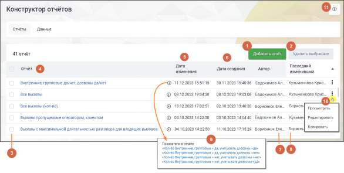
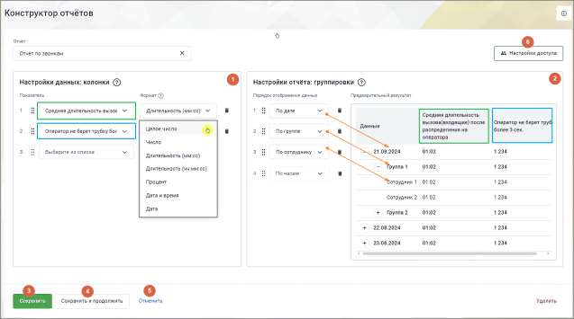
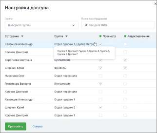
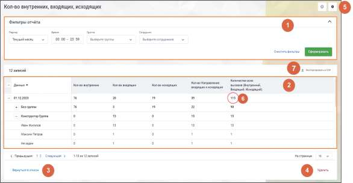
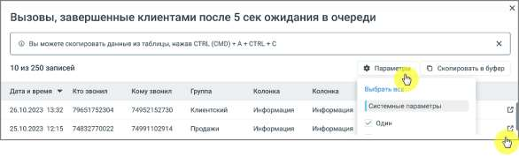

# 17.2. Отчеты

> Трассировка: PDF §17.2 · сквозные стр. 518-523 · источники: ч.1 `kb/sources/mango-cc-manual/CC_manual_1.26.28.1.pdf` с.518-523.

После успешной авторизации пользователь попадает в раздел "Отчеты". Страница содержит список всех доступных отчетов, с возможностью их просмотра, редактирования или удаления. Также на странице доступно создание новых отчетов.

| Разрешения, применяемые при работе c "Конструктором отчетов" находятся в разделе ЛК |  |  |
| --- | --- | --- |
|  | ВАТС Безопасность и Ограничения → Настройки доступа → (выбрать роль) → Инструменты |  |
| → Отчеты Контакт-Центра. |  |  |

Список отчетов представлен в виде таблицы. Каждая строка таблицы соответствует конкретному отчету и содержит название отчета, даты его создания и изменения. 1) Добавить отчёт – клик по кнопке открывает форму создания отчета

2) Удалить выбранное – клик по кнопке открывает окно подтверждения удаления. После подтверждения выбранные отчеты удаляются из списка. 3) Выбор отчетов для удаления – общий чекбокс позволяет выбрать все отчеты, а чекбоксы в каждой строке позволяют выбрать конкретные отчеты для действий. 4) Название отчета – клик по названию открывает страницу отчета для просмотра. 5) Дата изменения отчета – дата и время последнего изменения данного отчета в формате ДД.ММ.ГГГГ ЧЧ.ММ.СС. 6) Дата создания отчета – дата и время создания данного отчета в формате ДД.ММ.ГГГГ ЧЧ.ММ.СС. 7) Автор – в этой колонке отображается имя пользователя или сотрудника, который создал данный отчет. Это позволяет легко определить, кто был инициатором создания конкретного документа. Данное поле является статическим и не подлежит изменению, так как фиксирует исходную информацию о создателе отчета. 8) Последний изменивший – имя пользователя или сотрудника, который последним вносил изменения в отчет. Это полезно для отслеживания ответственности за последние обновления документа, особенно в случае совместной работы над отчетами. Поле обновляется автоматически при каждом редактировании отчета и фиксирует автора последнего изменения. 9) Пиктограмма "i" – клик по пиктограмме открывает окно с показателями отчета. Клик по показателю открывает страницу редактирования показателя.

10) Клик по пиктограмме открывает контекстное меню действий с отчетом. • Вариант "Редактировать" отображается только для тех сотрудников, у которых есть права на редактирование данного отчета. • Вариант "Копировать" отображается только для тех сотрудников, у которых есть права на создание отчетов. 11) Клик по пиктограмме открывает справочную информацию о разделе. В Конструкторе отчетов имеются следующие предустановленные отчеты: Отчеты, доступные для пользователей, зарегистрированных до 1.01.2025 года

| Название отчёта | Показатель 1 | Показатель 2 | Показатель 3 | Группировка |
| --- | --- | --- | --- | --- |
| Отчёт №1 | Уровень | Количество | Средняя | По группе, |
|  | обслуживания SL | входящих | продолжительность | сотруднику, дате |
|  | 20 | вызовов с SL 20 | разговора с клиентом |  |
|  |  |  | (все вызовы) |  |
| Отчёт №2 | Общее | Количество | Количество | По дате, |
|  | количество | успешных | принятых | сотруднику |
|  | принятых | исходящих | персональных |  |
|  | эффективных | вызовов | вызовов |  |
|  | вызовов |  |  |  |

Отчеты, доступные для пользователей, зарегистрированных после 1.01.2025 года Для всех пользователей, подключивших Конструкторе отчетов после 1 января 2005 года, при первом входе в Личный кабинет Конструктора создается отчет по всем показателям из списка "Показатели, доступные для пользователей, зарегистрированных после 1.01.2025 года" 17.2.1. Добавление отчета

На странице "Отчеты" Конструктора отчетов нажмите кнопку Добавить отчет.

На открывшейся странице заполните поля: 1) Блок "Настройка данных: колонки" • Показатель – выбор показателя, который будет использоваться для отображения данных в отчёте. В выпадающем списке доступна функция поиска показателя по наименованию. • Формат – способ представления данных, определяющий их визуальное отображение. Варианты: целое число, число, длительность (мм:сс), длительность (чч:мм:сс), процент, дата и время, дата. Менять местами элементы внутри блоков можно, зафиксировав указатель мыши на

пиктограмме и переместив элемент вверх или вниз по списку. 2) Блок "Настройка отчета: группировки" • Порядок отображения данных – определение последовательности расположения данных в отчёте. Варианты: по дате, по группе, по сотруднику, по часам.

| Для отображения "по сотруднику" доступен выбор "не задан". Сюда попадают вызовы, с |  |  |
| --- | --- | --- |
|  | которых не было распределения на сотрудника. Например: вызовы завершенные в IVR, вызовы |  |
|  | распределенные на группу без сотрудников, или если в группе не было сотрудников в статусе, в |  |
| котором распределяются звонки |  |  |

• Предварительный результат – предварительный просмотр того, как в отчете будут отображаться колонки и группировки. 3) Кнопка "Сохранить" – клик по кнопке сохраняет внесённые изменения. Пользователь переходит на страницу списка отчетов. Созданный отчет отображается в списке. 4) Кнопка "Сохранить и продолжить" – клик по кнопке сохраняет внесённые изменения. Пользователь переходит на страницу созданного отчета. 5) Кнопка "Отменить" – клик по кнопке отменяет внесённые изменения. Пользователь переходит на страницу списка отчетов.

6) Кнопка "Настройки доступа" – клик по кнопке открывает окно настроек доступа сотрудников к отчету: просмотра и редактирования.

| Кнопка "Настройки доступа" отображается на странице редактирования отчета только для |
| --- |
| сотрудников, для которых в ЛК ВАТС включено право "Настройка прав видимости отчетов". |

Настройка доступа сотрудников к отчетам Функция "Настройка доступа" позволяет сотрудникам с определенными правами управлять видимостью и правами на редактирование отчетов для других сотрудников. Эта настройка доступна только для отчетов, созданных пользователями, и недоступна для предустановленных отчетов, которые видны всем сотрудникам по умолчанию. 1. Права доступа к отчетам Для каждого сотрудника можно настроить следующие права: • Просмотр — позволяет сотруднику видеть отчет. • Редактирование — позволяет сотруднику редактировать, удалять и копировать отчет. При настройке прав действуют следующие правила: • Если назначено право на редактирование, право на просмотр устанавливается автоматически. • При снятии права на просмотр автоматически отменяется право на редактирование (если оно было установлено). • Без доступа — сотрудник не имеет доступа к отчету (если не выбрано ни одно из прав). 2. Мультивыбор и массовое предоставление прав • Мультивыбор позволяет выбрать сразу несколько сотрудников для назначения одинаковых прав на просмотр или редактирование отчетов. Чтобы предоставить права всем сотрудникам в списке, нажмите на чек-бокс в заголовке списка. 3. Фильтрация сотрудников Для удобства выбора сотрудников можно использовать фильтры: • По группам — выберите одну или несколько групп сотрудников из выпадающего списка. o По умолчанию отображаются все сотрудники. o Сотрудники без группы отображаются в разделе "Без группы". • По ФИО — введите имя или его часть в поисковую строку. Поиск не зависит от регистра и работает по любой части имени. Список сотрудников отображается по алфавиту по умолчанию. 4. Сохранение настроек доступа После изменения настроек доступа доступны две опции:

• Применить — настройки применяются к отчету, но для их окончательного сохранения необходимо сохранить отчет. • Отменить — если вы решите не применять изменения, нажмите "Отмена".

| После нажатия "Применить" необходимо сохранить изменения в самом отчете, чтобы |
| --- |
| настройки доступа вступили в силу. |

Если вы пытаетесь выйти из редактирования отчета, не сохранив настройки, система предупредит вас о несохраненных изменениях и предложит два варианта: • Отменить переход и вернуться к редактированию, чтобы сохранить настройки. • Подтвердить переход без сохранения изменений, если вы уверены, что хотите их отменить. 17.2.2. Просмотр отчета На вкладке "Отчеты" Конструктора отчетов выберите строку отчета, который необходимо просмотреть, и нажмите на его название или на пиктограмму просмотра "глаз" .

Для каждого отчета пользователям доступна фильтрация. 1) Блок фильтров: • Период – текущий день, вчерашний день, последние два дня, текущая неделя, текущий месяц или произвольный период (продолжительностью до 12 месяцев). • Время – временной отрезок в течение одного дня. • Сотрудники – список всех сотрудников ВАТС в алфавитном порядке. При выборе "не задан" система фильтрует вызовы, в которых не было распределения на сотрудника. При выборе сотрудника в фильтре в отчет попадут только персональные звонки сотрудника и групповые плечи, распределенные на него. • Группы – список всех групп сотрудников в алфавитном порядке, а также вариант "без группы". При выборе группы в отчет попадут только групповые звонки, распределенные на указанную группу и не будет персональных звонков. Также блок фильтров содержит кнопки: • "Очистить фильтр" – по клику по кнопке происходит сброс всех выбранных фильтров, возврат к изначальным параметрам отчёта.

• "Сформировать отчет" – клик по кнопке запускает процесс создания отчёта на основе выбранных параметров фильтрации, формируя и отображая результат. 2) Блок таблицы: Колонки таблицы состоят из заданных пользователем показателей. Строки таблицы зависят от заданной пользователем группировки. 3) Кнопка "Вернуться в список" – клик по кнопке возвращает пользователя на страницу списка отчетов. 4) Кнопка "Удалить" – клик по кнопке удаляет отчет (с подтверждением удаления) и возвращает пользователя на страницу списка отчетов.

5) Пиктограмма – клик по пиктограмме открывает отчет в режиме редактирования. 6) Значение показателя отчета – при нажатии на значение открывается детализация по показателю. Детализация доступна при нажатии на любой количественный показатель в отчете, отличный от нуля. В детализации отображаются: • Системные или пользовательские параметры отчета. Выбор отображаемых параметров доступен по нажатию на кнопку "Параметры" в окне детализации.

• Пиктограмма Клик по пиктограмме открывает модуль "Контроль качества" MANGO OFFICE. Здесь можно посмотреть детальную информацию по вызовам, попадающим в отчет Конструктора отчетов, прослушать их, поставить оценку, провести полноценную аналитику по вызовам и использовать ее в работе. Для работы этой функциональности в ЛК ВАТС должен быть подключен модуль "Контроль качества". Функциональность доступна только для успешных вызовов, которые имеются в модуле "Контроль качества".

• 7) Пользователь может скачать собранный отчет кликом на кнопку "Экспортировать в CSV". Название файла соответствует названию отчета плюс заданные в фильтрах даты отчета. Например "Отчет по пропущенным 12.01.-15.01".
