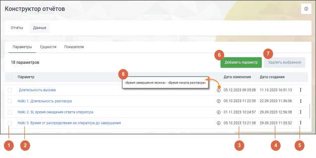
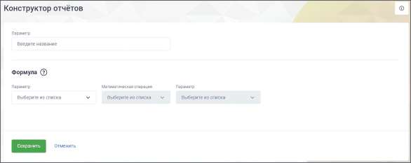
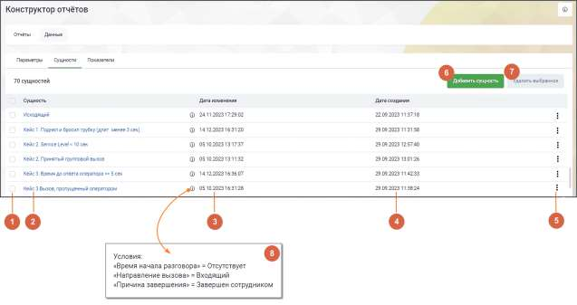
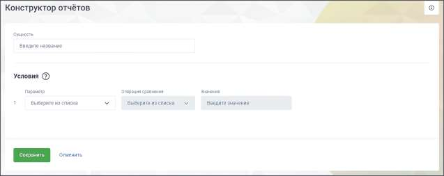
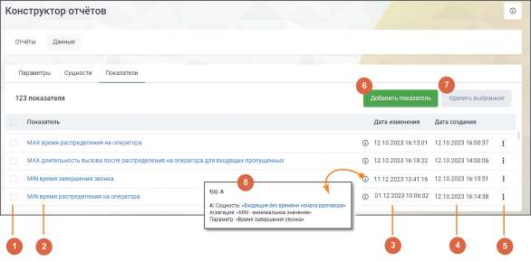
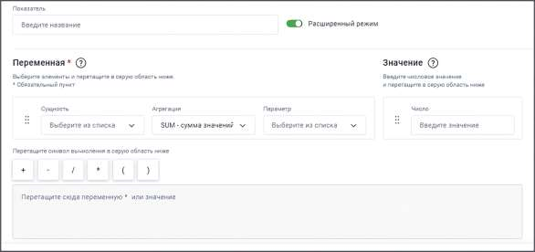
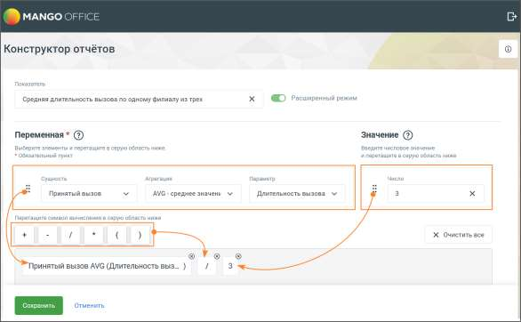

# 17.3. Данные

> Трассировка: PDF §17.3 · сквозные стр. 523-547 · источники: ч.1 `kb/sources/mango-cc-manual/CC_manual_1.26.28.1.pdf` с.523-547.

В Конструкторе отчетов используются следующие данные: параметры, сущности и показатели. Они представляют собой информацию о характеристиках, значениях и описаниях, звонков и используются для анализа и создания отчетов. Эти данные являются основой для настройки статистической отчетности по звонкам, позволяя строить аналитику и отслеживать различные аспекты работы сотрудников компании. Для всех данных в таблицах доступна функция сортировки, в зависимости от типа данных – по дате, по алфавиту.

17.3.1. Параметры Параметр – это настраиваемые характеристики вызова. Можно выбирать различные признаки вызова, собственные настройки времени и продолжительности. Параметры делятся на пользовательские и системные. В подразделе "Параметры" находится список пользовательских параметров, среди которых можно выбирать нужные для создания индивидуальных отчетов. 17.3.1.1. Системные параметры Системные параметры – параметры, заданные в системе по умолчанию. Системные параметры недоступны для редактирования. На основе системных параметров создаются пользовательские параметры и сущности. Список системных параметров: • Время завершения звонка – время, когда вызов был завершен, абонентом или последним оператором распределения звонка. • Время начала разговора – время, когда начался разговор между абонентом и первым оператором распределения звонка. • Время первого распределения звонка на группу – время, когда вызов впервые был направлен к группе операторов. • Время попадания вызова в IVR – время, когда вызов попадает в IVR. • Время поствызывной обработки – время, нахождения сотрудника в поствызывной обработке. Данные отображаются только при настроенной поствызывной обработке. • Время распределения на оператора – время, когда вызов был направлен к определенному оператору. • Количество групп, участвовавших в вызове – общее количество групп, через которые проходил вызов. • Количество попыток распределения – число попыток направления вызова к операторам или группам. • Направление вызова – информация о типе вызова (входящий, исходящий, внутренний). • Признак анонимной конференции – конференции, собранные в Контакт-центре в Mango Talker или любом софтфоне посредством DTMF. • Признак группового вызова – индикатор группового вызова, который обозначает, что вызов адресован нескольким адресатам. • Причина завершения – кем завершен вызов: сотрудником или клиентом. • Тип вызова – категория вызова (автоперезвон, обратный звонок, исходящий обзвон, обычный). • Тип перевода – тип переадресации вызова: слепой, консультативный. • Учитывать дозвоны на операторов – способ подсчета вызовов с учетом или без учета всех попыток дозвона до операторов.

• Длительность на удержании – общее время удержания (hold) в разговоре, в секундах. Если оператор несколько раз поставил на удержание в течение одного разговора, длительность будет общая. Параметр показывает в каком количестве вызовов операторы держат клиента на удержании дольше, чем допустимо по бизнес-процессам компании. • Время создания вызова – время, когда сотрудник инициировал звонок, нажав кнопку "позвонить". • Признак наличия разговора в рамках вызова – указывает, был ли разговор между абонентом и оператором в рамках конкретного вызова. Определяет, состоялся ли фактический диалог или вызов завершился до его начала. Варианты значения: Да, Нет. • Признак наличия разговора в рамках группы – указывает, произошел ли разговор между абонентом и одним из операторов, входящих в группу, на которую был направлен вызов. Варианты значения: Да, Нет. • Время начала дозвона – время, когда начались гудки дозвона.

| Пример использования: |
| --- |
| Можно использовать в конфигурации: Время начала разговора – нет, Учитывать дозвоны до |
| операторов – да. |
| o Принят компанией – Да: отображаются в том числе пропущенные вызовы по |
| сотрудникам, но принятые любым другим сотрудником ВАТС компании. |
| o Принят группой – Нет: отображаются вызовы, которые не принял сотрудник и не |
| принял иной сотрудник ВАТС компании, в которой состоит сотрудник. |

• Постзвонковая оценка — системный параметр, отражающий оценки клиентов после завершения звонков, с поддержкой операций сравнения и агрегации для аналитики качества обслуживания. 17.3.1.2. Пользовательские параметры Пользовательские параметры – это параметры, созданные пользователем для решения конкретных задач.

Элементы вкладки: 1) Выбор параметров для проведения операции удаления – общий чекбокс позволяет выбрать все параметры, а чекбоксы в каждой строке позволяют выбрать конкретные параметры для действий. 2) Название параметра – уникальное название параметра, которое идентифицирует или описывает его содержание. 3) Дата изменения параметра – дата и время последнего изменения данного параметра. 4) Дата создания параметра – дата и время создания данного параметра.

5) Клик по пиктограмме открывает контекстное меню действий с параметром. Варианты: копировать, редактировать. 6) Кнопка "Добавить параметр" – клик по кнопке открывает страницу добавления параметра. 7) Удалить выбранное – клик по кнопке открывает окно подтверждения удаления. После подтверждения выбранные параметры удаляются из списка. Параметры, используемые в других разделах, недоступны для удаления. В случае попытки удаления таких параметров выводится информационное сообщение. 8) Пиктограмма "i" – клик по пиктограмме открывает окно с формулой параметра.

| С 2025 года всем новым пользователям доступны обновленные предустановленные |  |
| --- | --- |
|  | параметры. Пользователям, зарегистрированным до 2025 года, доступны прежние |
| параметры. |  |

Параметры, доступные для пользователей, зарегистрированных до 1.01.2025 года

| № | Название параметра | Заложенная формула для расчета |
| --- | --- | --- |
| 1 | SL | «Время начала разговора» – «Время первого распределения звонка на группу» |
| 2 | Длительность разговора | «Время завершения звонка» – «Время начала разговора» |
| 3 | Длительность вызова | «Время завершения звонка» – «Время попадания вызова в IVR» |
| 4 | Длительность ожидания начала разговора | «Время начала разговора» – «Время попадания вызова в IVR» |

Параметры, доступные для пользователей, зарегистрированных после 1.01.2025 года

| № | Название параметра | Заложенная формула для расчета |
| --- | --- | --- |
| 1 | SL | «Время начала разговора» – «Время первого распределения звонка на группу» |
| 2 | Длительность разговора | «Время завершения звонка» – «Время начала разговора» |
| 3 | Скорость ответа оператора | «Время начала разговора» – «Время распределения на оператора» |

Предустановленные параметры могут быть изменены или удалены только пользователями, имеющими в Личном кабинете ВАТС права максимального уровня на выполнение операций "Редактирование" и "Удаление". 17.3.1.3. Создание пользовательского параметра На вкладке "Параметры" раздела "Данные" Конструктора отчетов нажмите кнопку Добавить параметр.

На открывшейся странице заполните поля: • Параметр (Введите название) – название параметра, уникальное в рамках Конструктора. Формула: • Параметр – первый системный параметр, на основании которого будет создан пользовательский параметр. • Математическая операция – варианты: сложение, вычитание, деление, умножение. • Параметр – второй системный параметр, на основании которого будет создан пользовательский параметр. Сохраните внесенные изменения кнопкой Сохранить. Созданный параметр отобразится в списке пользовательских параметров.

| ПРИМЕР |  |  |
| --- | --- | --- |
| Пользовательский параметр "Длительность вызова" настраивается следующим образом: |  |  |
| Параметр 1 | Математическая операция | Параметр 2 |
| Время завершения звонка (системный) | Вычитание | Время начала разговора (системный) |

Доступные комбинации системных параметров при создании пользовательских параметров:

|  |  |
| --- | --- |
| Параметр 1 | Параметр 2 |
| Количество групп, участвовавших в вызове | Количество попыток распределения |
| Количество попыток распределения | Количество групп, участвовавших в вызове |
| Время завершения звонка Время начала дозвона Время начала разговора Время первого распределения звонка на группу Время попадания вызова в IVR Время распределения на оператора Время создания вызова | Время начала дозвона Время начала разговора Время первого распределения звонка на группу Время попадания вызова в IVR Время распределения на оператора Время создания вызова |

Параметр 1 не может быть равен Параметру 2, и наоборот.

17.3.2. Сущности Сущность представляет собой определённый тип вызовов, задаваемый при помощи одного или нескольких параметров. Сущность формируется на основе условия сравнения между параметром и каким-либо значением. • Параметр может быть пользовательским или системным. • Условие устанавливается с помощью операторов сравнения, таких как равно (=), не равно (≠), больше (>), больше или равно (>=), меньше (<) и меньше или равно (<=), и применяется к определенному значению. • Значение может быть числовым или текстовым, в зависимости от характеристики, описываемой параметром. На вкладке размещается список созданных сущностей:

Элементы вкладки: 1) Выбор сущностей для проведения операции удаления – общий чекбокс позволяет выбрать все сущности, а чекбоксы в каждой строке позволяют выбрать конкретные сущности для действий. 2) Название сущности – уникальное название сущности, которое идентифицирует или описывает ее содержание. 3) Дата изменения сущности – дата и время последнего изменения данной сущности. 4) Дата создания сущности – дата и время создания данной сущности.

5) Клик по пиктограмме открывает контекстное меню действий с сущностью. Варианты: копировать, редактировать. 6) Кнопка "Добавить сущность" – клик по кнопке открывает страницу добавления сущности. 7) Удалить выбранное – клик по кнопке открывает окно подтверждения удаления. После подтверждения выбранные сущности удаляются из списка. Сущности, используемые в

других разделах, недоступны для удаления. В случае попытки удаления таких сущностей выводится информационное сообщение. 8) Пиктограмма "i" – клик по пиктограмме открывает окно с условиями сущности.

| С 2025 года всем новым пользователям доступны обновленные предустановленные |
| --- |
| сущности. Пользователям, зарегистрированным до 2025 года, доступны прежние сущности. |

Сущности, доступные для пользователей, зарегистрированных до 1.01.2025 года В Конструкторе отчетов имеются следующие предустановленные сущности:

| № | Сущность | Условия |
| --- | --- | --- |
| 1 | SL 20 секунд | «SL» ≤ 20 сек. |
|  |  | «Направление вызова» = Входящий |
|  |  | «Время начала разговора» = Присутствует |
|  |  | «Признак группового вызова» = Да |
|  |  | «Учитывать дозвоны на операторов» = Нет |
| 2 | Все вызовы | Тип вызова = «Автоперезвон, Обратный звонок, Исходящий |
|  |  | обзвон, Обычный» |
| 3 | Принятый вызов | «Время начала разговора» = Присутствует |
|  |  | «Направление вызова» = Входящий, Исходящий |
| 4 | Принятый групповой вызов | «Время начала разговора» = Присутствует |
|  |  | «Признак группового вызова» = Да |
|  |  | «Направление вызова» = Входящий |
|  |  | «Учитывать дозвоны на операторов» = Нет |
| 5 | Принятый персональный | «Время начала разговора» = Присутствует |
|  | вызов | «Признак группового вызова» = Нет |
|  |  | «Направление вызова» = Входящий |
| 6 | Пропущенный вызов | «Время начала разговора» = Отсутствует |
|  |  | «Направление вызова» = Входящий |
| 7 | Успешный исходящий вызов | «Направление вызова» = Исходящий |
|  |  | «Время начала разговора» = Присутствует |
|  |  | «Тип вызова» ≠ Обратный звонок |
| 8 | Эффективный вызов | «Время начала разговора» = Присутствует |
|  | групповой | «Признак группового вызова» = Да |
|  |  | «Длительность разговора» ≥ 30 сек. |
|  |  | «Учитывать дозвоны на операторов» = Нет |
| 9 | Эффективный вызов | «Время начала разговора» = Присутствует |
|  | персональный | «Признак группового вызова» = Нет |
|  |  | «Длительность разговора» ≥ 30 сек. |

Сущности, доступные для пользователей, зарегистрированных после 1.01.2025 года

| № | Название сущности | Условия |
| --- | --- | --- |
| 1 | Групповые вызовы, пропущенные сотрудником | «Тип вызова» = Обычный «Направление вызова» = Входящий «Признак наличия разговора в рамках вызова» = Да «Время начала разговора» = Отсутствует «Признак группового вызова» = Да «Учитывать дозвоны на операторов» = Да |
| 2 | Групповые вызовы, пропущенные всеми | «Тип вызова» = Обычный «Направление вызова» = Входящий «Признак наличия разговора в рамках вызова» = Нет |

|  |  | «Время начала разговора» = Отсутствует «Признак группового вызова» = Да «Учитывать дозвоны на операторов» = Да |
| --- | --- | --- |
| 3 | Персональные пропущенные вызовы | «Тип вызова» = Обычный «Направление вызова» = Входящий «Признак наличия разговора в рамках вызова» = Нет «Время начала разговора» = Отсутствует «Признак группового вызова» = Нет |
| 4 | Внутренние вызовы | «Направление вызова» = Внутренний |
| 5 | Автоперезвоны принятые | «Тип вызова» = Автоперезвон «Признак наличия разговора в рамках вызова» = Да «Учитывать дозвоны на операторов» = Да «Время начала разговора» = Присутствует |
| 6 | Автоперезвоны принятые (для средней продолжительности) | «Тип вызова» = Автоперезвон «Признак наличия разговора в рамках вызова» = Да «Учитывать дозвоны на операторов» = Да «Длительность разговора» ≠ 0 сек. «Время начала разговора» = Присутствует |
| 7 | Автоперезвоны, пропущенные всеми | «Тип вызова» = Автоперезвон «Учитывать дозвоны на операторов» = Да «Время начала разговора» = Отсутствует «Направление вызова» = Входящий «Признак наличия разговора в рамках вызова» = Нет |
| 8 | Попытки дозвона (автоперезвоны) | «Тип вызова» = Автоперезвон «Признак наличия разговора в рамках вызова» = Да «Учитывать дозвоны на операторов» = Да |
| 9 | Попытки дозвона (Исходящий обзвон + обычные) | «Направление вызова» = Исходящий «Тип вызова» = Исходящий обзвон, Обычный |
| 10 | Принятые групповые эффективные вызовы | «Направление вызова» = Входящий «Тип вызова» = Обычный «Признак группового вызова» = Да «Длительность разговора» ≥ 30 сек. «Время начала разговора» = Присутствует «Учитывать дозвоны на операторов» = Да |
| 11 | Принятые персональные эффективные вызовы | «Направление вызова» = Входящий «Тип вызова» = Обычный «Признак группового вызова» = Нет «Длительность разговора» ≥ 30 сек. «Время начала разговора» = Присутствует |
| 12 | Входящие вызовы с SL 10 сек | «Направление вызова» = Входящий «Признак наличия разговора в рамках вызова» = Да «SL» < 10 сек. «Тип вызова» = Обычный «Признак группового вызова» = Да «Время начала разговора» = Присутствует «Учитывать дозвоны на операторов» = Да |

| 13 | Входящие вызовы с SL 20 сек | «Направление вызова» = Входящий «Признак наличия разговора в рамках вызова» = Да «SL» < 20 сек. «Тип вызова» = Обычный «Признак группового вызова» = Да «Время начала разговора» = Присутствует «Учитывать дозвоны на операторов» = Да |
| --- | --- | --- |
| 14 | Входящие вызовы с SL 30 сек | «Направление вызова» = Входящий «Признак наличия разговора в рамках вызова» = Да «SL» < 30 сек. «Тип вызова» = Обычный «Признак группового вызова» = Да «Время начала разговора» = Присутствует «Учитывать дозвоны на операторов» = Да |
| 15 | Все принятые вызовы | «Направление вызова» = Входящий «Тип вызова» = Автоперезвон, Обратный звонок, Обычный «Признак наличия разговора в рамках вызова» = Да «Учитывать дозвоны на операторов» = Да |
| 16 | Принятые вызовы (обычные) | «Направление вызова» = Входящий «Тип вызова» = Обычный «Признак наличия разговора в рамках вызова» = Да |
| 17 | Принятые вызовы (обычные + автоперезвон + обратный звонок) для средних | «Направление вызова» = Входящий «Признак наличия разговора в рамках вызова» = Да «Тип вызова» = Автоперезвон, Обратный звонок, Обычный «Учитывать дозвоны на операторов» = Да |
| 18 | Принятые групповые вызовы (обычные) | «Направление вызова» = Входящий «Тип вызова» = Обычный «Признак наличия разговора в рамках вызова» = Да «Признак группового вызова» = Да «Учитывать дозвоны на операторов» = Да «Время начала разговора» = Присутствует |
| 19 | Принятые групповые вызовы (обычный) для поствызывной обработки | «Признак наличия разговора в рамках вызова» = Да «Направление вызова» = Входящий «Тип вызова» = Обычный «Признак группового вызова» = Да «Время поствызывной обработки» ≠ 0 сек. |
| 20 | Принятые групповые вызовы (обычный + автоперезвон + обратный звонок) | «Тип вызова» = Автоперезвон, Обратный звонок, Обычный «Признак группового вызова» = Да «Длительность разговора» ≠ 0 сек. «Учитывать дозвоны на операторов» = Да «Признак наличия разговора в рамках вызова» = Да |
| 21 | Принятые групповые вызовы (обычный + обратный + исходящий обзвон) | «Тип вызова» = Обратный звонок, Исходящий обзвон, Обычный «Признак группового вызова» = Да |
| 22 | Обратные звонки принятые | «Тип вызова» = Обратный звонок «Признак наличия разговора в рамках вызова» = Да |

| 23 | Исходящий обзвон для поствызывной обработки | «Тип вызова» = Исходящий обзвон «Время поствызывной обработки» ≠ 0 сек. |
| --- | --- | --- |
| 24 | Состоявшиеся вызовы для поствызывной обработки | «Признак наличия разговора в рамках вызова» = Да «Направление вызова» = Входящий, Исходящий «Тип вызова» = Обратный звонок, Исходящий обзвон, Обычный |
| 25 | Внешние разговоры | «Направление вызова» ≠ Внутренний «Тип вызова» = Обратный звонок, Исходящий обзвон, Обычный «Признак наличия разговора в рамках вызова» = Да «Время начала разговора» = Присутствует |
| 26 | Исходящие вызовы общие | «Направление вызова» = Исходящий «Тип вызова» = Исходящий обзвон, Обычный «Длительность разговора» ≠ 0 сек. |
| 27 | Исходящие вызовы для поствызывной обработки | «Направление вызова» = Исходящий «Тип вызова» = Исходящий обзвон, Обычный «Время поствызывной обработки» ≠ 0 сек. |
| 28 | Совершенные вызовы | «Направление вызова» = Исходящий «Время начала разговора» = Присутствует «Тип вызова» ≠ Автоперезвон, Обратный звонок |

Предустановленные сущности могут быть изменены или удалены только пользователями, имеющими в Личном кабинете ВАТС права максимального уровня на выполнение операций "Редактирование" и "Удаление". 17.3.2.1. Создание сущности На вкладке “Сущности” раздела “Данные” Конструктора отчетов нажмите кнопку Добавить сущность.

На открывшейся странице заполните поля: • Сущность – название сущности, уникальное в рамках Конструктора.

Условия: • Параметр – системный или пользовательский параметр, на основании которого будет создана сущность. • Операция сравнения – варианты: равно, не равно, больше, больше или равно, меньше, меньше или равно. • Значение – числовое или текстовое, в зависимости от параметра. Максимальное числовое значение – 100000, положительное, целое или дробное. Сохраните внесенные изменения кнопкой Сохранить. Созданная сущность отобразится в списке сущностей.

| Пример: Сущность "Эффективный исходящий звонок" может настраиваться следующим образом: |  |  |
| --- | --- | --- |
| Параметр | Операция сравнения | Значение |
| Направление вызова (системный) | = Равно | Исходящий |
| Длительность вызова (пользовательский) | > Больше | 20 сек. |

Доступные комбинации системных параметров, операций сравнения и значений при создании сущностей:

| Параметр | Операция сравнения | Значение |
| --- | --- | --- |
| Время завершения звонка | Равно | Присутствует Отсутствует |
| Время начала разговора | Равно | Присутствует Отсутствует |
| Время первого распределения звонка на группу | Равно | Присутствует Отсутствует |
| Время попадания вызова в IVR | Равно | Присутствует Отсутствует |
| Время создания звонка | Равно | Присутствует Отсутствует |
| Тип вызова | Равно Не равно | (доступен множественный выбор) Автоперезвон Обратный звонок Исходящий обзвон Обычный |
| Количество групп, участвовавших в вызове |  | Числовое значение |

| Параметр | Операция сравнения | Значение |
| --- | --- | --- |
|  | Больше Больше или равно Меньше Меньше или равно |  |
| Количество попыток распределения | Равно Не равно | Числовое значение |
|  | Больше Больше или равно Меньше Меньше или равно |  |
| Время попадания вызова в IVR | Равно | Присутствует Отсутствует |
| Время поствызывной обработки | Равно Не равно Больше Больше или равно Меньше Меньше или равно | Числовое значение |
| Время распределения на оператора | Равно | Присутствует Отсутствует |
| Направление вызова | Равно Не равно | (доступен множественный выбор) Внутренний Входящий Исходящий |
| Признак группового вызова | Равно | Да Нет |
| Признак анонимной конференции | Равно | Да Нет |
| Причина завершения |  |  |

| Параметр |  |  | Операция сравнения | Значение |  |
| --- | --- | --- | --- | --- | --- |
|  |  |  | Не равно | Завершен сотрудником |  |
| Постзвонковая оценка |  |  | Равно Не равно Больше Меньше Больше или равно Меньше или равно | Числовое значение от 1 до 5 (только целые) |  |
| Тип перевода |  |  | Равно Не равно | (доступен множественный выбор) Слепой |  |
|  |  |  |  | Консультативный |  |
|  | При группировке отчета «по сотрудникам» при переводе звонка будет отображаться два |  |  |  |  |
|  |  | вызова — КТО перевел и НА КОГО перевели. При использовании группировок «по группе» |  |  |  |
|  |  | и «по дате», будет отображаться один вызов. При переводе звонка между группами, |  |  |  |
|  | отображение будет аналогично. |  |  |  |  |
| Равно Да Учитывать дозвоны на операторов (способ подсчета вызовов) Нет |  |  |  |  |  |
|  |  |  |  |  |  |
|  | «Учитывать дозвоны на операторов» — означает считать дозвоны до каждого оператора. |  |  |  |  |
|  |  | «Не учитывать» — означает смотреть только дозвон на группу. Рекомендуется |  |  |  |
|  |  | использовать со всеми параметрами, в которых для подсчета нужны данные по дозвону до |  |  |  |
|  | операторов. |  |  |  |  |

17.3.3. Показатели Показатели в Конструкторе отчетов представляют собой сущности, которые проходят обработку (агрегацию) по заданным параметрам. Показатели отображаются в отчетах в виде колонок и предоставляют сводную информацию о различных аспектах данных. Каждая агрегирующая функция имеет свое назначение: • SUM (сумма) – вычисляет общую сумму значений определенного показателя. Например, общая продолжительность всех разговоров за определенный период времени. • AVG (среднее значение) – определяет среднее значение показателя из набора данных. Например, среднее время разговора за день или месяц. • COUNT (количество значений) – подсчитывает количество значений определенного параметра или событий. Например, количество пропущенных вызовов за определенный период.

| Для функции COUNT недоступна возможность выбора параметра, по которому будет |
| --- |
| происходить агрегация. |

• MIN (минимальное значение) – определяет наименьшее значение показателя из набора данных. Например, минимальное время дозвона. • MAX (максимальное значение) – вычисляет наибольшее значение показателя из набора данных. Например, максимальное время разговора. На вкладке размещается список показателей.

Элементы вкладки: 1) Выбор показателей для проведения операции удаления – общий чекбокс позволяет выбрать все показатели, а чекбоксы в каждой строке позволяют выбрать конкретные показатели для действий. 2) Название показателя – уникальное название показателя, которое идентифицирует или описывает его содержание. 3) Дата изменения показателя – дата и время последнего изменения данного показателя. 4) Дата создания показателя – дата и время создания данного показателя.

5) Клик по пиктограмме открывает контекстное меню действий с показателем. Варианты: копировать, редактировать. 6) Кнопка "Добавить показатель" – клик по кнопке открывает страницу добавления показателя. 7) Удалить выбранное – клик по кнопке открывает окно подтверждения удаления. После подтверждения выбранные показатели удаляются из списка. Показатели, используемые в других разделах, недоступны для удаления. В случае попытки удаления таких показателей выводится информационное сообщение. 8) Пиктограмма "i" – клик по пиктограмме открывает окно с формулой показателя. Клик по названию сущности открывает страницу редактирования сущности. В Конструкторе отчетов имеются следующие предустановленные показатели:

Показатели, доступные для пользователей, зарегистрированных до 1.01.2025 года

| Название | Сущность | Агрегац | Параметр | Операци | Сущность | Агрегац | Форму |
| --- | --- | --- | --- | --- | --- | --- | --- |
| показателя | А | ия А | А | я | B | ия B | ла |
|  |  |  |  |  |  |  | итогова |
|  |  |  |  |  |  |  | я |
| Количество входящих вызовов с SL 20 | SL 20 секунд | COUNT – количест во значений |  |  |  |  |  |
| Количество принятых персональных вызовов | Принятый персональн ый вызов | COUNT – количест во значений |  |  |  |  |  |
| Количество успешных исходящих вызовов | Успешный исходящий вызов | COUNT – количест во значений |  |  |  |  |  |
| Общее количество принятых эффективных вызовов | Эффективн ый вызов персональн ый | COUNT – количест во значений |  | + (сложени е) | Эффективн ый вызов групповой | COUNT – количест во значений | A + B |
| Средняя продолжительно сть разговора с клиентом (все вызовы) | Принятый вызов | AVG – среднее значение | Длительнос ть разговора |  |  |  |  |
| Уровень обслуживания SL 20 | SL 20 секунд | COUNT – количест во значений |  | / (деление) | Принятый групповой вызов | COUNT – количест во значений | A / B * 100 |

Показатели, доступные для пользователей, зарегистрированных после 1.01.2025 года

| № | Наименование | Формула расчета | Источник данных |
| --- | --- | --- | --- |
|  | показателя |  |  |
| Общие |  |  |  |
| 1 | Общее количество пропущенных вызовов | A + B + C Сущность: «Групповые вызовы, пропущенные всеми» Агрегация: «COUNT – количество значений» B: Сущность: «Персональные пропущенные вызовы» | История вызовов в разрезе по сотруднику: пропущенные входящие вызовы. (Внутренние вызовы в показателе не учитываются) |

|  |  | Агрегация: «COUNT – количество значений» C: Сущность: «Групповые вызовы, пропущенные сотрудником» Агрегация: «COUNT – количество значений» |  |
| --- | --- | --- | --- |
| 2 | Общее количество принятых вызовов | Сущность: «Принятые вызовы (обычные)» Агрегация: «COUNT – количество значений» | История вызовов в разрезе по сотруднику: принятые входящие вызовы. (Внутренние вызовы в показателе не учитываются) |
| 3 | Общее количество принятых эффективных вызовов | A + B A: Сущность: «Принятые групповые эффективные вызовы» Агрегация: «COUNT – количество значений» B: Сущность: «Принятые персональные эффективные вызовы» Агрегация: «COUNT – количество значений» | История вызовов в разрезе по сотруднику: принятые входящие вызовы длительностью 30 и более секунд (Внутренние вызовы в показателе не учитываются) |
| 4 | Количество пропущенных персональных вызовов | Сущность: «Персональные пропущенные вызовы» Агрегация: «COUNT – количество значений» | История вызовов в разрезе по сотруднику: пропущенные персональные входящие вызовы. (Внутренние вызовы в показателе не учитываются) |
| 5 | Максимальная продолжительность разговора | Сущность: «Все принятые вызовы» Агрегация: «MAX – максимальное значение» Параметр: «Длительность разговора» | История вызовов в разрезе по сотруднику: принятые входящие вызовы. (Внутренние вызовы в показателе не учитываются) |
| 6 | Количество внутренних вызовов | Сущность: «Внутренние вызовы» Агрегация: «COUNT – количество значений» | История вызовов в разрезе по сотруднику: внутренние вызовы. |
| 7 | Средняя продолжительность разговора (Все принятые вызовы) | Сущность: «Принятые вызовы (обычные + автоперезвон + обратный звонок) для средних» Агрегация: «AVG – среднее | История вызовов в разрезе по сотруднику: принятые входящие вызовы. |

|  |  | значение» Параметр: «Длительность разговора» | (Внутренние вызовы в показателе не учитываются) |
| --- | --- | --- | --- |
| 8 | Средняя скорость ответа | Сущность: «Принятые вызовы (обычные + автоперезвон + обратный звонок) для средних» Агрегация: «AVG – среднее значение» Параметр: «Скорость ответа оператора» | История вызовов в разрезе по сотруднику: принятые входящие вызовы (групповые и персональные) |
| Обслуживание вызовов, распределенных из группы |  |  |  |
| 9 | Количество принятых групповых вызовов | Сущность: «Принятые групповые вызовы(обычные)» Агрегация: «COUNT – количество значений» | История вызовов в разрезе по группе: Принятые входящие вызовы. Фильтруется по сотруднику. |
| 10 | Количество пропущенных групповых вызовов | A+B A: Сущность: «Групповые вызовы, пропущенные всеми» Агрегация: «COUNT – количество значений» B: Сущность: «Групповые вызовы, пропущенные сотрудником» Агрегация: «COUNT – количество значений» | История вызовов в разрезе по сотруднику: пропущенные входящие вызовы, только групповые звонки Фильтруется по сотруднику. |
| 11 | Количество принятых автоперезвонов | Сущность: «Автоперезвоны принятые» Агрегация: «COUNT – количество значений» | История вызовов в разрезе по группе: принятые звонки с типом "автоперезвон". Фильтруется по сотруднику. |
| 12 | Средняя продолжительность разговора (групповые вызовы) | Сущность: «Принятые групповые вызовы (обычные + автоперезвон + обратный звонок)» Агрегация: «AVG – среднее значение» Параметр: «Длительность разговора» | История вызовов в разрезе по группе: принятые входящие вызовы. Фильтруется по сотруднику. |
| 13 | Процент обслуженных вызовов | A / (B + C + D) * 100 A: Сущность: «Принятые групповые вызовы(обычные)» Агрегация: «COUNT – количество значений» |  |

|  |  | B: Сущность: «Принятые групповые вызовы(обычные)» Агрегация: «COUNT – количество значений» C: Сущность: «Групповые вызовы, пропущенные всеми» Агрегация: «COUNT – количество значений» D: Сущность: «Групповые вызовы, пропущенные сотрудником» Агрегация: «COUNT – количество значений» |  |
| --- | --- | --- | --- |
| 14 | Процент потерянных групповых вызовов | (A + B) / (C + D + E) * 100 A: Сущность: «Групповые вызовы, пропущенные всеми» Агрегация: «COUNT – количество значений» B: Сущность: «Групповые вызовы, пропущенные сотрудником» Агрегация: «COUNT – количество значений» C: Сущность: «Принятые групповые вызовы(обычные)» Агрегация: «COUNT – количество значений» D: Сущность: «Групповые вызовы, пропущенные всеми» Агрегация: «COUNT – количество значений» E: Сущность: «Групповые вызовы, пропущенные сотрудником» Агрегация: «COUNT – количество значений» |  |
| 15 | Суммарное время принятых групповых вызовов | A + B A: Сущность: «Принятые групповые вызовы(обычный + обратный звонок + ИО)» Агрегация: «SUM – сумма значений» Параметр: «Длительность разговора» | История вызовов в разрезе по группе: суммарное время разговоров по каждому сотруднику, включая входящие и обратные звонки. |

|  |  | B: Сущность: «Автоперезвоны принятые» Агрегация: «SUM – сумма значений» Параметр: «Длительность разговора» |  |
| --- | --- | --- | --- |
| 16 | Количество принятых обратных звонков | Сущность: «Обратные звонки принятые» Агрегация: «COUNT – количество значений» | История вызовов в разрезе по группе с фильтром по сотруднику. Учитываются принятые обратные звонки, выполненные в автоматическом режиме. |
| 17 | Количество входящих вызовов с SL 10сек | Сущность: «Входящие вызовы с SL 10сек» Агрегация: «COUNT – количество значений» | История вызовов в разрезе по сотруднику: принятые входящие звонки |
| 18 | Количество входящих вызовов с SL 20сек | Сущность: «Входящие вызовы с SL 20сек» Агрегация: «COUNT – количество значений» | История вызовов в разрезе по сотруднику: принятые входящие звонки |
| 19 | Количество входящих вызовов с SL 30сек | Сущность: «Входящие вызовы с SL 30сек» Агрегация: «COUNT – количество значений» | История вызовов в разрезе по сотруднику: принятые входящие звонки |
| 20 | Уровень обслуживания SL 10сек | A / B * 100 A: Сущность: «Входящие вызовы с SL 10сек» Агрегация: «COUNT – количество значений» B: Сущность: «Принятые групповые вызовы(обычные)» Агрегация: «COUNT – количество значений» | История вызовов в разрезе по сотруднику: принятые входящие звонки |
| 21 | Уровень обслуживания SL 20сек | A / B * 100 A: Сущность: «Входящие вызовы с SL 20сек» Агрегация: «COUNT – количество значений» B: Сущность: «Принятые групповые вызовы(обычные)» Агрегация: «COUNT – количество значений» | История вызовов в разрезе по сотруднику: принятые входящие звонки |
| 22 | Уровень обслуживания SL 30сек | A / B * 100 A: Сущность: «Входящие вызовы с SL 30сек» | История вызовов в разрезе по сотруднику: принятые входящие звонки |

|  |  | Агрегация: «COUNT – количество значений» B: Сущность: «Принятые групповые вызовы(обычные)» Агрегация: «COUNT – количество значений» |  |
| --- | --- | --- | --- |
| 23 | Среднее время поствызывной обработки (входящие вызовы) | Сущность: «Принятые групповые вызовы (обычные) для поствызывной обработки» Агрегация: «AVG – среднее значение» Параметр: «Время поствызывной обработки» |  |
| Обслуживание вызовов распределенных персонально на сотрудника |  |  |  |
| 24 | Количество принятых персональных вызовов | Сущность: «Принятые персональные вызовы» Агрегация: «COUNT – количество значений» | История вызовов в разрезе по сотруднику, принятые входящие вызовы. История вызовов в разрезе по группе с фильтром по сотруднику, принятые входящие вызовы. |
| 25 | Средняя продолжительность разговора (Персональные вызовы) | Сущность: «Принятые персональные вызовы» Агрегация: «AVG – среднее значение» Параметр: «Длительность разговора» | История вызовов в разрезе по сотруднику, принятые входящие вызовы. (Внутренние вызовы в показателе не учитываются) История вызовов в разрезе по группе с фильтром по сотруднику, принятые входящие вызовы. |
| Совершение исходящих вызовов |  |  |  |
| 26 | Количество совершенных вызовов | Сущность: «Совершенные вызовы» Агрегация: «COUNT – количество значений» | История вызовов в разрезе по сотруднику: исходящие вызовы и исходящий обзвон (за исключением внутренних и несостоявшихся вызовов). |
| 27 | Средняя продолжительность | (A + B) / (C + D) A: Сущность: «Исходящие вызовы общие» | История вызовов в разрезе по сотруднику: исходящие вызовы, |

|  | разговора (Исходящие вызовы) | Агрегация: «SUM – сумма значений» Параметр: «Длительность разговора» B: Сущность: «Автоперезвоны принятые (для средней продолжительности)» Агрегация: «SUM – сумма значений» Параметр: «Длительность разговора» C: Сущность: «Автоперезвоны принятые (для средней продолжительности)» Агрегация: «COUNT – количество значений» D: Сущность: «Исходящие вызовы общие» Агрегация: «COUNT – количество значений» | исходящий обзвон и успешные автоперезвоны |
| --- | --- | --- | --- |
| 28 | Суммарное время совершенных вызовов | A + B A: Сущность: «Исходящие вызовы общие» Агрегация: «SUM – сумма значений» Параметр: «Длительность разговора» B: Сущность: «Автоперезвоны принятые» Агрегация: «SUM – сумма значений» Параметр: «Длительность разговора» | История вызовов в разрезе по сотруднику: исходящие вызовы, исходящий обзвон и успешные автоперезвоны |
| 29 | Количество попыток дозвона | A + B + C A: Сущность: «Попытки дозвона (ИО + обычные)» Агрегация: «COUNT – количество значений» B: Сущность: «Автоперезвоны, пропущенные всеми» Агрегация: «COUNT – количество значений» | История вызовов в разрезе по сотруднику: исходящие вызовы (состоявшиеся и несостоявшиеся), исходящий обзвон (состоявшиеся и несостоявшиеся), автоперезвоны (принятые и пропущенные). |

|  |  | C: Сущность: «Попытки дозвона (автоперезвоны)» Агрегация: «COUNT – количество значений» | (Внутренние вызовы в показателе не учитываются) |
| --- | --- | --- | --- |
| 30 | Среднее время поствызывной обработки (исходящий обзвон) | Сущность: «Исходящий обзвон для поствызывной обработки» Агрегация: «AVG – среднее значение» Параметр: «Время поствызывной обработки» |  |
| 31 | Среднее время поствызывной обработки (исходящие вызовы) | Сущность: «Исходящие вызовы для поствызывной обработки» Агрегация: «AVG – среднее значение» Параметр: «Время поствызывной обработки» |  |
| Использование рабочего времени |  |  |  |
| 32 | Суммарное время внешних разговоров | A + B A: Сущность: «Внешние разговоры» Агрегация: «SUM – сумма значений» Параметр: «Длительность разговора» B: Сущность: «Автоперезвоны принятые» Агрегация: «SUM – сумма значений» Параметр: «Длительность разговора» | История вызовов в разрезе по сотруднику: все внешние разговоры, обратные звонки и исходящий обзвон. |
| 33 | Суммарное время внутренних разговоров | Сущность: «Внутренние вызовы» Агрегация: «SUM – сумма значений» Параметр: «Длительность разговора» | История вызовов в разрезе по сотруднику: все внутренние разговоры |
| 34 | Суммарное время поствызывной обработки вызова | Сущность: «Состоявшиеся вызовы для поствызывной обработки» Агрегация: «SUM – сумма значений» Параметр: «Время поствызывной обработки» | Отчет "Рабочее время сотрудника" |

Предустановленные показатели доступны для изменения или удаления. 17.3.3.1. Создание показателя

На вкладке “Показатели” раздела “Данные” Конструктора отчетов нажмите кнопку Добавить показатель. Добавление показателя доступно в двух режимах: простой и расширенный.

Рис.1 Добавление показателя в простом режиме

Рис.2 Добавление показателя в расширенном режиме На открывшейся странице выберите режим и заполните поля: • Показатель – название показателя, уникальное в рамках Конструктора, не более 126 символов. Переменная: • Сущность – ранее созданная в Конструкторе сущность, на основании которой будет рассчитан показатель. • Агрегация – выбор агрегирующей функции. • Параметр – системный или пользовательский параметр. Значение (только при расширенном режиме): • Число – положительное число, целое или дробное, с которым можно производить математические операции. Максимальное значение 100000. Математические операции: сложение, вычитание, деление, умножение, скобки.

| Для одного показателя может быть задано несколько переменных, чисел и математических |
| --- |
| операций. |

Для создания формулы показателя в расширенном режиме необходимо зафиксировать

указатель мыши на пиктограмме заполненных блоков "переменная" и "число" и переместить их на поле, дополнив их математическими операциями, как показано на рисунке ниже. Перемещение очистит блок переменной и даст возможность формирования новой переменной. Затем новую переменную можно аналогичным образом переместить на поле.

<!-- изображение на стр. 546: байты не извлечены (PyMuPDF недоступен) -->

<!-- изображение на стр. 547: байты не извлечены (PyMuPDF недоступен) -->
