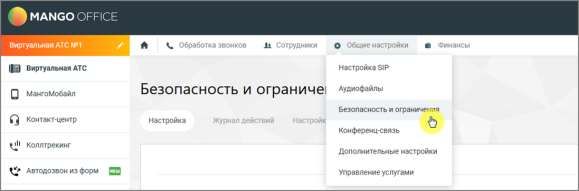
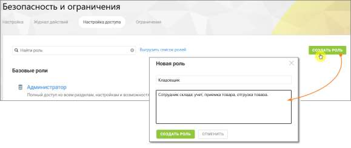
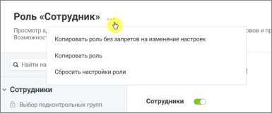

# 18. Приложение 1. Управление правами доступа

> Трассировка: PDF §18 · сквозные стр. 547-548 · источники: ч.1 `kb/sources/mango-cc-manual/CC_manual_1.26.28.1.pdf` с.547-548.

В данном приложении приведено сводное описание параметров доступности, разрешений (прав) и функциональных возможностей Личного кабинета ВАТС MANGO OFFICE в зависимости от выбранной роли, установленных по умолчанию.

| Права доступа для роли в ЛК ВАТС не являются статичными параметрами. Система |
| --- |
| предоставляет возможность пользователю менять (включать и отключать) большинство |
| прав доступа для ролей, в зависимости от потребностей бизнеса. |

1. Управление ролями Управление ролями выполняется в разделе: Настройки АТС → Безопасность и ограничения → Настройка доступа

В этом разделе можно просматривать роли, создавать новые роли, изменять права доступа ролей и удалять пользовательские роли. Роль представляет собой набор прав доступа. Назначение роли пользователю определяет, какие функции системы будут ему доступны.

Создавать роли могут только пользователи, обладающие правом доступа «Создать роль». 2. Создание роли Создание роли позволяет определить новый набор прав доступа для пользователей системы. Создать пользовательскую роль можно с помощью кнопки «Создать роль». Этот способ используется, если требуется создать роль с полностью уникальным набором прав.

| Роль, созданная таким образом, изначально не имеет никаких прав доступа. После |
| --- |
| создания необходимо включить нужные права, чтобы пользователи могли выполнять свои |
| задачи. |

<!-- изображение на стр. 548: байты не извлечены (PyMuPDF недоступен) -->

Чтобы создать роль: • откройте раздел Настройки АТС → Безопасность и ограничения • нажмите кнопку Создать роль • укажите название роли • при необходимости укажите описание роли • настройте права доступа роли • нажмите Сохранить 3. Создание роли путем копирования Новую роль можно создать на основе существующей роли. В этом случае права доступа исходной роли копируются в новую роль.

<!-- изображение на стр. 548: байты не извлечены (PyMuPDF недоступен) -->

Данная строка меню доступна для нажатия если у пользователя активировано право доступа
