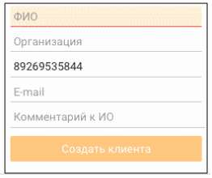
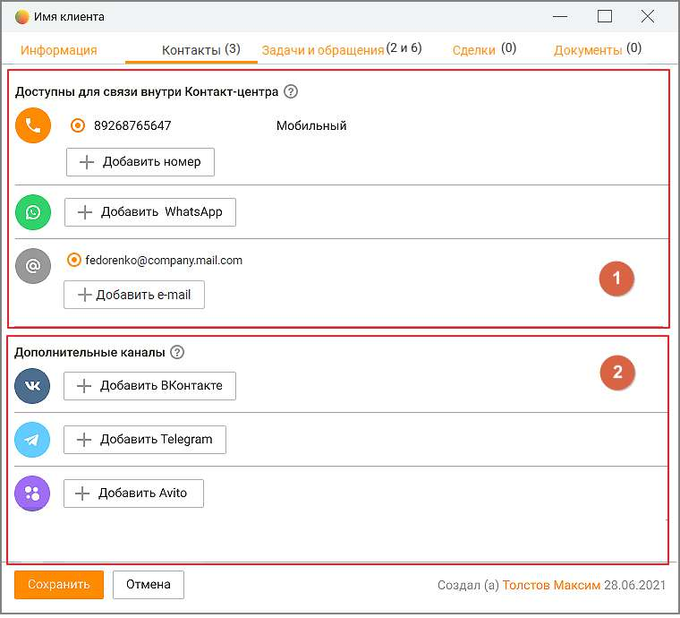
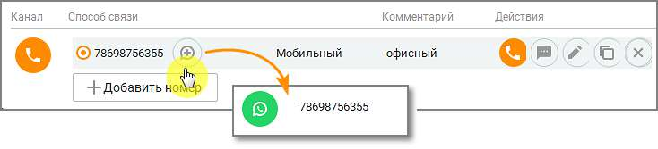
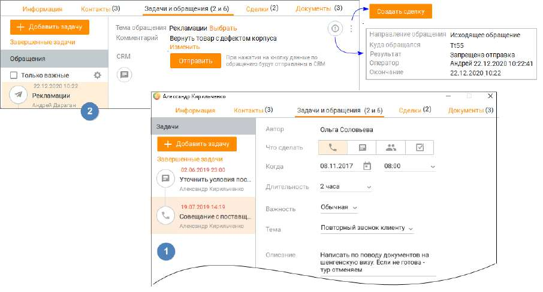
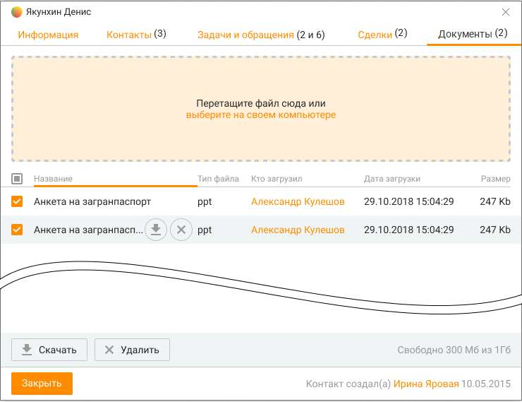

# 10.1.1. Создание и редактирование клиентов

| Пользователь с ролью Сотрудник может только просматривать список клиентов. О |  |  |
| --- | --- | --- |
|  | доступности функций редактирования и удаления контактов см. Приложение 2, подраздел |  |
| "Контакты". |  |  |

Создание клиента Для создания нового клиента на вкладке Контакты нажмите Новый контакт в нижней части панели. После этого на экране отображается окно карточки клиента. Укажите необходимые данные, используя соответствующие элементы интерфейса (их подробное описание приведено далее). После ввода всех контактных данных нажмите Сохранить. Запись сохраняется и отображается в адресной книге. Дата создания указывается автоматически. Если при создании нового клиента в адресной книге уже имеется клиент с таким же телефонным номером, то на экране отображается окно с соответствующим предупреждающим сообщением. При выборе варианта "Да" будет создан новый клиент с этим номером телефона. В уже существующей карточке клиента данный номер телефона будет удален.

Создание клиента из карточки Гостя Клиент со статусом Гость – неидентифицированный клиент, которого нет в адресной книге, и который обращается в первый раз. Или обращается повторно, но не был внесен в адресную книгу при первом обращении. Карточка Гостя содержит поля, аналогичные карточке создания нового контакта. В зависимости от вида обращения – текстовое или звонок – на закладке Контакты в карточке Гостя имеется номер телефона либо адрес, с которого обратился клиент. Номер телефона при этом сохраняется в карточке контакта, как "номер мобильного телефона". Чтобы добавить клиента в адресную книгу, внесите данные в остальные поля карточки Гостя и нажмите кнопку Новый контакт. При этом задачи и обращения (открытые и закрытые) Гостя привязываются к этому контакту.

Поле ФИО является обязательным для заполнения.

Создание клиента из карточки обращения Блок информации о клиенте в разделе Мои обращения содержит элементы:

Заполните свободные поля карточки контакта и щелкните по кнопке "Создать клиента". В адресной книге будет создан новый контакт. История обращений "Гостя" сохраняется в истории обращений создаваемого клиента. В случае, когда обращение получено из социальной сети или мессенджера (Telegram, VK, WhatsApp, Авито, Авито Работа, Max), то аватар и имя аккаунта клиента автоматически заносятся в карточку нового контакта. При звонковом вызове в карточку также заносятся номер телефона и учетных записей SIP. При создания контакта из закрытого обращения к новому контакту привязываются все обращения клиента, поступившие с этого адреса до и после закрытия обращения.

| Также в блоке информации о клиенте содержатся пользовательские поля, помеченные *, как |
| --- |
| обязательные для заполнения |

Как отредактировать карточку клиента Чтобы редактировать карточку клиента, нажмите ссылку с ФИО клиента либо дважды щелкните название организации клиента (если оно указано). После этого на экране отображается окно карточки клиента. В заголовке этого окна указано ФИО клиента. Внесите необходимые изменения в карточку, используя соответствующие элементы интерфейса (их подробное описание приведено далее в подразделе "Подробнее о контактных данных"). Затем нажмите Сохранить. После этого сохраняются внесенные вами изменения. Если при редактировании клиента указывается наименование организации, отсутствующей в списке организаций на вкладке Организация, то автоматически будет создана карточка новой организации. К карточке будет привязан клиент. Если же такая организация уже существует, клиент не привязывается к ней автоматически, и его необходимо привязать вручную.

| Если вы внесли изменения в данные и хотите закрыть карточку клиента, на экране |  |  |
| --- | --- | --- |
|  | отображается окно с соответствующим предупреждающим сообщением. Если в адресной |  |
|  | книге уже имеется клиент с указанным вами при редактировании телефонным номером, то |  |
| на экране отображается окно с соответствующим предупреждающим сообщением. |  |  |

Как удалить клиента Чтобы удалить клиента из Избранного, откройте его карточку и выключите настройку Избранное. Затем нажмите Сохранить. После этого клиент удаляется из личной адресной книги, но остается в общей адресной книге. Чтобы удалить клиента(ов) из общей адресной книги, установите напротив нужного клиента(ов) флаг в соответствующем столбце таблицы и нажмите кнопку Удалить контакты. После этого на экране отображается окно с запросом на подтверждение удаления. После подтверждения производится безвозвратное удаление клиента(ов) из адресной книги. Чтобы удалить все записи, установите флаг в заголовке соответствующего столбца и

нажмите кнопку Удалить контакты. Также в нижней части окна предусмотрена кнопка для вызова функции "Удалить все контакты". После этого на экране отображается окно с запросом на подтверждение удаления. После подтверждения клиенты безвозвратно удаляются из адресной книги.

| Наличие прав на удаление клиентов зависит от роли пользователя. Вы также можете |  |  |
| --- | --- | --- |
|  | выбрать для удаления только клиентов, которые соответствуют заданными критериям |  |
|  | отбора. Для отбора подлежащих удалению клиентов можно использовать поле поиска, |  |
| списки и флажок Только личная адресная книга. |  |  |

Удаленным из адресной книги клиентам есть возможность позвонить или написать СМС из карточки обращения клиента.

При удалении контакта, созданного из карточки обращения Гостя, все его обращения становятся "гостевыми", то есть не имеющими привязки к контакту. Такие обращения могут

быть привязаны к другому контакту нажатием кнопки в шапке обращения. При этом если у удаленного контакта были обращения с различных адресов, то "гостевых" обращений также будет несколько – по числу адресов. При удалении клиента все загруженные в его карточку документы удаляются, незавершенные загрузки документов прерываются, все открытые карточки клиентов закрываются. Сведения о клиенте распределены по вкладкам: • Информация — сведения о клиенте; • Контакты — контактные данные клиента; • Задачи и обращения — список задач и обращений клиента; • Сделки — список сделок клиента; • Документы — список загруженных в систему документов клиента.

| Для новых контактов и контактов во статусом "Гость" вкладки Сделки и Задачи и обращения |
| --- |
| не отображаются. |

Информация и контакты Подробнее о контактных данных клиента. Информация Вкладка "Информация" содержит следующие атрибуты и поля:

VIP-клиент Настройка позволяет установить или убрать признак «важности» клиента для соответствующего клиента. При включенной настройке VIP-клиент будет отображаться в виде соответствующего значка в различных элементах интерфейса Контакт-центра MANGO OFFICE. Избранное Этот флажок позволяет указать, будет ли клиент включен в избранные контакты пользователя. Если этот флажок установлен, то клиент включается в "Избранное" (о чем свидетельствует соответствующий значок в рабочей области окна Клиенты, и наоборот. Вы можете пометить контакт как "Избранное" для индивидуальной работы с ним в дальнейшем.

ФИО Это поле является обязательным для ввода. Позволяет указать фамилию, имя, отчество клиента. Максимальное количество символов – 50. Организация Позволяет выбирать и указывать организацию для клиентов (например, ООО «Успех»). По мере ввода символов отображаются первые пять (или менее) названий организаций, в которых встречается искомая комбинация. Если организации с таким наименованием в списке не оказалось, то после нажатия Enter будет создана новая организация. Максимальное количество символов -128. Если при создании нового или редактировании существующего клиента указывается наименование организации, отсутствующей в списке организаций на вкладке Организация,

то автоматически будет создана карточка новой организации. К карточке будет привязан клиент. Если же такая организация уже существует, клиент не привязывается к ней автоматически, и его необходимо привязать вручную. Один клиент может быть привязан только к одной организации. Клик по пиктограмме открывает карточку организации в режиме редактирования.

Чтобы изменить название организации, наведите курсор на название организации и отредактируйте информацию. Для удаления организации из карточки клиента оставьте поле пустым. Должность Укажите должность клиента в поле ввода. Максимальное количество символов – 50. Список Позволяет выбирать и указывать списки клиентов (например, Поставщики, Клиенты, Подрядчики). Один и тот же клиент может входить в несколько списков. Максимальное количество символов – 32. Нажмите стрелку в правом углу поля. После этого в карточке клиента отображается окно, содержащее существующие списки клиентов. Выберите нужные списки, установив соответствующие флажки. Чтобы создать список клиентов, нажмите кнопку Создать список внизу окна. Затем укажите название нового списка в появившемся поле ввода. Сохранение списка происходит по нажатию клавиши Ок.

Чтобы редактировать список клиентов, установите курсор на нужный список и нажмите на пиктограмму . Затем внесите необходимые изменения. Сохранение изменений происходит

по клику вне окна или по нажатию клавиши Enter. Допускается не более 500 списков. Чтобы удалить список клиентов, выберите список и

кликните на пиктограмму . Сайт Сайт клиента. Максимальное количество символов – 255. Дата рождения Укажите дату в поле ввода в формате ДД.ММ.ГГГГ или выберите ее с использованием календаря. Пол Чтобы указать пол клиента, нажмите соответствующую кнопку. Комментарий Позволяет указать информацию о клиенте произвольного характера (например, ФИО менеджера, номер лицевого счета и т. п.). Максимальное количество символов – 1000.

| Телефон |
| --- |
| Номер телефона клиента в формате +Х(ХХХ)ХХХ-ХХХХ. Автоматически добавляется на |
| вкладке "Контакты", как мобильный телефон клиента. |
| E-mail |
| Адрес электронной почты автоматически добавляется на вкладке "Контакты", как почтовый |
| адрес клиента. |

Ответственный

Контакт, для которого назначен ответственный сотрудник, считается личным контактом. Обращения в компанию от такого контакта будут распределяться на ответственного сотрудника.

| Поле Ответственный доступно только сотрудникам с правом "Просматривать |
| --- |
| персональные контакты. |

ID – ID-номер контакта отображается, если помечен как "видимый" в настройках поля карточки клиента. Значение ID можно выделить и скопировать в буфер с помощью стандартных клавиш – Сtrl+С. Контакт создал (если есть) – имя сотрудника, создавшего контакт (в таблице Адресной книги соответствует полю "Автор"). Если автор не удален из Контакт-центра, клик по имени автора приводит к открытию карточки соответствующего сотрудника. Контакты Вкладка "Контакты" содержит следующие атрибуты и поля: 1. Доступны для связи внутри Контакт-центра – сотрудник может добавить номер телефона, номер WhatsApp и E-mail в карточку клиента вручную и инициировать отправку исходящего сообщения. Прочие текстовые каналы (ВКонтакте, Telegram, Max, Авито) отображаются в списке доступных только после: • авторизации аккаунта соответствующего канала в Личном кабинете пользователя ВАТС (модуль «Текстовые коммуникации») • получения первого сообщения от клиента по соответствующему каналу. 2. Дополнительные каналы – каналы, пока еще не доступные для связи с клиентом.

Один и тот же аккаунт может отображаться и в списке "Доступных для связи" и "Дополнительных каналов", если оператор сначала добавил канал вручную, а затем клиент написал первое сообщение по этому каналу.

| Если сотрудник инициирует отправку сообщения в WhatsApp, формат номера телефона, |  |  |
| --- | --- | --- |
|  | указанного как контакт WhatsApp в карточке клиента, должен совпадать с форматом номера, |  |
| на который сотрудник отправляет сообщение. |  |  |

Номера телефонов Позволяет указывать номера телефонов клиента.

| Первый указанный номер становится способом связи по умолчанию для клиента. Чтобы |  |  |
| --- | --- | --- |
|  | выбрать другой элемент в качестве способа связи по умолчанию, используйте переключатель |  |
|  | в первом столбце. Вы можете позвонить по номеру или отправить СМС-сообщение на номер |  |
| клиента, нажав соответствующую кнопку. |  |  |

Чтобы добавить номер телефона, нажмите кнопку Добавить номер. После этого в таблице выше появляется новая строка. По умолчанию выбран тип номера Городской (телефон). Отметьте поле Мобильный, если это мобильный номер телефона. Для добавления второго номера нажмите Добавить номер.

Чтобы редактировать номер, щелкните по кнопке . Внесите необходимые изменения и нажмите вне пределов полей ввода.

Клик по пиктограмме помечает указанный номер телефона, как контактный в WhatsApp.

Чтобы редактировать тип номера (способа связи), выберите нужный номер и дважды щелкните в столбце Тип. Затем выберите нужный тип из списка. Чтобы позвонить по номеру, наведите курсор на строку с номером и нажмите соответствующую кнопку. Кнопка отображается для номеров телефонов любого типа кроме "Факс".

Чтобы удалить номер (способ связи), выберите номер и нажмите кнопку . Электронные адреса Позволяет указывать адреса электронной почты для клиента.

| Первый указанный электронный адрес становится адресом по умолчанию для клиента. |  |  |  |
| --- | --- | --- | --- |
|  | Чтобы выбрать другой адрес по умолчанию, используйте переключатель в первом столбце. |  |  |
|  | Вы можете отправить клиенту сообщение электронной почты, нажав соответствующую |  |  |
|  | ссылку с электронным адресом. При этом используется зарегистрированный в системе по |  |  |
|  | умолчанию почтовый клиент, и в поле "Кому" автоматически подставляется |  |  |
| соответствующий адрес электронной почты. |  |  |  |

Чтобы добавить электронный адрес, нажмите кнопку Добавить адрес. После этого в таблице выше появляется новая строка. Введите электронный адрес в формате «имя@хост.суффикс(ы) домена» (например, petrov@host.org.ru) в отображающееся поле ввода, максимальная длина 64 символа. Если нужно добавить комментарий к электронному адресу, дважды щелкните в соответствующем столбце и укажите его в появившемся поле ввода. Далее нажмите вне пределов полей ввода. После этого электронный адрес добавляется и отображается в списке.

Чтобы редактировать электронный адрес, выберите нужный адрес и нажмите кнопку или дважды щелкните поле ввода в нужном столбце. Внесите необходимые изменения и нажмите вне пределов полей ввода.

Чтобы удалить электронный адрес, выберите адрес и нажмите кнопку . Соц. сети и мессенджеры Позволяет указывать аккаунты пользователя в ВКонтакте, Telegram, Авито, Max, WhatsApp. Чтобы добавить аккаунт, нажмите соответствующую кнопку. После этого в таблицу добавляется новая строка. Введите аккаунт в отображающееся поле ввода. Затем нажмите вне пределов полей ввода. После этого аккаунт добавляется и отображается в списке. Разрешенные символы для ввода номера WhatsApp: цифры от 0 до 9, символ "+".

| Чтобы открыть в браузере профиль контакта в социальных сетях, выберите нужный аккаунт |  |
| --- | --- |
| и нажмите кнопку | . |
| Чтобы редактировать аккаунт, нажмите кнопку |  |
| столбце. Внесите необходимые изменения и нажмите вне пределов полей ввода. |  |
| Чтобы удалить аккаунт, нажмите кнопку |  |

Задачи и обращения Каждый клиент может быть связан: • со множеством задач, сделок и обращений • с одной организацией Вкладка "Задачи и обращения" предназначена для просмотра задач сотрудников, в которых упоминается текущий клиент, его звонковых и текстовых обращений, как находящихся в обработке, так и завершенных.

В левой части окна содержится список задач и обращений. 1. ЗАДАЧИ Для каждой задачи в списке указывается следующая информация: • Пиктограмма, соответствующая задаче, • Дата и время выполнения задачи; • Тема задачи (при её наличии); • Имя клиента, связанного с задачей.

При щелчке по записи задачи в правой части окна отображается карточка задачи в режиме просмотра. Клик по кнопке "Завершенные задачи" открывает список завершенных задач. Фильтрация

списка доступна по клику на пиктограмму 2. ОБРАЩЕНИЯ Для каждого обращения в списке указывается следующая информация: • Пиктограмма, соответствующая каналу поступления обращения, • Дата и время поступления обращения; • Тема обращения (при её наличии); • Имя сотрудника, принявшего обращение в обработку.

• Комментарий – содержимое поля копируется в буфер обмена кликом на пиктограмму . • Обращения, находящиеся в обработке на данный момент, отмечены как "В работе". Если чекбокс "Только важные" проставлен, в списке обращений выдаются только обращения с указанными настройками важности. Настройки важности задаются кликом по пиктограмме

. При щелчке по записи обращения в правой части окна отображается лента сообщений текущего обращения. Заголовок ленты содержит: • Тема обращения (при её наличии). Доступно редактирование как для завершенного обращения, так и для обращения, находящегося в процессе обработки, по щелчке на кнопке Выбрать; • Результат — значение указывается автоматически при завершении обработки обращения; • Комментарий — комментарий, указанный при завершении обработки обращения. Доступно редактирование; • Оператор — Имя сотрудника, принявшего обращение в обработку; • CRM — об обращении в CRM-систему. Доступна при подключенной интеграции. При просмотре текстовых обращений окно содержит переписку между клиентом и сотрудником, назначенным на обработку обращения. При просмотре текстового обращения, находящегося в обработке, сообщения в обращении обновляются: • при открытии обращения, • каждые 30 секунд, • при написании одним из собеседников ответного сообщения. При просмотре звонкового обращения, находящегося в обработке, пользователю с определенным набором прав и полномочий доступны функции прослушивания, суфлирования и организации конференции в рамках текущего вызова. При просмотре завершенного звонкового обращения при наличии записи разговора в окне отображается панель плеера для прослушивания и скачивания записи. В случае прохождения сотрудником скрипта окно содержит наименование скрипта и кнопку для перехода к просмотру пройденного скрипта.

Клик по пиктограмме открывает кнопку создания сделки. Для получения дополнительной информации о номере обращения, времени поступления и обработки вызова, и др. щелкните

<!-- изображение на стр. 314: байты не извлечены (PyMuPDF недоступен) -->

по пиктограмме . Сделки Каждый клиент может быть связан со множеством сделок. Вкладка Сделки предназначена для просмотра сделок сотрудников, в которых упоминается текущий клиент, как со статусом В работе, так и завершенных. А также для просмотра задач по каждой из сделок.

<!-- изображение на стр. 315: байты не извлечены (PyMuPDF недоступен) -->

<!-- изображение на стр. 315: байты не извлечены (PyMuPDF недоступен) -->

Во вкладке доступны следующие действия: • Просмотр всех сделок клиента, с указанием воронки сделки, этапа сделки и общей суммы сделок по каждому этапу. • Добавление сделки; • Просмотр карточки сделки; • Просмотр карточки сотрудника, ответственного за сделку; • Просмотр и добавление задач, привязанных к сделке;

<!-- изображение на стр. 315: байты не извлечены (PyMuPDF недоступен) -->

• Настройка отображения полей таблицы. Документы Вкладка Документы предназначена для просмотра документов, связанных с текущим клиентом. Чтобы прикрепить файл, перетащите его на поле карточки, или выберите на своем компьютере, используя стандартные средства операционной системы. Размер загружаемого файла не должен превышать 100 МБ. Файл должен иметь реквизиты "название-тип", уникальные для этого клиента.

<!-- изображение на стр. 316: байты не извлечены (PyMuPDF недоступен) -->

<!-- изображение на стр. 316: байты не извлечены (PyMuPDF недоступен) -->

<!-- изображение на стр. 316: байты не извлечены (PyMuPDF недоступен) -->

<!-- изображение на стр. 316: байты не извлечены (PyMuPDF недоступен) -->

Прикрепленные файлы можно скачать или удалить , предварительно подтвердив свое согласие на удаление. Любой пользователь может работать с документами, кроме случаев, когда одновременно выполняются следующие условия: • у клиента назначен ответственный; • текущий пользователь не является ответственным у клиента; • текущий пользователь не обладает правом "Просматривать персональные контакты". Также пользователю доступно пакетное скачивание/удаление файлов. Кнопки Скачать и Удалить доступны после выбора файлов в списке. После запроса на скачивание откроется стандартное окно проводника Windows с выбором пути для сохранения файлов.
