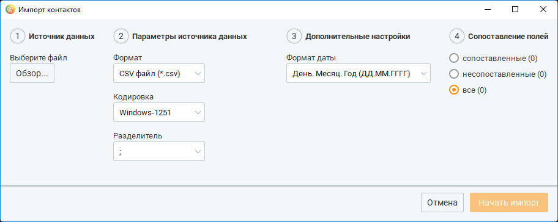
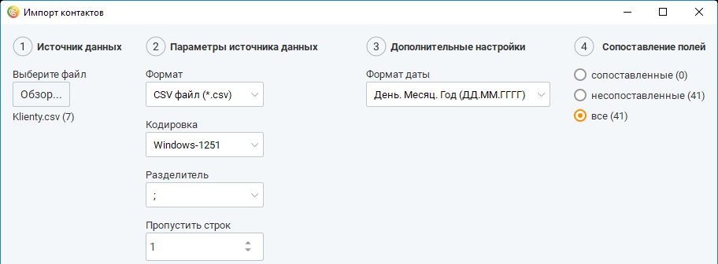

# 10.1.2. Импорт и экспорт контактов

Контакт-центр MANGO OFFICE обеспечивает возможность обмена данными с другими программными продуктами путем импорта (загрузки в нужную адресную книгу) и экспорта (выгрузки из нужной адресной книги) контактных данных. Импорт и экспорт может осуществляться с использованием общей либо личной адресной книги.

| О доступности пользователям функций импорта и экспорта контактов см. Приложение 2 |  |  |
| --- | --- | --- |
| "Роли и права доступа Контакт-центра", подраздел "Контакты". |  |  |
|  | При импорте данных в адресную книгу, первый способ связи (телефон, e-mail) всегда |  |
| указывается в качестве основного. |  |  |

| Если импорт контактных данных выполняется из личной адресной книги, то |
| --- |
| импортированные контакты помечаются как личные. |

в личную адресную книгу проставьте галочку в чекбоксе Ответственный до начала процедуры импорта.

| Если галочка в чекбоксе Ответственный не проставлена, то для импортированных контактов |
| --- |
| пользователь ВАТС проставляется ответственным, если данные в поле "Ответственный" |
| совпадают с ФИО пользователя |

Максимальное количество данных для импорта – 1 000 000 контактов. Как импортировать контакты Чтобы импортировать контакты, нажмите кнопку Импорт в нижней части рабочей области. После этого на экране отображается окно Импорт контактов.

Выберите файл, из которого будут загружаться контактные данные. Нажмите кнопку Обзор... в группе Источник данных. После этого на экране отображается окно Открыть файл для импорта. Выберите нужный файл (с расширением .csv), используя стандартные средства операционной системы, затем нажмите кнопку Открыть. После этого загружается выбранный файл, и его имя отображается в группе Источник данных. В группе Параметры источника данных выберите необходимую кодировку экспортируемых данных из списка Кодировка. После этого (при необходимости) укажите число строк, которые нужно пропустить с начала файла при импорте (это могут быть, например, заголовки столбцов), используя поле ввода с регулятором Пропустить строк.

| По умолчанию пропускается одна строка. Если строки пропускать не нужно, укажите в |
| --- |
| этом поле значение 0. |

Затем выберите нужный разделитель между полями данных (точка с запятой, точка либо символ табуляции) из списка Разделитель. После этого (при необходимости) выберите формат даты в группе Дополнительные настройки. Чтобы импорт данных был корректным, нам необходимо сопоставить поля данных в импортируемом файле и доступные поля данных в адресной книге Контакт-центра MANGO OFFICE. Для этого выберите наиболее соответствующее поле данных из списка, находящегося над каждым столбцом таблицы, которая отображается в нижней части окна Импорт контактов. Например, для имени, фамилии и отчества наиболее подходит поле ФИО. Пропущенные строки (строки, которые не будут импортированы) выделяются цветом.

Поля ФИО и Телефон являются обязательными для сопоставления.

| Для удобства в процессе сопоставления полей вы можете выбирать, какие поля данных |  |  |
| --- | --- | --- |
|  | будут отображаться в окне Импорт контактов, используя переключатель в группе |  |
|  | Сопоставление полей |  |
|  | — все (по умолчанию) — отображаются все поля; |  |
|  | — сопоставленные — отображаются только поля, для которых уже указано соответствие; |  |
|  | — не сопоставленные — отображаются только поля, для которых еще не указано |  |
| соответствие. |  |  |

При импорте данных из файла-источника следует соблюдать корректный размер импортируемых значений: • ФИО — текст, максимальное количество символов – 50; • Должность — текст, максимальное количество символов – 50; • Организация — текст, максимальное количество символов – 128; • Список — текст, максимальное количество символов – 40; • Сайт — текст, максимальное количество символов – 40;

• Комментарий — текст, максимальное количество символов – 255; • Комментарий к номеру телефона или E-mail — текст, максимальное количество символов – 255. Когда вы определили соответствие полей в источнике и целевой адресной книге, нажмите кнопку Начать импорт. После этого начинается импорт контактов в целевую адресную книгу. При импорте контакта, телефон которого полностью совпадает с существующим в целевой адресной книге, на экране отображается окно с соответствующим предупреждающим сообщением.

Как экспортировать контакты Чтобы экспортировать контакты, выберите подлежащие выгрузке контакты в рабочей области.

| Для выбора всех контактов установите флажок в заголовке соответствующего столбца. |  |  |
| --- | --- | --- |
|  | Для импорта контактов только из личной адресной книги установите флажок в чекбоксе |  |
| Ответственный. |  |  |

Затем нажмите кнопку Экспорт на панели массовых действий. После этого на экране отображается окно Экспорт контактов. Выберите необходимую кодировку экспортируемых данных из списка Кодировка в группе Параметры. Затем выберите нужный разделитель между полями данных (точка с запятой, точка либо символ табуляции) из списка Разделитель в группе Параметры. После этого (при необходимости) выберите формат даты в группе Дополнительные настройки. Теперь выберите подлежащие экспорту поля данных. При необходимости выбирайте поля в соответствии с очередностью, нужной для целевого приложения. Для выбора поля данных дважды щелкните по нужному полю в списке Доступные поля либо воспользуйтесь соответствующими кнопками. После этого поле перемещается в список Выбранные поля.

<!-- изображение на стр. 320: байты не извлечены (PyMuPDF недоступен) -->

| Чтобы отменить выбор поля, дважды щелкните по нему еще раз. После этого оно |  |  |
| --- | --- | --- |
|  | возвращается в список Доступные поля. Чтобы перенести все поля из одного списка в |  |
| другой, нажмите кнопку с угловой стрелкой в исходном списке. |  |  |

<!-- изображение на стр. 320: байты не извлечены (PyMuPDF недоступен) -->

После этого при необходимости выберите тип экспорта, используя соответствующий переключатель. Значение переключателя Экспорт отмеченных контактов доступно, если перед экспортом вы отметили флажком хотя бы один контакт. При выборе значения переключателя Экспорт всех контактов (по умолчанию) будут экспортированы все контакты в адресной книге. Когда вы завершите выбор подлежащих экспорту полей и типа экспорта, нажмите кнопку Начать экспорт. В появившемся окне Экспортировать в файл выберите имя и путь сохранения файла и нажмите кнопку Сохранить. После этого сохраняются выбранные для экспорта данные в файл с расширением .csv.
