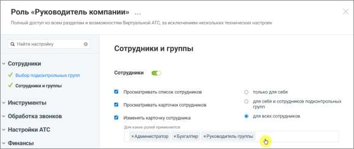
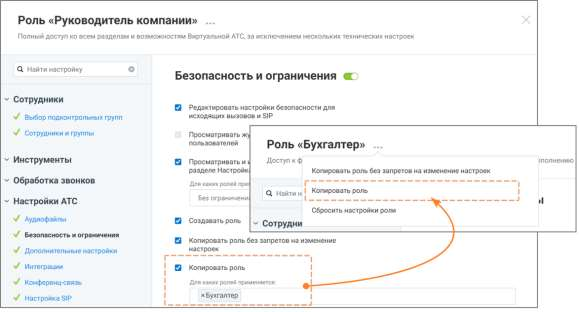
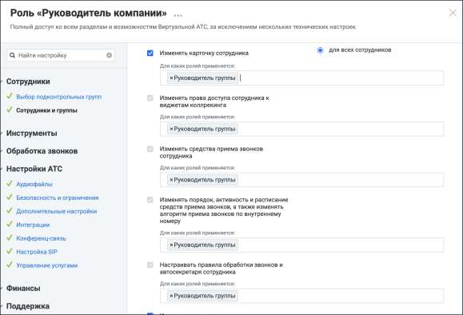
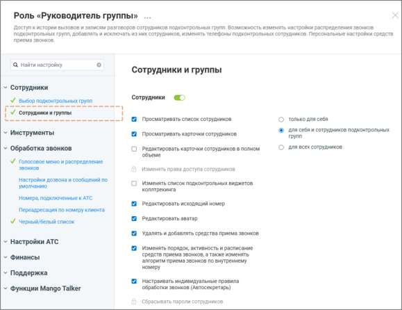

# Настройка АТС → Безопасность и ограничения → Копировать роль без запретов на

> Трассировка: PDF §18 · сквозные стр. 548-552 · источники: ч.1 `kb/sources/mango-cc-manual/CC_manual_1.26.28.1.pdf` с.548-552.

изменение настроек.

| Важно понимать: копия роли наследует от источника только перечень доступных |
| --- |
| разделов. Если раздел был закрыт/открыт для исходной роли, после создания копии он |
| останется аналогично закрытым/открытым, с возможностью последующего изменения |
| доступа. |
| Также внутри каждого унаследованного раздела копия получает возможность подключения |
| полного набора всех возможных прав, даже если у источника они были отключены. После |
| создания роли-копии обязательно отключите ненужные права, чтобы избежать избыточных |
| разрешений. |

Чтобы создать роль на основе существующей, без запретов на изменение настроек: • откройте раздел Настройки АТС → Безопасность и ограничения • выберите системную роль, на основе которой будет создаваться пользовательская

• нажмите иконку контекстного меню и в выпадающем окне выберите вариант «Копировать роль без запретов на изменение настроек» • нажмите кнопку Создать роль • укажите название роли • при необходимости укажите описание роли • настройте права доступа роли • нажмите Сохранить 4. Гибкая настройка прав с учетом ролей В ЛК ВАТС существует возможность тонкой настройки для ряда существующих опций. При активации некоторых разрешений можно ограничить их действие не только уровнем влияния (на себя, подчиненных или всех), но и конкретным списком ролей. Как это работает: вы включаете настройку (например, «Изменять карточку сотрудника») и выбираете уровень влияния «Для всех сотрудников». Дополнительно вы можете указать, для сотрудников с какими ролями будет доступно это действие. При настройке вам доступны следующие варианты: • Без ограничений — настройка активна для всех сотрудников, независимо от их роли (работает так же, как и раньше). • Выбор одной или нескольких ролей из списка — в этом случае действие будет разрешено только в том случае, если целевой сотрудник имеет одну из выбранных ролей.

Рисунок 1. Роль «Руководитель компании», настройка «Изменять карточку сотрудника» На рис.1 пользователю с ролью Руководитель компании предоставлено разрешение на изменение карточки сотрудника только для ролей Администратор, Бухгалтер, Руководитель группы.

Рисунок 2. Роль «Руководитель компании», настройка «Копировать роль» На рис.2 показан пример настройки роли Руководитель компании. У этой роли есть полный доступ ко всем разделам системы, а в блоке настроек «Копировать роль» задано ограничение: руководитель может копировать только роль Бухгалтер. Это означает, что сотрудник с ролью Руководитель компании: • сможет создать копию роли Бухгалтер (кнопка копирования будет активна); • не сможет скопировать никакие другие роли — при попытке это сделать система покажет уведомление об отсутствии прав.

Рисунок 3. Роль «Руководитель компании», настройки.

На рис.3 пользователь с ролью Руководитель кампании имеет доступ к редактированию карточки сотрудника пользователям только с ролью Руководитель группы. Это позволяет строить более сложные и безопасные сценарии разграничения доступа, когда возможность совершить действие зависит от того, на какую роль оно нацелено. 5. Права доступа Права доступа роли определяют, какие действия доступны пользователям с этой ролью и к каким разделам системы они могут получить доступ. Каждое право доступа связано с определённой функцией системы. Если право включено, пользователю доступна соответствующая функция. Если право отключено, выполнение этой функции недоступно. Настройка прав доступа выполняется при создании роли или при редактировании существующей роли. Чтобы изменить права доступа роли: • откройте раздел Настройки АТС → Безопасность и ограничения → Настройка доступа • выберите роль, права доступа которой необходимо изменить • включите или отключите необходимые права доступа и ограничения • нажмите Сохранить.

Некоторые права доступа могут зависеть от других прав. В этом случае изменение одного права может автоматически изменить состояние другого права. При редактировании прав в интерфейсе Личного кабинета ВАТС в таких случаях отображаются подсказки. Также часть прав может быть недоступна для изменения и отображаться в режиме только чтения. Такие права устанавливаются системой и не могут быть изменены вручную. Статусы прав доступа в разрезе возможностей подключения:

- право доступно, но не подключено

- право доступно и подключено

- возможность подключения зависит от активности какого-либо из предыдущих прав доступа

- право недоступно для подключения

- право подключено и недоступно для отключения

Иконка рядом с названием раздела означает, что для роли включена возможность доступа хотя бы к одной функции этого раздела. Если иконка отсутствует, доступ к функциям раздела для данной роли не предоставлен. Переключатель состояния прав доступа раздела может иметь следующий вид:

— все права доступа к разделу для данной роли отключены

— права доступа доступны для подключения

— все права доступа отключены и недоступны для подключения

— все права доступа включены и недоступны для отключения
