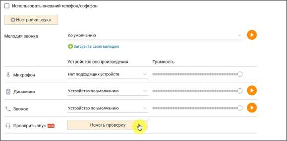

# Настройки звука

> Трассировка: PDF §2.5 · сквозные стр. 65-66 · источники: ч.1 `kb/sources/mango-cc-manual/CC_manual_1.26.28.1.pdf` с.65-66.

При включенной настройке Использовать внешний телефон / софтфон вы можете использовать внешний аппаратный или программный телефон для осуществления разговоров с помощью Контакт-центра MANGO OFFICE.

| При использовании внешнего телефона / софтфона вместе с Контакт-центром MANGO |  |  |  |
| --- | --- | --- | --- |
|  | OFFICE становятся недоступными элементы интерфейса, предназначенные для настройки |  |  |
|  | гарнитуры во время разговора (см. раздел Настройка гарнитуры во время разговора). |  |  |

При щелчке по кнопке Настройки звука отображается список звуковых настроек софтфона: Мелодия звонка. Чтобы загрузить свою мелодию звонка, следует щелкнуть по ссылке "Загрузить свою мелодию" и при помощи стандартного диалогового окна операционной системы указать путь к файлу. Микрофон, динамики, звонок. Укажите тип устройства, либо оставьте устройства по умолчанию (рекомендуется). Проверить звук. Кликнув по кнопке "Начать проверку" пользователь сможет сделать запись голоса с помощью службы тестирования звука и услышать себя.
