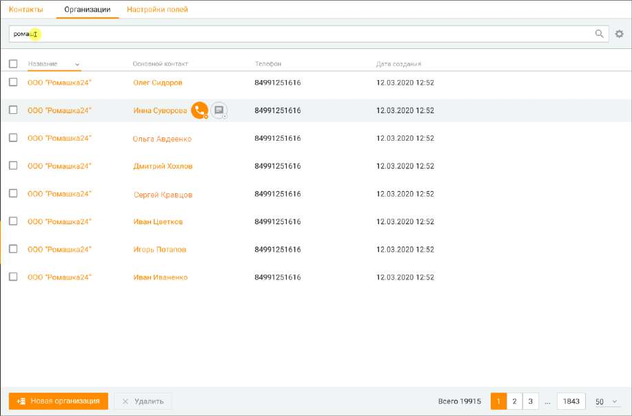

# 10.2. Организации

> Трассировка: PDF §10.2 · сквозные стр. 320-322 · источники: ч.1 `kb/sources/mango-cc-manual/CC_manual_1.26.23_compressed.pdf` с.320-322.

| Вкладка для просмотра Организаций доступна, если пользователь обладает правом |
| --- |
| "Просматривать контакты" или правом "Просматривать персональные контакты". |

Пользователь может открыть карточку организации из: • списка организаций на вкладке Клиенты/Организации; • списка клиентов на вкладке Клиенты/Контакты; • карточки клиента; • карточки задачи.

Клик по наименованию организации открывает карточку организации. Клик по основному контакту открывает карточку клиента. Чтобы поддерживать в актуальном состоянии список контактных лиц организации, список обновляется при каждом просмотре карточки контакта, привязанного к текущей организации, удаления связи с контактом или привязки нового контакта. Вкладка содержит: Поле поиска - для поиска по организациям необходимо ввести как-минимум один символ и нажать "ввод". Если оставить поле пустым, поиск выдаст полный список имеющихся организаций. Поиск по организациям осуществляется по следующим полям: Название организации, Адрес, ИНН, Сайт, Комментарий, ID организации, ФИО основного привязанного контакта. Список организаций - В списке по умолчанию отображаются следующие колонки: Название, Телефон, Адрес, ИНН, Сайт, Основной контакт, Дата создания карточки организации, Автор. Вы можете самостоятельно выбрать, какие столбцы будут отображаться на панели. Для этого

щелкните левой кнопкой мыши по пиктограмме и установите/снимите флаги напротив наименований столбцов. Кнопка Новая организация – создание новой организации. Кнопка Удалить – удаление организации.

| На данный раздел распространяется возможность скрытия номера клиента. Узнать больше |  |  |
| --- | --- | --- |
|  | здесь. |  |

