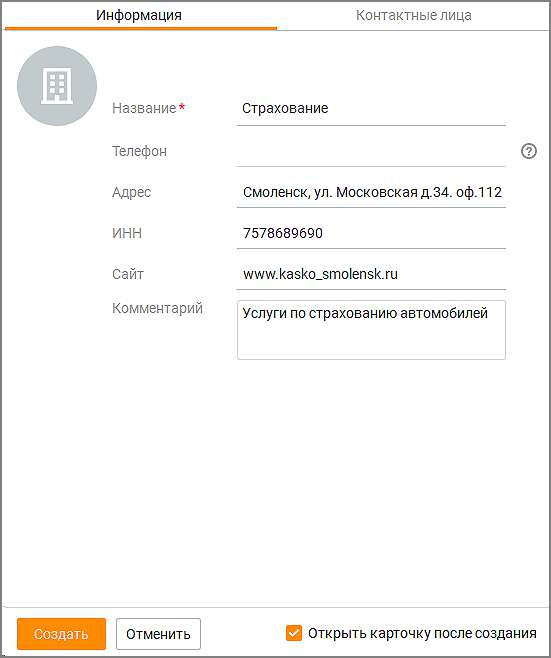
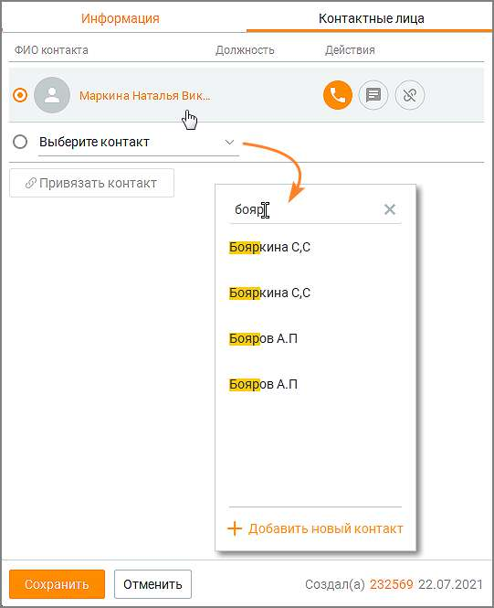

# 10.2.1. Создание, редактирование и удаление организаций

> Трассировка: PDF §10.2.1 · сквозные стр. 322-325 · источники: ч.1 `kb/sources/mango-cc-manual/CC_manual_1.26.23_compressed.pdf` с.322-325.

| Пользователь может создавать, редактировать организацию или связывать организацию с |
| --- |
| контактом, если он обладает правом "Создавать и редактировать контакты". |

Создание новой организации возможно: • из вкладки Организации кликом по кнопке Новая организация; • из карточки контакта, при заполнении или редактировании поля "Организация". Для создания новой организации кликните по кнопке Новая организация и заполните данные создаваемой организации на вкладке Информация.

Название — поле является обязательным для заполнения. При вводе текста в поле предлагается выбор из выпадающего списка организаций, в название которых входит (в любой части названия) введенный текст; Телефон — поле недоступно для заполнения пользователем. Заполняется данными основного контакта автоматически после привязки контакта на вкладке Контактные лица; Адрес — адрес организации; ИНН — ИНН организации; Сайт — веб-сайт организации; Комментарий — комментарий пользователя; Чекбокс Открыть карточку после создания – если чекбокс проставлен, после клика по кнопке "Создать" карточка организации откроется в режиме просмотра и редактирования. Сохраните внесенные изменения кликом по кнопке Создать. Клик по кнопке Отменить отменяет внесенные изменения.

| Привязка контакта на вкладке Контактные лица при создании новой организации |  |  |
| --- | --- | --- |
|  | невозможна. Следует сначала создать новую организацию, далее открыть карточку |  |
| организации в режиме редактирования. |  |  |

Вкладка Контактные лица содержит: • Кнопку Привязать контакт – при вводе текста в поле предлагается выбор из выпадающего списка контактов , в ФИО которых входит (в любой части ФИО) введенный текст. Одна организация может быть привязана к множеству контактов. Личные контакты других сотрудников в выпадающем списке не отображаются.

Список привязанных контактов – пиктограммой обозначается основной контакт организации. Телефон основного контакта автоматически отображается на вкладке Информация. Клик по ФИО контакта открывает карточку контакта в режиме просмотра и редактирования.

Клик по кнопке "Добавить новый контакт" открывает карточку создания нового контакта. При этом пользователь должен обладать правом "Создавать и редактировать контакты".

Действия с привязанным контактом: – позвонить, – написать сообщение, – отвязать контакт от организации. Установить и удалить связь организации и контакта также можно из карточки контакта.

| Автора (если есть) и дату создания организации – размещается в нижнем правом углу |
| --- |
| карточки организации. Если автор не удален из Контакт-центра, при клике на автора |
| открывается карточка сотрудника, создавшего организацию. |

• Сохранить – клик по кнопке сохраняет внесенные изменения. • Отменить – клик по кнопке отменяет внесенные изменения.

<!-- изображение на стр. 325: байты не извлечены (PyMuPDF недоступен) -->

Пользователь может удалить организацию, если обладает правом "Удалять контакты". Для удаления организации отметьте в списке на вкладке "Организации" требуемые

|  | После подтверждения согласия на удаление |
| --- | --- |
| организация безвозвратно удаляется из адресной книги. При этом все открытые карточки |  |
| организаций закрываются. |  |
