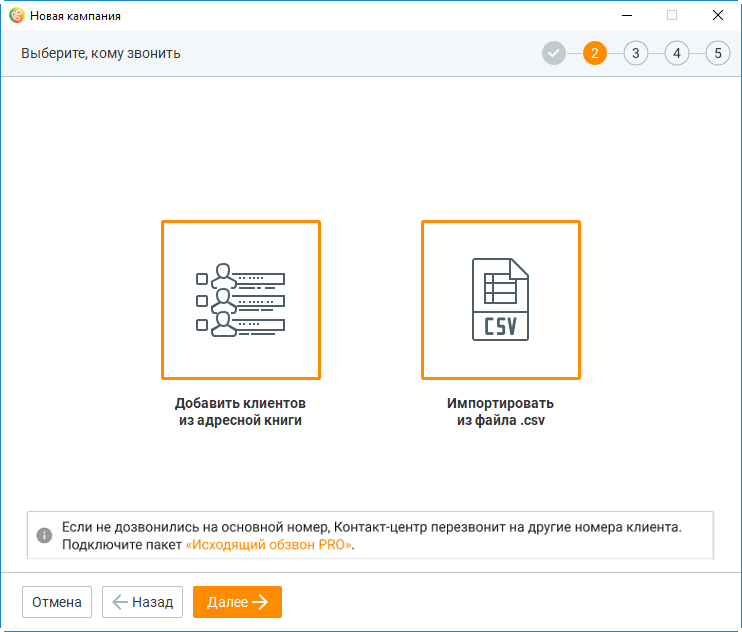
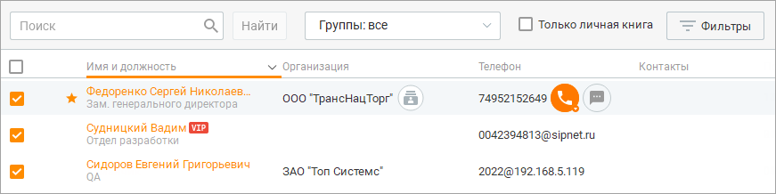
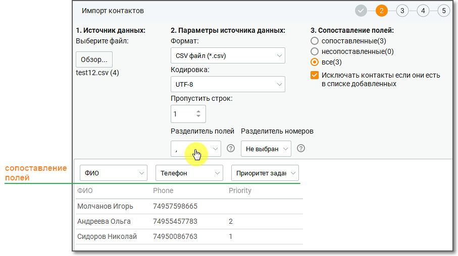
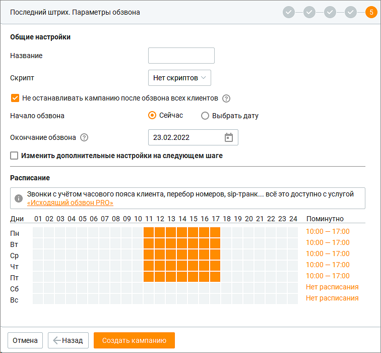
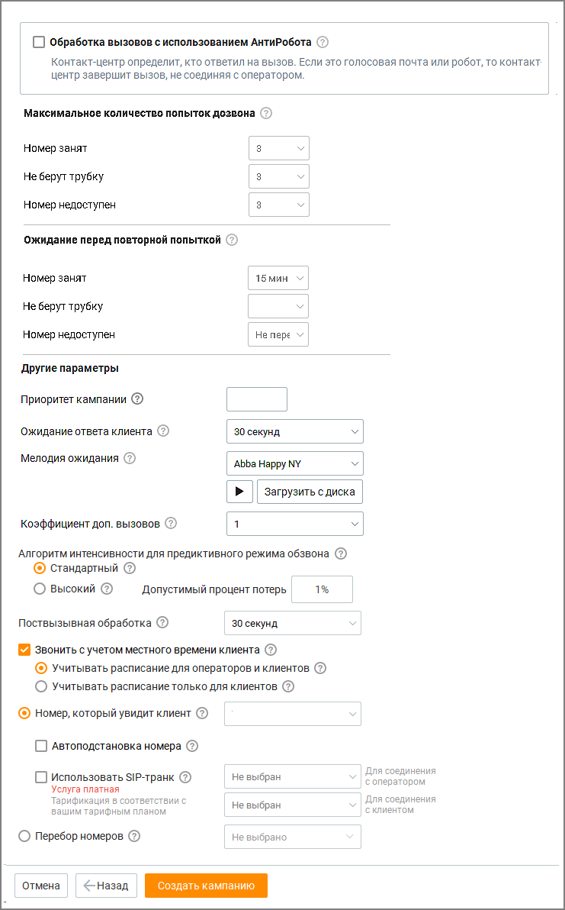
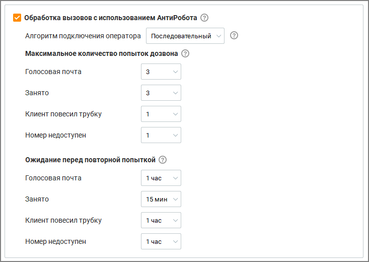
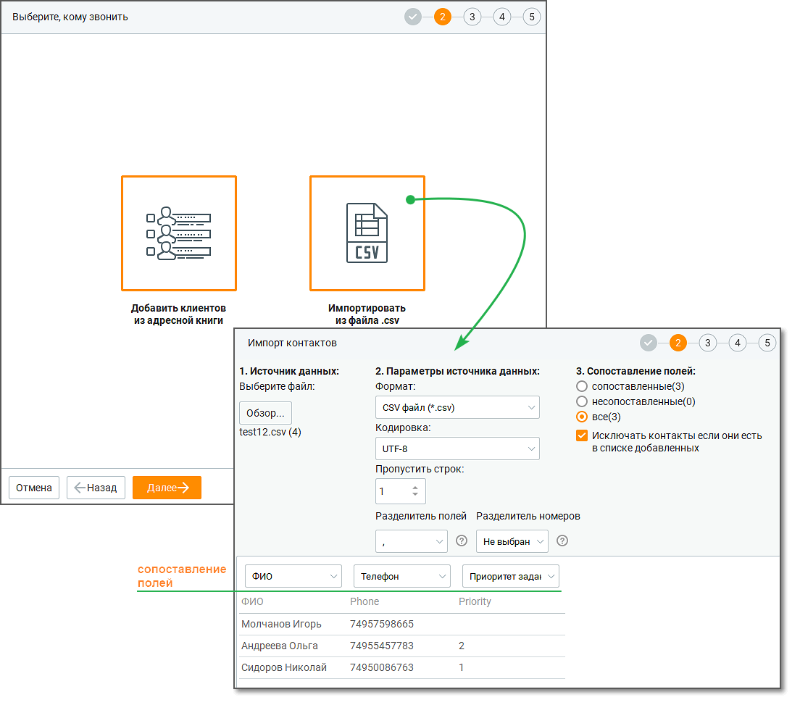
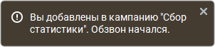

# 11.4.1. С участием сотрудника

> Трассировка: PDF §11.4.1 · сквозные стр. 347-361 · источники: ч.4 `kb/sources/mango-cc-manual/CC_manual_1.26.23-part-4.pdf` с.44-58.

Параметры, указываемые при создании кампании в режиме "С участием сотрудника", не зависят от выбранного шаблона. Выбор контактов На данном шаге необходимо определить список внешних абонентов, по которым будет осуществляться обзвон:

Предусмотрено два способа добавления контактов, которые можно комбинировать: 1. Добавить клиентов из Контактов (адресной книги) – добавление контактов из адресной книги текущего продукта Контакт-центра MANGO OFFICE; 2. Импортировать из файла .csv – добавление контактов из внешнего источника (CSV файл).

| Количество контактов в одной кампании зависит от версии продукта. При превышении |  |  |
| --- | --- | --- |
|  | количества контактов соответствующая кнопка для добавления контактов будет недоступна. |  |
|  | Чтобы увеличить количество контактов, смените версию продукта либо обратитесь в |  |
| клиентский отдел компании в вашем регионе. |  |  |

При добавлении контактов из адресной книги форма создания кампании скрывается и выполняется переход в модуль "Клиенты". Для поиска контактов вы можете использовать инструменты данного модуля. После выбора нужных контактов нажмите кнопку Отправить контакты.

Выбранные контакты отображаются в списке формы шага по добавлению контактов. Для удаления ненужных контактов выделите их флагами и нажмите Исключить. При импорте контактов из файла используется стандартная форма импорта данных с возможностью сопоставления полей. Поле "Телефон" является обязательным для сопоставления.

| Рекомендуется изменять CSV-файлы через приложение MS Excel. Другие приложения |
| --- |
| могут некорректно формировать файл для импорта. |

Передача списка пользовательских полей происходит в том числе при пустых значениях импортируемого файла, а также в случае, если поля не были сопоставлены при импорте. После завершения редактирования списка контактов нажмите Далее. Сопоставление полей Перед началом кампании рекомендуется настроить пользовательские поля на вкладке Настройка полей. Настройки для сопоставления полей в Контактах и кампании Исходящего обзвона открываются, если в данную компанию контакты добавляются впервые. Если же ранее в данную кампанию был добавлен хотя бы один контакт из адресной книги, то выбранные новые контакты добавляются в кампанию с настройками сопоставления полей, сделанными ранее для предыдущих добавленных контактов. При подключенной услуге "Исходящий обзвон PRO" с полем "Телефон" можно сопоставить до 5-ти столбцов с номерами телефона клиента.

Сопоставление полей необходимо для корректного отображения данных в карточке обращения, поступающего сотруднику в процессе обзвона. А также для сбора статистики кампаний Исходящего обзвона "Без участия сотрудника".

В карточке кампании ИО отобразятся только те пользовательские поля, для которых были указаны сопоставления при загрузке базы. Сопоставление полей при импорте из файла csv:

| Если у вас не открывается меню сопоставления полей, проверьте – корректно ли выбран |
| --- |
| разделитель полей. |

Проверка списка контактов Шаг 2 – проверка списка контактов для исключения контактов, участвующих в других кампаниях Исходящего обзвона. При подключенной услуге "Исходящий обзвон PRO" на Шаге 2 осуществляется автоматическая проверка списка выбранных контактов на их участие в других кампаниях ИО, в соответствии с заданными пользователем параметрами фильтрации.

Доступны следующие фильтры: Всех кампаний – варианты периода: Последний месяц, Последние 2 месяца, Последние 3 месяца, Произвольный период; Кампаний в работе – возможность выбора периода отсутствует; Прямых вызовов – варианты периода: сегодня, вчера, последние 2 дня, последняя неделя, последний месяц, произвольный. После нажатия кнопки Применить будет произведена проверка. Всплывающее уведомление информирует о количестве найденных совпадений. Контакты, участвующие в других

кампаниях ИО, отмечаются пиктограммой и иконкой подсказки.

Чтобы исключить нежелательные контакты из списка кампании ИО, отметьте их и нажмите кнопку Исключить. Выбор тематик На следующем шаге создания кампании вы можете определить набор тематик для исходящего обзвона:

Список включает все тематики для исходящих вызовов. Действия по добавлению и редактированию списка результатов аналогичны действиям по работе с тематиками в справочнике тематик обращений. После завершения редактирования списка результатов нажмите Далее. В момент создания кампании у всех сотрудников, которые участвуют в ней в качестве исполнителя, список доступных тематик для обработки обращения обновляется. Выбор операторов На следующем шаге необходимо определить список операторов, которые будут осуществлять обзвон:

В левой части приведен список доступных операторов, ограниченный набором групп, включая сотрудников-роботов. Операторы, у которых не активен переключатель "Учитывать статус сотрудника при распределении вызовов на него", не могут принимать участие в обзвоне и отмечены красным шрифтом. Набор групп определяется в выпадающем списке. Выбор нескольких операторов осуществляется выделением с помощью левой кнопки мыши. Перенос выполняется по нажатию кнопок со стрелками влево/вправо, двойным щелчком либо кнопкой Все (для переноса всех доступных операторов). После завершения редактирования списка операторов нажмите Далее. Параметры обзвона На следующем шаге создания кампании необходимо указать следующие параметры:

1. Название – краткое описание текущего задания; 2. Скрипт – назначение доступных скриптов на выбранных операторов; 3. Чекбокс "Не останавливать кампанию после обзвона всех клиентов" – настройка, позволяющая кампании не переходить в статус "Завершена", если достигнуто максимальное количество попыток дозвона по всем контактам. Кампания остается в статусе "Запланирована", что делает возможным синхронное создание новых заданий через API. После создания кампании настройка недоступна для изменения. 4. Начало обзвона – по умолчанию указывается текущая дата; 5. Окончание обзвона – окончание кампании по обзвону. Кампании ИО бывают двух видов: бесконечные и конечные. Конечные кампании ИО имеют дату/время окончания обзвона. Бесконечные кампании – не имеют даты окончания и могут дополняться номерами для обзвона. 6. Чекбокс "Изменить дополнительные настройки на следующем шаге" – дополнительные настройки кампании в виде отдельного шага; 7. Расписание для проведения исходящего обзвона. Каждый прямоугольник обозначает один час. Расписание хранится локально на компьютере текущего пользователя. Настройки сохраняются при создании кампании и применяются при создании следующей кампании. Для изменения расписания предусмотрено два способа:

• Щелчком левой кнопки мыши по определенному прямоугольнику. Первый щелчок выделяет один час, второй щелчок снимает выделение; • Щелчком левой кнопки мыши по значению в поле "Период времени". Значения вводятся во всплывающем окне, здесь же предусмотрена возможность указания нескольких временных периодов. При подключенной услуге "Исходящий обзвон PRO" обзвон осуществляется исходя из времени в регионе клиента. Если услуга не подключена – по умолчанию действует время часового пояса региона Москва. Если флаг "Изменить дополнительные настройки на следующем шаге" не был установлен, нажмите Создать кампанию. В противном случае на форме будет присутствовать кнопка "Далее" и переход к Дополнительным настройкам. Дополнительные настройки К дополнительным настройкам можно вернуться после создания кампании, открыв карточку кампании. На данном шаге вы можете изменить следующие параметры:

1. Обработка вызовов с использованием АнтиРобота – опция, позволяющая не соединять с оператором вызовы, по которым ответил автоответчик или робот. Доступна при подключении соответствующей услуги и роли пользователя.

| Настройки Антиробота |
| --- |
| При проставлении чекбокса "Антиробот" открывается окно настроек: |
|  |
| a. Алгоритм подключения оператора — выпадающий список, определяющий |
| логику подключения оператора: |
| • Последовательный — операторы подключаются по очереди в заданном порядке. |
| • Параллельный — вызов одновременно направляется на нескольких операторов. |
| Первый ответивший принимает вызов, остальные получают уведомление об |
| окончании попытки соединения. |
| b. Максимальное количество попыток дозвона — параметры, определяющие |
| допустимое количество автоматических попыток соединения с клиентом в |
| зависимости от причины неудачи. |
| c. Ожидание перед повторной попыткой — временной интервал между неудачной |
| попыткой дозвона и следующей попыткой в зависимости от причины разрыва |
| соединения. |

2. Максимальное количество попыток дозвона – количество попыток дозвона при определенном событии (не более 10-ти); 3. Ожидание перед повторной попыткой – время, через которое выполняется следующая попытка дозвона, в зависимости от события. 4. Приоритет кампании ИО – для управления порядком обработки кампаний ИО можно установить приоритет в диапазоне от 1 (самый высокий) до 999 (самый низкий). Задачи из кампании с более высоким приоритетом будут обрабатываться в первую очередь. Если оставить поле приоритета пустым, то приоритет не будет учтен, и кампания ИО будет обработана после кампаний с более высоким приоритетом.

Также можно установит приоритет совершения звонков в рамках одной кампании ИО. Чтобы указать приоритет звонковых заданий, их необходимо загрузить в кампанию ИО через интерфейс Контакт-центра или через интерфейс API.

| Приоритет звонков |
| --- |
| Приоритет звонковых заданий – приоритет задания представляет собой |
| натуральное число от 1 до 999. Чем меньше число, тем выше приоритет. В |
| отличие от настройки приоритета кампаний ИО настройка приоритета |
| звонковых заданий в рамках одной кампании ИО настраивается только через |
| импорт звонков из файла csv: |
| • При создании кампании ИО на шаге 2 "Выбор контактов" необходимо |
| выбрать блок "Импортировать из файла.csv". |
|  |
| • В файле импорта csv для каждого звонкового задания можно указывать его |
| приоритет. Если приоритет не задан, то задание встает в конец очереди |
| обзвона. |
| • Сначала обзваниваются все задания с приоритетом 1, затем задания с |
| приоритетом 2, и так далее (минимальный приоритет – 999). Перед каждым |
| звонком по заданию с приоритетом 2 и ниже система проверяет – не |
| появилось ли задание с более высоким приоритетом. |
| • Порядок обзвона заданий с одинаковым значением приоритета случаен, и |
| система обрабатывает их в произвольной последовательности. |

5. Ожидание ответа клиента – максимальное время, в течение которого ожидается поднятие трубки абонентом. Доступны варианты 15, 20, 30, 60 секунд; 6. Мелодия ожидания – выбор мелодии, которая воспроизводится абоненту во время ожидания ответа оператора, с возможностью предварительного прослушивания. Если в кампании ИО задействован "АнтиРобот", мелодия начинает проигрываться при звонке на "АнтиРобот". 7. Коэффициент дополнительных вызовов – отношение количества одновременно совершаемых попыток дозвона к количеству свободных операторов; 8. Алгоритм интенсивности для предиктивного режима обзвона – настройки управления интенсивностью обзвона. Реализована возможность выбора алгоритма интенсивности с градацией на следующие уровни: o Стандартный режим: Подходит для компаний, стремящихся к минимизации потерь вызовов при стабильной нагрузке операторов. o Высокий режим: Рекомендуется в ситуациях с необходимостью увеличения интенсивности звонков за счёт допустимого процента потерь, например, при ограниченном времени на обработку базы. 9. Номер, который увидит клиент – номер линии ВАТС, который будет определяться у внешних абонентов; 10. Автоматическая подстановка номера – чекбокс отображается, если на продукте подключена соответствующая услуга, а также в наличии настроенные правила автоподстановки номеров ВАТС. Если чекбокс отмечен, то исходящий номер будет выбран для каждого клиента, согласно правилам, настроенным в автоподстановке номеров ВАТС. Данная настройка не поддерживается при включённой функции "Перебор номеров". 11. Звонить с учетом местного времени клиента – если чекбокс проставлен, исходящий дозвон осуществляется с учетом часового пояса клиента: • учитывать расписание для операторов и клиентов – дозвон начнется в часы совпадения рабочего времени клиента и сотрудника; • учитывать расписание только для клиентов – дозвон начнется по расписанию рабочего времени клиента. 12. Поствызывная обработка – время после окончания разговора, предназначенное для поствызывной обработки. В течение этого времени новые вызовы на оператора не распределяются; 13. Использовать SIP-транк – поле для настройки исходящих линии для клиента и для оператора, в случае подключения телефонии через канал SIP-транк; 14. Перебор номеров – если чекбокс проставлен, при дозвоне до клиента используются разные исходящие номера (кроме номеров на 8-800). При этом чекбоксы Автоматическая подстановка номера и Использовать SIP-транк недоступны для выбора. После завершения работы с дополнительными настройками нажмите кнопку Создать кампанию. На этом добавление кампании завершено, далее выполняется возврат к списку кампаний.

Пример использования коэффициента дополнительных вызовов

| В случае, когда отношение количества одновременно совершаемых попыток дозвона к количеству |
| --- |
| свободных операторов равно либо меньше, чем установленный коэффициент дополнительных |
| вызовов, Контакт-центр MANGO OFFICE совершает попытки вызова. Если количество операторов в |
| статусе Обзвон равно нулю, попытки вызовов не совершаются. |
| Пример: |
| 1. 9 вызовов / 10 операторов = 0.9 |
| Установлен коэффициент 0.7 |
| 0.9 > 0.7 попытки вызова не совершаются (остается свободный оператор); |
|  |
| 2. 9 вызовов / 10 операторов = 0.9 |
| Установлен коэффициент 0.9 |
| 0.9 = 0.9 попытки вызова совершаются; |
|  |
| 3. 9 вызовов / 10 операторов = 0.9 |
| Установлен коэффициент 1 |
| 0.9 < 1 попытки вызова совершаются; |
|  |
| 4. Перед началом запуска кампании 0 вызовов |
| 0 вызовов / 10 операторов = 0 |
| Установлен коэффициент 1 |
| 0 < 1 попытки вызова совершаются; |
|  |
| 5. В случае, когда система начала дозваниваться до внешнего абонента, а оператор сменил статус. |
| 5 вызовов / 0 операторов |
| В этом случае текущий вызов закончится, а новый не начнется, так как количество операторов в |
| статусе "Обзвон" = 0. |

| При превышении количества созданных кампаний, а также автоматических кампаний без |  |  |
| --- | --- | --- |
|  | участия оператора, в области системных уведомлений отображается соответствующее |  |
| сообщение. |  |  |

После завершения добавления кампания поочередно переходит в статусы "Обрабатывается" и "Запланирована". Запуск кампании, т. е. переход в статус "Выполняется", зависит от выполнения следующих условий: • дата начала обзвона должна соответствовать текущей дате; • расписание обзвона должно соответствовать текущему времени; • хотя бы один оператор должен быть переведен в статус "Обзвон". При соблюдении всех условий статус кампании автоматически меняется на "Выполняется" и обзвон контактов стартует.

| В момент создания/редактирования кампании исходящего обзвона у всех сотрудников, |  |  |
| --- | --- | --- |
|  | добавленных в кампанию, в области системных уведомлений отображается соответствующее |  |
| сообщение, включающее дату начала кампании. |  |  |

<!-- изображение на стр. 361: байты не извлечены (PyMuPDF недоступен) -->
