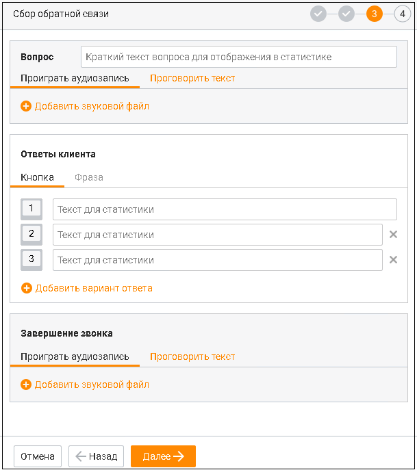
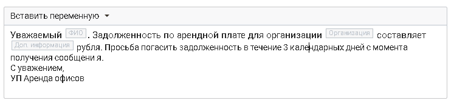
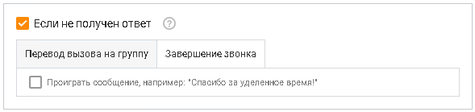
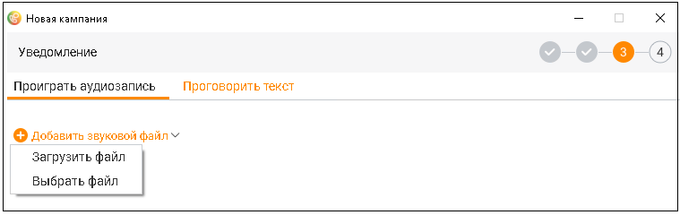

# 11.4.2. Без участия сотрудника

Параметры, указываемые при создании кампании в режиме "Без участия сотрудника", зависят от выбранного шаблона Шаг 1. Выбор шаблона

Сбор обратной связи При создании кампании по шаблону "Сбор обратной связи" необходимо выполнить несколько шагов: Шаг 2. Выбор контактов. Аналогично добавлению кампании с режимом "С участием сотрудника". Шаг 3. Сопоставление полей. Аналогично добавлению кампании с режимом "С участием сотрудника". Шаг 4. Сбор обратной связи.

На данном шаге необходимо заполнить следующие блоки:

|  | Добавление звукового или текстового файла с вопросом для абонента. Для |  |  |
| --- | --- | --- | --- |
| звукового варианта допускается загрузка нового файла либо выбор из ранее загруженных |  |  |  |
| файлов, с указанием длительности мелодии. |  |  | Для текстового варианта после ввода текста |
| можно выбрать мужской или женский голос озвучки (с прослушиванием вариантов, один раз |  |  |  |
| в 10 сек). |  |  |  |

В тексте могут содержаться до 50-ти переменных из контактной информации клиента: ФИО, Организация, Должность, Доп. информация, Телефон, Пользовательские поля. Максимальный размер текста 500 символов с пробелом (переменные не учитываются).

| Для того, чтобы при просмотре статистики кампании ориентироваться в задаваемом вопросе, |
| --- |
| оставьте краткое поясняющее описание. |
| 2. Ответы клиента. |

Ответ клиента может представлять собой кнопку или фразу.

|  | Вкладка Фраза доступна, если у пользователя в Контакт-центре MANGO OFFICE |  |  |
| --- | --- | --- | --- |
|  | подключена услуга Распознавание речи. |  |  |
| Кнопка |  |  | Значение кнопки устанавливается автоматически. По умолчанию добавлен первый |
|  |  |  | блок ответа с кнопкой "1". |
| Фраза |  |  | Строка, длиной не более 250 символов. Допускается ввод одного или нескольких слов. Запятая считается разделителем между отдельными фразами. Например, в поле задан текст: "нет, не хочу, не нужно, до свидания". В случае, если система распознает ответы абонента "нет", "не хочу", "не нужно", "до свидания" – в статистику запишется заданный вариант ответа (соответствующий краткому "тексту для статистики"). Если абонент скажет "хочу", "нужно" – такие фразы не будут распознаны как заданный вариант ответа. Разрешенные для ввода символы: • Буквы (кириллица); • Цифры; • Пробел; • Запятая; • Дефис (тире); • Кавычки "" и «». |
|  |  | Для того, чтобы при просмотре статистики кампании ориентироваться в ответах абонента, |  |
|  |  | оставьте краткое поясняющее описание к каждому ответу. Допускается создание не более 10 |  |
|  |  | ответов. Для удаления ответа щелкните по пиктограмме |  |
|  |  | 3. Завершение звонка. Добавление звукового или текстового файла, который будет |  |
|  |  | воспроизведен абоненту по завершению звонка. Для звукового варианта допускается загрузка |  |
|  |  | нового файла либо выбор из ранее загруженных файлов, с указанием длительности мелодии. |  |
|  |  | Для текстового варианта после ввода текста можно выбрать мужской или женский голос |  |
|  |  | озвучки (с прослушиванием вариантов, один раз в 10 сек). |  |

В тексте могут содержаться до 50-ти переменных из контактной информации клиента: ФИО, Организация, Должность, Доп. информация, Телефон, Пользовательские поля. Максимальный размер текста 500 символов с пробелом (переменные не учитываются). Шаг 5. Параметры обзвона. Аналогично добавлению кампании с режимом "С участием сотрудника" Шаг 6. Дополнительные настройки. Аналогично добавлению кампании с режимом "С участием сотрудника", за исключением пунктов: • Мелодия ожидания; • Коэффициент дополнительных вызовов; • Поствызывная обработка. На этом создание кампании завершено, далее выполняется возврат к списку кампаний. Специальное предложение для клиентов При создании кампании по шаблону "Специальное предложение для клиентов" необходимо выполнить несколько шагов: Шаг 2. Выбор контактов. Аналогично добавлению кампании с режимом "С участием сотрудника". Шаг 3. Сопоставление полей. Аналогично добавлению кампании с режимом "С участием сотрудника". Шаг 4. Специальное предложение.

На данном шаге необходимо заполнить следующие блоки:

| 1. Предложение. Добавление звукового или текстового варианта со специальным |
| --- |
| коммерческим предложением для абонента. Для звукового варианта допускается загрузка |
| нового файла либо выбор из ранее загруженных файлов, с указанием длительности мелодии. |
| Для текстового варианта после ввода текста можно выбрать мужской или женский голос |
| озвучки (с прослушиванием вариантов, один раз в 10 сек). |
| В тексте могут содержаться до 50-ти переменных из контактной информации клиента: ФИО, |
| Организация, Должность, Доп. информация, Телефон, Пользовательские поля. |
| Максимальный размер текста 500 символов с пробелом (переменные не учитываются). |

2. Добавить вариант ответа клиента. Ответ клиента может представлять собой кнопку, фразу или иметь статус ответ не получен.

| Вкладка Фраза доступна, если у пользователя в Контакт-центре MANGO OFFICE |
| --- |
| подключена услуга Распознавание речи. |

| Кнопка | Значение кнопки устанавливается автоматически. По умолчанию добавлен первый |
| --- | --- |
|  | блок ответа с кнопкой "1". |
| Фраза | Строка, длиной не более 250 символов. Допускается ввод одного или нескольких слов. Запятая считается разделителем между отдельными фразами. Например, в поле задан текст: "нет, не хочу, не нужно, до свидания". В случае, если система распознает ответы абонента "нет", "не хочу", "не нужно", "до свидания" – в статистику запишется заданный вариант ответа (соответствующий краткому "тексту для статистики"). |

|  | Если абонент скажет "хочу", "нужно" – такие фразы не будут распознаны как заданный вариант ответа. Разрешенные для ввода символы: • Буквы (кириллица); • Цифры; • Пробел; • Запятая; • Дефис (тире); • Кавычки "" и «». |
| --- | --- |

Если клиент нажал кнопку или произнес ключевую фразу. Выбор действия в зависимости от того, какую кнопку нажал абонент: перевод звонка на группу или завершение вызова. Каждое действие может сопровождаться воспроизведением звукового и текстового сообщения.

| Для корректного срабатывания распределения вызовов хотя бы один из операторов |
| --- |
| указанной группы должен находиться в статусе "На линии". |

Для того, чтобы при просмотре статистики кампании ориентироваться в ответах абонента, оставьте краткое поясняющее описание к каждому ответу. Допускается создание не более 10

вариантов ответов. Для удаления ответа щелкните по пиктограмме . Если ответ клиента не получен. Чтобы предусмотреть действия в случае отсутствия ответа клиента, поставьте галочку в чекбоксе "Если не получен ответ". Доступны для выбора действия: перевод звонка на группу или завершение вызова. Каждое действие может сопровождаться воспроизведением звукового и текстового сообщения.

Шаг 5. Параметры обзвона. Аналогично добавлению кампании с режимом "С участием сотрудника" Шаг 6. Дополнительные настройки. Аналогично добавлению кампании с режимом "С участием сотрудника", за исключением пунктов: • Мелодия ожидания; • Коэффициент дополнительных вызовов. На этом создание кампании завершено, далее выполняется возврат к списку кампаний. Уведомление При создании кампании по шаблону "Уведомление" необходимо выполнить несколько шагов: Шаг 2. Выбор контактов. Аналогично добавлению кампании с режимом "С участием сотрудника".

Шаг 3. Сопоставление полей. Аналогично добавлению кампании с режимом "С участием сотрудника". Шаг 4. Уведомление.

На данном шаге необходимо добавить звуковой или текстовый файл с уведомлением для

|  | Для звукового варианта допускается загрузка нового файла либо выбор одного из |
| --- | --- |
| ранее загруженных файлов. Формат файла – mp3, максимальный размер – 20 МБ. Для |  |
| текстового варианта после ввода текста можно выбрать мужской или женский голос озвучки |  |
| (с прослушиванием вариантов, один раз в 10 сек). |  |
| В тексте могут содержаться переменные из контактной информации клиента: ФИО, |  |
| Организация, Должность, Доп. информация, Телефон, Пользовательские поля. |  |
| Максимальный размер текста 500 символов с пробелом (переменные не учитываются). |  |

Шаг 5. Параметры обзвона. Аналогично добавлению кампании с режимом "С участием сотрудника" Шаг 6. Дополнительные настройки. Аналогично добавлению кампании с режимом "С участием сотрудника", за исключением пунктов: • Мелодия ожидания; • Коэффициент дополнительных вызовов; • Поствызывная обработка На этом создание кампании завершено, далее выполняется возврат к списку кампаний.

| При превышении количества созданных кампаний, а также автоматических кампаний без |  |  |
| --- | --- | --- |
|  | участия оператора, в области системных уведомлений отображается соответствующее |  |
| сообщение. Чтобы увеличить количество, смените версию Контакт-центра MANGO OFFICE. |  |  |

После завершения добавления кампания поочередно переходит в статусы "Обрабатывается" и "Запланирована". Запуск кампании, т. е. переход в статус "Выполняется", зависит от выполнения следующих условий: • дата начала обзвона должна соответствовать текущей дате; • расписание обзвона должно соответствовать текущему времени. При соблюдении всех условий статус кампании автоматически меняется на "Выполняется" и обзвон контактов стартует.
