# Дополнительные настройки

> Трассировка: PDF §2.5 · сквозные стр. 66-96 · источники: ч.1 `kb/sources/mango-cc-manual/CC_manual_1.26.28.1.pdf` с.66-96.

При щелчке по кнопке Дополнительные настройки отображается список дополнительных настроек софтфона: • Диапазон локальных SIP-портов; • SIP-порт назначения; • Диапазон локальных RTP-портов; • Использование технологии STUN; • Выбор и приоритет использования кодеков.

| Кнопка Очистить реестр позволяет устранить неполадки слышимости путем полной очистки реестра |
| --- |
| Windows. Если во время работы возникли проблемы слышимости, воспользуйтесь инструкцией по |
| устранению неполадок. |

| Информацию о настройках подключения вы можете получить у вашего системного |
| --- |
| администратора. |

Для того, чтобы новые настройки вступили в силу, необходимо перезапустить приложение. 2.5.1.3.8. Подключение Данная вкладка предназначена для настройки подключения программы для доступа в Web.

Вкладка доступна всем пользователям.

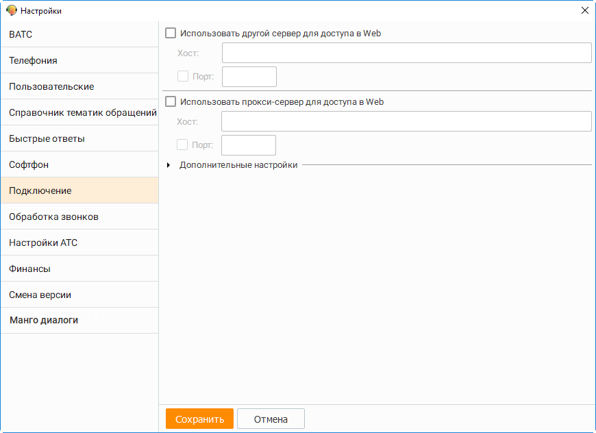

При необходимости использовать настройки другого сервера для доступа в Web установите одноименный флажок. В полях Хост и Порт следует указать URL-адрес хоста и (при необходимости) номер порта сервера Контакт-центра MANGO OFFICE. Чтобы указать порт, установите соответствующий флажок.

| Настройки сервера следует изменять только по рекомендации сотрудников компании |  |  |
| --- | --- | --- |
|  | MANGO OFFICE. Самостоятельное изменение настроек сервера может привести к потере |  |
| работоспособности программы. |  |  |

В случае, когда флаг Использовать другой сервер для доступа в Web установлен, но поля Хост и Порт не заполнены, на экране отображается соответствующее предупреждение. Также если при запуске Контакт-центра MANGO OFFICE система обнаружит установленный флаг, но отсутствие заполненных полей Хост и Порт, то будут использованы настройки по умолчанию. Флажок Использовать прокси-сервер для доступа в Web устанавливается в случае, если в вашей организации для доступа к интернету используется прокси-сервер. Информацию о прокси-сервере вы можете получить у вашего системного администратора. После установки флажка становятся активными дополнительные поля Хост и Порт. В них следует указать URL-адрес или IP-адрес хоста, а также номер порта прокси-сервера, используемого для доступа к интернету.

После изменения настроек необходимо выполнить перезагрузку приложения. Для того, чтобы вернуть значения настроек к изначальным, откройте Дополнительные настройки и нажмите кнопку Вернуться в параметрам по умолчанию. В этом случае будут установлены следующие настройки: • По умолчанию используется хостинг https://api.mangotele.com/v2/ (порт – не указан). • Использовать другой сервер для доступа в Web: Не выбран. • Хост: Не задан. • Порт: Не задан. • Использовать Прокси-сервер для доступа к Web: Не выбран. • Хост: Не задан. • Порт: Не задан. Сохранение настроек выполняется автоматически, если сменился фокус (курсор установлен в другое поле) или по истечении 4 секунд с момента обновления поля. Дополнительные настройки включают: • Период пинга/проверки соединения (с) – Период в секундах, с которым отправляются контрольные пакеты для проверки работоспособности соединения на стороне сервера в случае отсутствия активности соединения. Для медленного (3G) интернета рекомендуется установить значение "5". • Максимальное время ожидания синхронизации данных (с) – максимально допустимое время в секундах для синхронизации данных по пользователям и вызовам на момент установки соединения. Для высоконагруженных Контакт-центров MANGO OFFICE рекомендуется не уменьшать значение этого показателя. • Задержка начала запуска процедуры восстановления соединения (с) – период в секундах между очередными попытками восстановления соединения. Уменьшение значения показателя для быстрых сетей не рекомендуется. • Максимальное время ожидания восстановления соединения (с) – максимально допустимое время в секундах ожидания восстановления соединения в случае разрыва. Допускается увеличение значения показателя для медленных соединений. • Вернуться к параметрам по умолчанию – возврат первоначальных настроек. 2.5.1.3.9. Справочник тематик обращений На данной вкладке осуществляется редактирование списка папок и тематик обращений, применяемых при обработке вызова, при редактировании информации об уже совершенных вызовах, при создании кампании исходящего обзвона, а также для виджетов обратных звонков и т. д.

| Права доступа к вкладке настраиваются в разделе Безопасность и ограничения → |  |  |
| --- | --- | --- |
| [выбрать роль] → Инструменты → Обращения. Для стандартных ролей: |  |  |
| Сотрудник, Бухгалтер, Оператор – доступ закрыт; |  |  |
|  | Супервизор – редактирование тематик всех групп, в которых пользователь является |  |
| супервизором; | супервизором; |  |
| Администратор – редактирование тематик всех групп. |  |  |

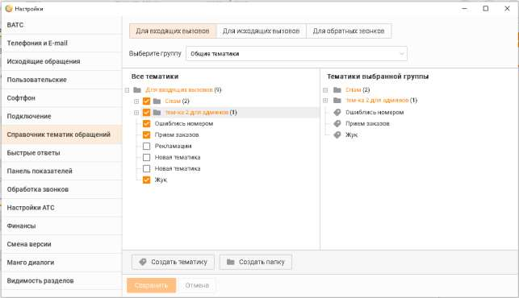

Максимально допустимое количество папок -100, может быть увличено до 500. Для тематик предусмотрен лимит в 500 единиц, который может быть расширен до 1500. Для расширения лимитов обратитесь к персональному менеджеру для подключения соответствующей услуги. Длина названий папок и тематик ограничена 100 символами. Максимальная глубина вложенности структуры не может превышать 5 уровней. Тематики для определенного типа вызова создаются для каждой группы сотрудников. Таким образом, при вызове определенного типа сотруднику будут доступны тематики только одного соответствующего списка. Для обратных звонков тематики создаются для выбранного виджета "Обратный звонок".

| Доступ к вкладке Для обратных звонков возможен только при наличии хотя бы одного |
| --- |
| виджета "Обратный звонок". |

Список в левой части окна содержит все созданные тематики. В правой части окна отображается список тематик, выбранных для текущей группы сотрудников либо виджета "Обратный звонок". Выбор тематик осуществляется при установке флага напротив нужной папки либо тематики. Сохранение изменений выполняется автоматически. Папка или тематика создаются в иерархическом дереве последним элементом текущего элемента – папки либо тематики. Чтобы добавить тематику, нажмите ссылку Создать тематику. Введите название тематики и нажмите клавишу Enter. При этом порядок расположения ранее добавленных тематик и папок сохраняется. Чтобы изменить тематику, выберите ее. Выбранная тематика подсвечивается цветом (см.

пример на рисунке выше). Затем нажмите кнопку либо дважды щелкните левой кнопкой мыши. Измените название тематики и нажмите клавишу Enter.

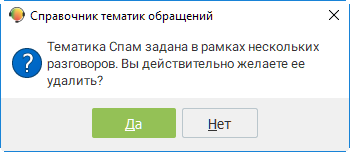

Чтобы удалить тематику, выберите ее и нажмите кнопку . Если тематика была задана в рамках одного или нескольких разговоров, то на экране отображается соответствующее сообщение вида:

| Справочник тематик является единым. Проявляйте повышенную внимательность при |  |  |
| --- | --- | --- |
|  | изменении или удалении тематик. При переносе папки вместе с ней переносятся все ее |  |
| элементы. При удалении папки удаляются все ее элементы. |  |  |

Чтобы изменить положение тематики, используйте кнопки и . В результате положение тематики изменится в рамках одного уровня. Также вы можете воспользоваться механизмом "перетаскивания" тематик, который позволяет создать иерархическое дерево, меняя уровни. Для этого "захватите" тематику и переместите ее на ту тематику, которая станет родительской.

Изменения, внесенные в список тематик, сохраняются автоматически. 2.5.1.3.10. Быстрые ответы На данной вкладке осуществляется редактирование списка быстрых ответов, применяемых при обработке обращений.

| Доступ к вкладке и возможности по редактированию зависят от роли пользователя: |  |  |  |  |
| --- | --- | --- | --- | --- |
|  | Сотрудник, Бухгалтер, Оператор – доступ закрыт; |  |  |  |
|  | Супервизор – редактирование быстрых ответов всех групп, в которых пользователь |  |  |  |
|  | является супервизором; |  |  |  |
| Администратор – редактирование быстрых ответов всех групп. |  |  |  |  |

Список в левой части окна содержит все созданные быстрые ответы. В правой части окна отображается список быстрых ответов, выбранных для текущей группы сотрудников. Выбор быстрых ответов осуществляется при установке флага напротив нужной категории либо быстрого ответа. Сохранение изменений выполняется автоматически.

Категории и быстрые ответы группы "Без группы" будут доступны всем пользователям Категория или быстрый ответ создаются в иерархическом дереве последним элементом текущего элемента. Быстрые ответы без категории отображаются в форме "быстрых ответов" после всех прочих категорий. Чтобы добавить быстрый ответ, нажмите кнопку Создать быстрый ответ. Введите название быстрого ответа и нажмите клавишу Enter. Чтобы добавить категорию, нажмите кнопку Создать категорию. Введите название категории и нажмите клавишу Enter. Чтобы добавить быстрый ответ в определенную категорию, установите курсор на наименование категории и нажмите кнопку Создать быстрый ответ. Созданный ответ будет автоматически добавлен в указанную категорию. Два одинаковых быстрых ответа нельзя добавить в одну категорию, но можно добавить в разные категории. Чтобы изменить быстрый ответ, выберите его. Выбранный быстрый ответ подсвечивается

цветом. Затем нажмите кнопку либо дважды щелкните левой кнопкой мыши. Измените название и нажмите клавишу Enter. Аналогичным образом допускается изменение категории.

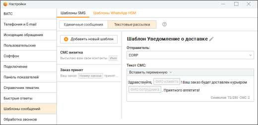

Чтобы изменить положение категории либо быстрого ответа, используйте кнопки и . В результате положение быстрого ответа изменится в рамках одного уровня.

Чтобы удалить быстрый ответ, выберите его и нажмите кнопку .

Чтобы удалить категорию, выберите ее и нажмите кнопку . При этом будут удалены все быстрые ответы данной категории.

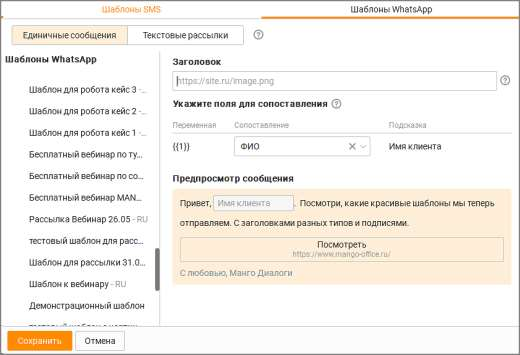

Изменения, внесенные в список быстрых ответов, сохраняются автоматически. 2.5.1.3.11. Шаблоны сообщений Вкладка предназначена для настройки сообщений, отправляемых пользователям по каналам СМС и WhatsApp. Шаблоны СМС Создавать, редактировать и удалять шаблоны могут пользователи, у которых имеется хотя бы

|  | На |
| --- | --- |
| вкладке можно создавать шаблоны как для единичных сообщений, так и для текстовых |  |
| рассылок. |  |

| Если услуга текстовых рассылок не подключена, подвкладка "Текстовые рассылки" не |
| --- |
| отображается. |

Максимальное количество возможных шаблонов – 100. Для расширения лимита необходимо обратиться с запросом к персональному менеджеру.

Добавить новый шаблон – добавление шаблона СМС-сообщения; Наименование шаблона – поле может быть не уникально, максимум 255 символов; Имя отправителя – возможные значения поля устанавливаются в Личном кабинете ВАТС. Значение поля получатель смс-сообщения видит, как имя отправителя. Если отправитель недоступен, сообщение будет отправлено от отправителя, настроенного в ЛК ВАТС по умолчанию.

| ПРИМЕР: |
| --- |
| Пользователь в ЛК ВАТС подключил услугу "Отраслевое имя" и настроил в шаблоне СМС-сообщения |
| отраслевое имя в качестве отправителя. |
| Позже пользователь отключил услугу "Отраслевое имя", но продолжает отправлять СМС на основе |
| этого шаблона. |
| Результат: СМС-сообщения отправляются от отправителя, настроенного в ЛК по умолчанию. |

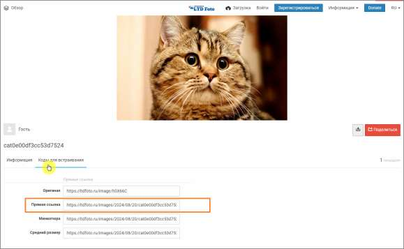

Текст сообщения - максимальное количество символов в поле – 280; Символов:_/280 СМС:_ – данные в правом нижнем углу окна формы содержат информацию: • символов_/280 – количество использованных символов из 280-ти возможных; • СМС:_ – количество СМС-сообщений, на которые будет разбит текст; Одно СМС-сообщение содержит (символов, включая пробелы): • 140 – для латинских символов • 70 – для кириллических символов. Вставить переменную - в качестве переменных можно использовать • все поля адресной книги; • поля ФИО и e-mail из карточки сотрудника, который отправляет сообщение; • два поля из карточки сделки: клиент и ссылка на оплату. Поля из карточки сделки передаются в шаблон только при условии запуска шаблона отправки СМС из сделки. Такой шаблон не требует предварительного создания пользователем, так как создается системой автоматически. Значения переменных будут подставлены при выборе адресата и при отправке сообщения. Одна переменная может быть использована в шаблоне более одного раза. Удалить шаблон – клик по кнопке Удалить приводит к скрытию шаблона из списка шаблонов. Шаблон будет удален без возможности восстановления только после клика по кнопке Сохранить. Нажатие кнопки Отмена отменяет команду удаления шаблона. При сохранении настроек кнопкой Сохранить изменения становятся доступными всем пользователям продукта. Изменения в настройку можно вносить в любой момент. Шаблоны WhatsApp

Для создания HSM-шаблона WhatsApp ознакомьтесь с инструкцией.

| На вкладке отображаются шаблоны как для единичных сообщений, так и для текстовых |
| --- |
| рассылок. |

Вкладка отображается, если у пользователя: • имеется хотя бы одна подконтрольная группа; • в ЛК ВАТС имеется хотя бы один созданный и активный шаблон WhatsApp. Создавать, редактировать и удалять шаблон в Контакт-центре невозможно.

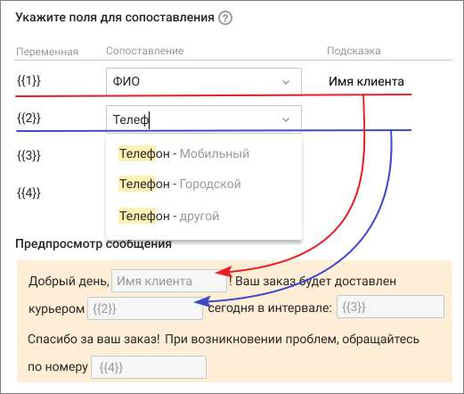

1. Шаблоны WhatsApp – в блоке отображаются наименования категорий и активных шаблонов, созданных в ЛК ВАТС, в "Шаблонах WhatsApp". В Контакт-центре эти данные не редактируются. 2. Заголовок - заголовок, описывающий тип шаблона и указанный при создании шаблона. В поле "Заголовок" Контакт-центра размещается подсказка о типе заголовка: изображение, текст, документ видео. Тип заголовка не подлежит изменению. В поле необходимо вставить прямую ссылку на файл – видео, изображение или документ. Как получить прямую ссылку на изображение Для размещения изображения при создании сообщения на основе шаблона в сообщение необходимо вставить прямую ссылку на файл. Это ссылка, на конце которой указано расширение файла – .jpg, .jpeg, .png Например https://ltdfoto.ru/images/2024/08/20/cat548ba3aa37a77c1a.jpg Для получения прямой ссылки на изображение можно использовать бесплатные облачные файловые хранилища: • imgur.com – для изображений и видео • ltdfoto.ru – для изображений • telegra.ph – для изображений

| Ссылки на файл на Яндекс-диске не подходят, так как они не являются прямыми |
| --- |
| ссылками. |

Пример размещения прямой ссылки на ltdfoto.ru:

Как получить прямую ссылку на видео Для размещения видео при создании сообщения на основе шаблона в сообщение необходимо вставить прямую ссылку на файл. Это ссылка, на конце которой указано расширение файла mp4 для видео. Для получения прямой ссылки на изображение или видео можно использовать бесплатные облачные файловые хранилища: • imgur.com – для изображений и видео

| Ссылки на файл на Yandex-диске не подходят, так как они не являются прямыми |
| --- |
| ссылками. |

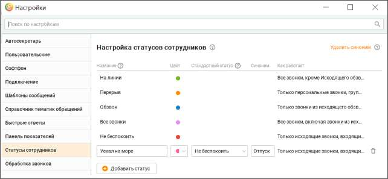

Пример размещения прямой ссылки на imgur.com: 1) Откройте окно добавления видео кликом по кнопке "New post", и добавьте файл. 2) Установите курсор на видео, в правом верхнем углу отобразится пиктограмма "...". Нажмите на нее и в выпадающем списке выберите строку меню "Get share link". 3) В строке "BBCode" скопируйте свою ссылку, удалив теги [] в начале и конце ссылки. 3. Переменная – количество переменных, заданное при создании шаблона. Максимальное количество – 40 переменных. Если в шаблоне нет ни одной переменной, то отображается только текст шаблона. 4. Сопоставление – выпадающий список для сопоставления переменных с контактными данных клиентов и сотрудников Контакт-центра. Переменную можно сопоставить с одним полем в адресной книге (стандартным и пользовательским), с одним полем из карточки сотрудника (ФИО или e-mail) либо полями из карточки сделки (клиент или ссылка на оплату).

| ПРИМЕР |
| --- |
| При ответе клиенту с использованием данного шаблона вместо переменной {{1}} будет |
| подставляться значение поля ФИО клиента из Контактов адресной книги. |
|  |

5. Подсказка – при наведении курсора на строку с переменной отображается пиктограмма

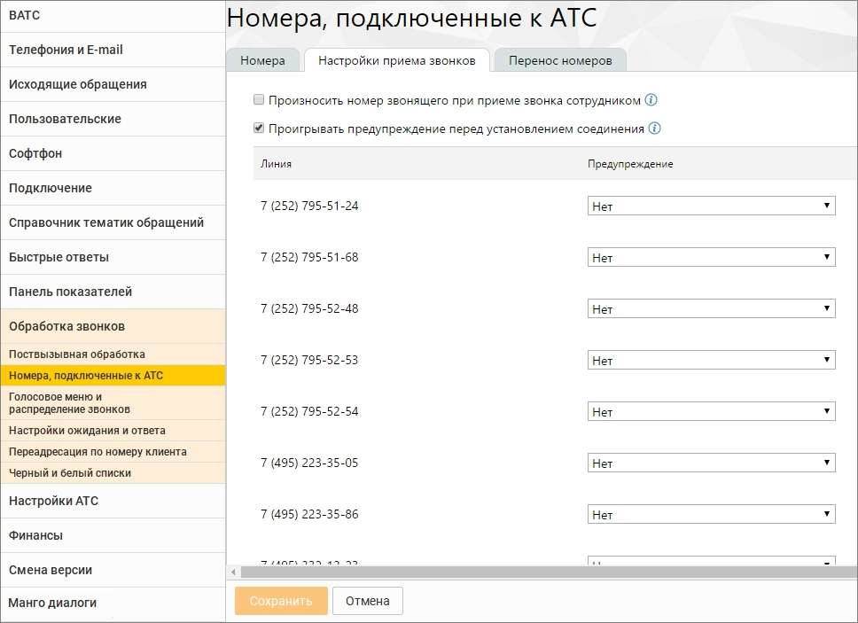

для добавления или редактирования комментария. 6. Предпросмотр сообщения - текст созданного в ЛК ВАТС шаблона, максимальное количество символов -4096. В Контакт-центре сам текст отредактировать невозможно. Возможно только изменить присвоенные переменным значения. 7. Кнопка-ссылка, Кнопка-звонок – текст кнопок, номер телефона и URL ссылки указываются в ЛК ВАТС при создании шаблона с кнопками. В Контакт-центре изменить их невозможно. Клик пользователя, получившего такое сообщение, по кнопке приводит к выполнению соответствующего действия.

2.5.1.3.12. Статусы сотрудников

| Добавление пользовательских статусов возможно, если подключена услуга "Настройка |  |
| --- | --- |
|  | статусов сотрудника". Подключение услуги возможно из приложения Контакт-центр |
| MANGO OFFICE при первом заходе на вкладку. |  |

Вкладка доступна всем пользователям, у которых есть хотя бы одна подконтрольная группа.

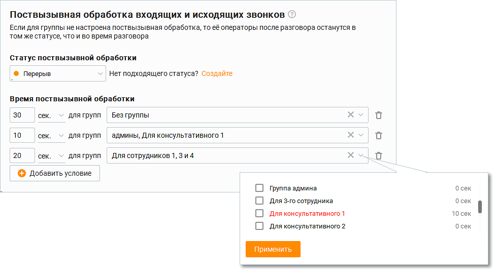

Для создания нового статуса сотрудника заполните поля: • Название – название статуса будет отображаться в аналитике, а также на верхней панели Контакт-центра для выбора текущего статуса пользователем; • Цвет – палитра из 9-ти вариантов цвета; • Стандартный статус – настройка поля определяет возможности телефонии пользовательского статуса; • Синоним – не более 20 символов. Должен быть уникальным в рамках одного Контакт- центра. Как может быть использован синоним:

| Пример 1: |
| --- |
| У пользователя два Контакт-центра. Оба продукта связаны с одной внешней системой. В систему из |
| обоих продуктов нужно передавать статус с единым реквизитом. |
| Наличие синонима позволяет привязываться к синониму статуса, который пользователь может |
| задать одинаковым на своих нескольких Контакт-центрах. |
| Пример 2: |
| Требуется вернуть удаленный статус. При создании статуса заново Контакт-центр сгенерирует новый |
| id. Что не всегда удобно, особенно если во внешней системе используется id старого статуса. |
| Наличие синонима позволяет при удалении статуса, создать новый статус, и ввести тот же синоним |
| что был у удаленного статуса. Соответственно, если есть привязка к синониму, во внешней системе |
| ничего изменять не потребуется. |

Кнопка Удалить синоним/Использовать синоним удаляет или добавляет столбец синонимов. Сохраните внесенные изменения кликом по кнопке Сохранить. Новый статус сотрудника будет активен сразу после сохранения. Созданные пользовательские статусы сотрудников можно отредактировать или удалить. Помимо пяти стандартных, в Контакт-центре могут быть созданы до 30 пользовательских статусов. Все пользовательские статусы учитываются во вкладках Контакт-центра – графиках, таблицах, отчетах, показателях, файлах экспорта и др. – наряду со стандартными. При входе в систему (до авторизации) пользовательский статус не может быть выбран. Доступны только стандартные статусы сотрудников. 2.5.1.3.13. Обработка звонков Данная вкладка содержит блоки настроек телефонных номеров.

| Вкладка отображается, если пользователь имеет хотя бы одну подконтрольную группу или |
| --- |
| роль Администратор. |

Подробное описание настроек приведено в п.4.4 справочника абонента "Виртуальная АТС MANGO OFFICE". 2.5.1.3.13.1. Поствызывная обработка

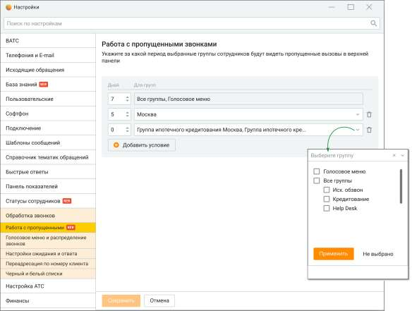

| Вкладка отображается, если пользователь имеет хотя бы одну подконтрольную группу или |
| --- |
| роль Администратор. |

| На вкладке настраивается время, в течение которого операторы группы, завершившие |
| --- |
| разговор, переходят в выбранный статус. |
| По истечении установленного времени поствызывной обработки или при клике по кнопке |
| "Готов к работе" статус текущего оператора группы автоматически возвращается к |
| предыдущему значению. |
| Если выбранный пользовательский статус к завершению вызова удален или в Личном |
| кабинете ВАТС отключена услуга "Пользовательский статус", оператор переходит в статус |
| "Не беспокоить". |
| Максимальное время, в течение которого возможна задержка обновления информации о |
| правилах постзвонковой обработки для операторов группы – 10 минут. |
| Поствызывная обработка применяется при внешних вызовах (в том числе к автоперезвонам и |
| заказу обратного звонка), кроме кампаний Исходящего обзвона. |

Поствызывная обработка применяется только после завершения внешних вызовов: состоявшихся исходящих и принятых входящих. При выходе пользователя из приложения во время поствызывной обработки, она прекращается, т. е. таймер поствызывной обработки останавливается. Пользователь переходит в статус "Не в сети". После повторного входа в приложение таймер поствызывной обработки не запускается.

Кнопка "Добавить условие" открывает поле для добавления нового условия. Группы, для которых условие поствызывной обработки уже настроено, отображаются в выпадающем списке красным цветом. Повторный выбор группы сопровождается системным сообщением о подтверждении назначения нового правила. Если оператор состоит более чем в одной группе, и значения для поствызывной обработки в группах отличаются, то в качестве времени обработки выбирается максимальное время из значений по группам, в которых он состоит.

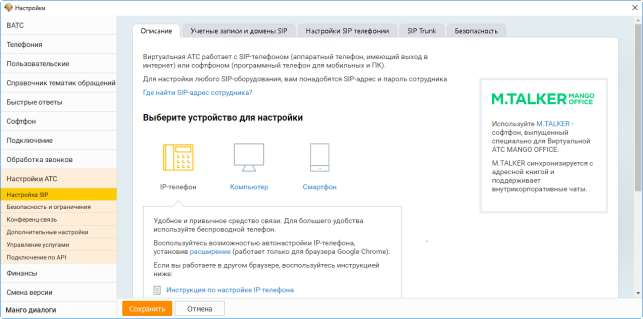

Максимальное количество условий – 50.

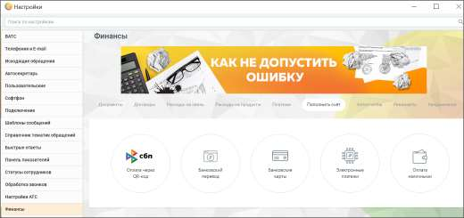

Чтобы удалить условие поствызывной обработки, кликните по пиктограмме (корзина). 2.5.1.3.13.2. Работа с пропущенными Вкладка предназначена для настройки периода отображения пропущенных звонков.

Настройка доступна только пользователям с ролью Администратор. Администратор может настроить период, за которой считает необходимым перезванивать по пропущенным звонка. Таким образом операторы будут работать только по горячим контактам и не тратить время на обработку холодных. Для гибкого обслуживания клиентов, обращающихся в компанию по разным вопросам, возможно настроить различный период отображения для разных групп операторов.

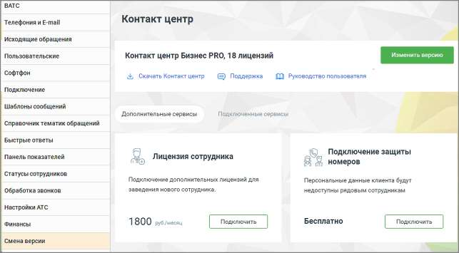

На вкладке пользователю доступны следующие настройки: Дней – количество дней, за которые будут отображаться пропущенные вызовы. Максимальное количество – 7 дней. Для групп – выбор групп, для которых будет действовать правило. Возможен выбор следующих значений: • Все группы и каждая группа отдельно • Голосовое меню Кнопка "Добавить условие" – добавление строки условия. Максимальное количество условий – 10.

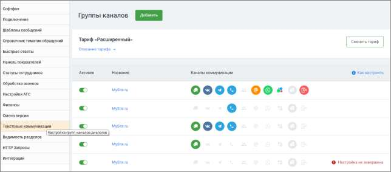

Фильтрация вызовов происходит по группе, пропустившей звонок, а не по вхождению текущего пользователя в группу, которая пропустила звонок. Если пользователь состоит в двух группах, пропустивших звонок, то правило действует с учетом настроек для последней группы, пропустившей звонок. Если звонок пропущен в Голосовом меню, то настройка применяется для всех пользователей на продукте, состоящих в какой-либо группе или нет.

2.5.1.3.14. Настройки АТС Данная вкладка содержит блоки настроек АТС.

Подробное описание настроек приведено в справочнике абонента "Виртуальная АТС MANGO OFFICE". 2.5.1.3.15. Финансы Данная вкладка содержит настройки и инструменты для работы с текущим Лицевым счетом:

Подробное описание настроек приведено в справочнике абонента "Виртуальная АТС MANGO OFFICE".

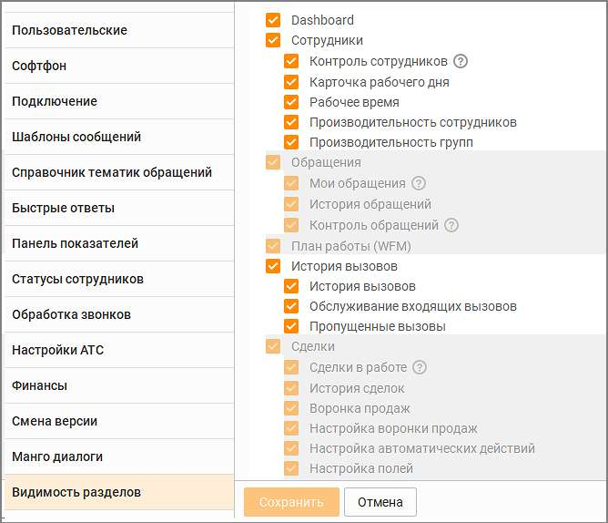

2.5.1.3.16. Смена версии Данная вкладка предназначена для изменения версии и тарифа продукта на другие, согласно потребностям и расходам. А также для подключения дополнительных сервисов.

Подробное описание процесса приведено в справочнике абонента "Виртуальная АТС MANGO OFFICE". 2.5.1.3.17. Текстовые коммуникации Данная вкладка предназначена для работы с группами каналов Текстовых коммуникаций.

На закладке отображается информация о тарифе и список подключенных групп каналов в порядке их создания. Для каждой группы указывается следующее:

• Активность группы с возможностью ее активировать/деактивировать, по умолчанию при создании группа активна. При деактивации не отображается на сайте, сообщения из соц. сетей не поступают.

| Активация/деактивация группы каналов не приводит к подключению или отключению |
| --- |
| услуг. |

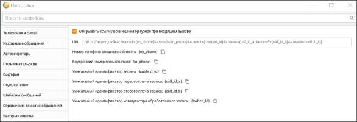

• Название группы каналов – активная ссылка, по нажатию открывается форма редактирования группы; • Список подключенных каналов в виде иконок. При наведении на иконку отображается название канала, а также кто обрабатывает обращения с данного канала (название группы, сотрудника или sip-линии в зависимости от канала). Узнайте больше о настройках и работе Текстовых коммуникаций в Руководстве пользователя. 2.5.1.3.18. Видимость разделов Вкладка предназначена для настройки отображения разделов Контакт-центра MANGO OFFICE Персонализированное рабочее место: Пользователь Личного кабинета MANGO OFFICE с правом "Изменять права доступа сотрудников" (по умолчанию: Руководитель компании и Администратор) может настроить в ЛК рабочие места сотрудников на основании их ролей, что позволяет гибко адаптировать доступные функции для каждой роли. Все настройки сохраняются в облаке (на сервере MANGO OFFICE), что исключает необходимость ручного конфигурирования на каждом компьютере. Преимущества персонализированных настроек: • Настройка рабочего места для новых сотрудников происходит быстрее. • Рабочее место каждого сотрудника соответствует его задачам. • Улучшена производительность за счет отключения ненужных модулей и снижения нагрузки на ПК. Подробнее о настройке Персонализированного рабочего места узнайте в Справочнике ВАТС, раздел Безопасность и ограничения → Настройка доступа. Если у пользователя не подключена услуга на какой-либо модуль или вкладку, то настройка модуля или вкладки не отображается. По умолчанию часть модулей и настроек отключена. Недоступные для изменения в Контакт-центре настройки можно изменить в Личном кабинете MANGO OFFICE, раздел Безопасность и ограничения → Настройка доступа.

После внесения необходимых изменений в доступных настройках, сохраните их, кликнув по кнопке Сохранить. Размещение настроек персонализированного рабочего места в Личном кабинете ВАТС для соответствующих разделов Контакт-центра:

| Видимость разделов в Контакт-центре |  | Настройка доступа в ЛК ВАТС |  |
| --- | --- | --- | --- |
|  |  |  | Расположение в ЛК: |
|  |  |  | Безопасность и ограничения → |
| Категория | Раздел |  |  |
|  |  |  | Настройка доступа → |
|  |  |  |  |
|  |  |  | Инструменты → ... |
| Главное окно |  |  |  |
|  | Пропущенные вызовы (монитор пропущенных вызовов) |  | Инструменты → Управление звонками → Монитор пропущенных |
| Настройки | Статусы сотрудников |  | Инструменты → Управление сотрудниками → Редактирование кастомных статусов |
|  | Софтфон |  | Инструменты → Управление звонками → Использовать внешний телефон / софтфон |

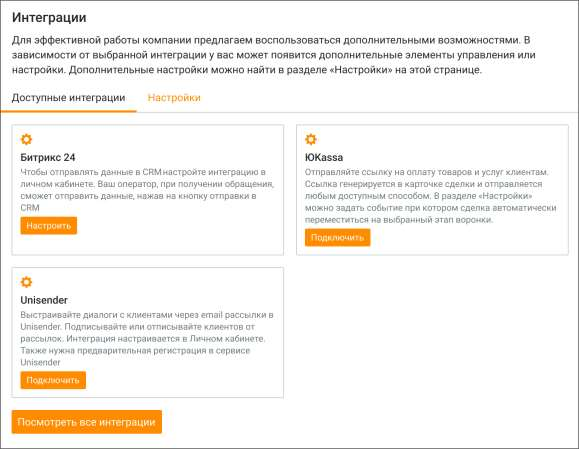

| Dashboard | Виджеты Dashboard | Инструменты → Отчеты Контакт-Центра → Просматривать виджеты Dashboard |
| --- | --- | --- |
| Обращения |  |  |
|  | Мои обращения | Инструменты → Обращения |
|  | История обращений | Инструменты → Отчеты Контакт-Центра → Просматривать классификацию обращений |
|  | Контроль обращений | Инструменты → Обращения → Просматривать вкладку контроль обращений |
| План работы (WFM) |  |  |
|  | График работы, Планирование входящих | Инструменты → WFM → График работы и планирования |
|  | Шаблоны графика работ | Инструменты → WFM → Шаблоны графика работ |
|  | Настройка автоматических действий | Инструменты → WFM → Настройка автоматических действий |
|  | Работа по трудовому договору | Инструменты → WFM → Работа по трудовому договору |
|  | Производственный календарь | Инструменты → WFM → Производственный календарь |
|  | Отчеты | Инструменты → WFM → Отчеты |
| Сделки | Сделки в работе, История сделок | Инструменты → Сделки |
|  | Воронка продаж |  |
|  |  | Инструменты → Сделки → Настраивать воронку продаж |
|  |  | Инструменты → Сделки → Настраивать автоматические действия |
|  |  | Инструменты → Сделки → Настраивать поля в сделках |
| Клиенты |  |  |
|  | Клиенты | Инструменты → Адресная книга |
|  | Организации | Инструменты → Адресная книга |
|  | Настройка полей | Инструменты → Адресная книга → Настраивать поля в адресной книге |

|  | Настройка разрешения на просмотр персональных контактов и звонки персональным номерам | Инструменты → Адресная книга → чекбокс "Коммуникация с персональными контактам (возможность позвонить и написать на персональный контакт)" |
| --- | --- | --- |
| Исходящий обзвон |  | Инструменты → Исходящий обзвон |
| Очередь обращений |  | Инструменты → Обращения → "Очередь обращений" |
|  | Вызовы | Инструменты → Обращения → "Очередь обращений", чекбокс "очередь звонков" |
|  | Чаты | Инструменты → Обращения → "Очередь обращений", чекбокс "очередь текстовых обращений" |
|  | Заказы ОЗ | Инструменты → Обращения → "Очередь обращений", чекбокс "заказы ОЗ" |
| Внутреннее общение |  |  |
|  | Чаты | Инструменты → Сотрудники → Сотрудники и группы → Внутренние чаты |
|  | Комнаты конференций | Инструменты → Настройки АТС → Конференц-связь |
| История вызовов |  |  |
|  | История вызовов | Инструменты → История вызовов |
|  | Пропущенные вызовы | Инструменты → Отчеты Контакт-Центра → Просматривать историю пропущенных вызовов |
|  | Обслуживание входящих вызовов | Инструменты → Отчеты Контакт-Центра → Просматривать обслуживание входящих вызовов |
| Текстовые рассылки |  | Инструменты → Текстовые рассылки |

При изменении доступности разделов в Личном кабинете ВАТС для определенной роли, изменения вступают в силу после перезагрузки Контакт-центра. 2.5.1.3.19. HTTP Запросы Функция предназначена для быстрого заполнения внешней базы данных, а также поиска по базе. При внешнем входящем вызове в браузере открывается заданная ссылка.

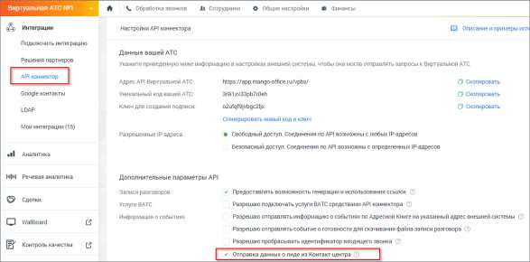

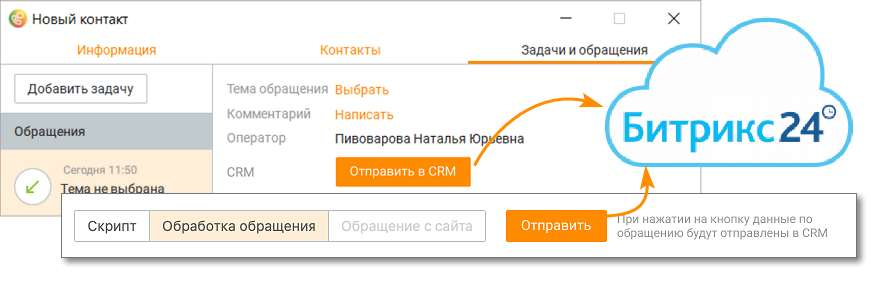

Последовательность настройки функции пользователем: • проставить галочку в чекбоксе, включающем/выключающем работу функции; • прописать целевой url. Сохраните внесенные изменения кнопкой Сохранить. При входящем вызове в заданном по умолчанию браузере будет открыт URL, содержащий вместо переменных следующие номера телефонов: • {ex_phone} – номер телефона внешнего абонента, совершающего вызов; • {in_phone} – внутренний номер пользователя, на который поступает вызов; • {context_id} – уникальный идентификатор звонка; • {call_id_a} – уникальный идентификатор первого плеча звонка ; • {call_id_b}- уникальный идентификатор второго плеча звонка; • {switch_id} – уникальный идентификатор коммутатора, обработавшего звонок.

| Примеры заполнения пользователем поля URL |
| --- |
| http://консалтинг.рф/?ключ1={ex_phone}&ключ2={in_phone} |
| https://investproekt.ru/contact/?ключ1={ex_phone}&ключ2={in_phone} |

2.5.1.3.20. Интеграции

| На вкладке настраиваются интеграции с CRM Битрикс 24, сервисом рассылок Unisender и |  |
| --- | --- |
|  | сервисом приема платежей ЮKassa. Вкладка доступна пользователям с ролью |
| Администратор. |  |

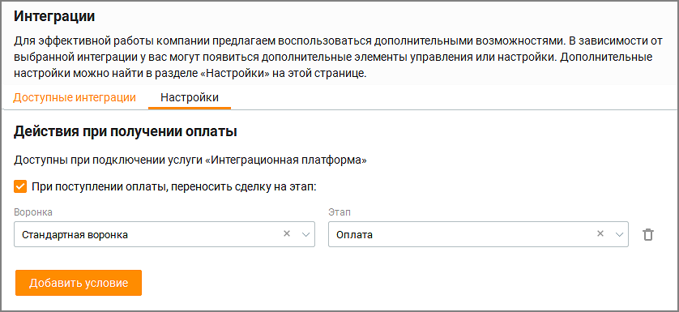

Клик по кнопке "Посмотреть все интеграции" открывает модуль Интеграции в Личном кабинете пользователя ВАТС. В блоках интеграций Битрикс 24, ЮKassa и Unisender в зависимости от статуса подключения, доступны следующие кнопки: • кнопка "Подключить", если услуга не подключена; • кнопка "Настроить", если услуга подключена. Подраздел Настройки вкладки доступен если в ЛК ВАТС подключена услуга ЮKassa.

2.5.1.3.20.1. Битрикс 24 Для отправки данных из Контакт-центра в CRM Битрикс 24 необходимо подключить услугу Интеграции в Личном кабинете пользователя ВАТС, а также настроить API коннектор. Подключение осуществляется в разделе "Интеграции" → кнопка "API коннектор" → подраздел "Дополнительные параметры API". Установите галочку в чекбоксе "Отправка данных о лиде из Контакт-центра". Перезапустите приложение Контакт-центр MANGO OFFICE для обновления настроек.

При подключенной интеграции на вкладке в Контакт-центре отображается уведомление – Услуга подключена. По умолчанию включен режим ручной отправки данных операторами Контакт-центра, кликом по кнопке "Отправить".

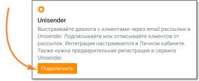

Отправка обращения в Битрикс24 возможна, только если обращение привязано к контакту адресной книги (вкладка Клиенты/Контакты). 2.5.1.3.20.2. ЮKassa

| Настройки подраздела "Настройка" влияют только на интеграцию с ЮKassa и на иные |
| --- |
| интеграции не распространяется. |

При подключении услуги ЮKassa пользователю доступен следующий функционал:

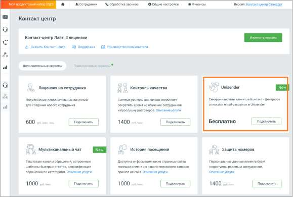

• Настройка интеграции (производятся в Личном кабинете пользователя ВАТС на странице интеграции); • Отправка запроса на формирование ссылки на оплат, из любой сделки в Контакт- центре; • Настройка действий при получении оплаты (вкладка Интеграции/Настройки).

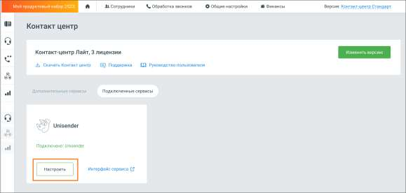

Настройте условия, при которых сделка будет автоматически перемещена на этап воронки при получении оплаты. Доступен выбор следующих условий: • воронка – выбор воронки из списка доступных воронок на продукте; • этап воронки – выбор этапа воронки.

Клик по пиктограмме удаляет условие перемещения сделки. Клик по кнопке Добавить условие добавляет условие. Максимальное количество условий – 5. 2.5.1.3.20.3. Unisender Интеграция Контакт-центра Mango OFFICE с сервисом рассылок Unisender позволяет настроить синхронизацию списков рассылок в Unisender и списков клиентов в Адресной книге, вносить изменения в списки рассылок на стороне Unisender из Контакт-центра.

| Для настройки интеграции необходимо иметь аккаунт в Unisender, а также роль в Контакт- |
| --- |
| центре, с правом настраивать интеграции. |

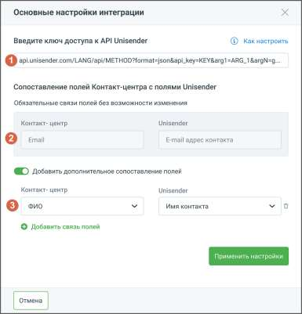

Кликните по кнопке Подключить в блоке Unisender.

Откроется окно Личного кабинета пользователя ВАТС, вкладка "Дополнительные сервисы". Найдите блок "Unisender" и нажмите кнопку Подключить. В открывшемся окне подтвердите согласие на подключение.

Далее на вкладке "Подключенные сервисы" в блоке "Unisender" необходимо произвести настройки интеграции. Нажмите кнопку Настроить.

Откроется окно основных настроек интеграции:

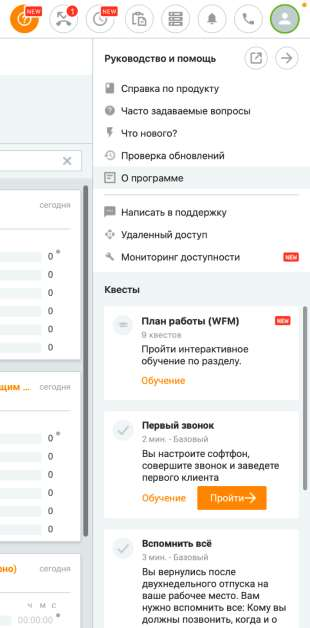

Окно настроек содержит следующие элементы: 1. Поле для ввода ключа доступа – ключ предоставляется на стороне Unisender. Чтобы получить ключ, пройдите по ссылке API-ключ UniSender и выполните указанные в инструкции действия. 2. Информационный блок обязательных связей – связь между указанными полями Контакт- центра и Unisender будет создана автоматически. 3. Блок дополнительной связи – открывается, если переключатель "Добавить дополнительное сопоставление полей" активен. Здесь можно настроить дополнительные связи между полями Контакт-центра и Unisender. Например, передавать в Unisender имя пользователя, для настройки персонализированного обращения в рассылке. Кнопка "Добавить связь полей" добавляет новую связку "Контакт-центр/Unisender". Сохраните внесенные изменения кликом по кнопке Применить настройки. После интеграции доступны следующие действия: • Отписать клиентов (email) – единичная и массовая отписка • Подписать клиентов (email) – единичная и массовая подписка • Создать новый список рассылки • Удалить список рассылки • Изменить наименование списка рассылки 2.5.1.4. Квесты

<!-- изображение на стр. 95: байты не извлечены (PyMuPDF недоступен) -->

| Модуль Квесты доступен при подключении в Личном кабинете соответствующей услуги. |
| --- |
| Для подключения обратитесь к Персональному менеджеру. |

<!-- изображение на стр. 95: байты не извлечены (PyMuPDF недоступен) -->

Список доступных пользователю квестов зависит от его роли и находится в п. "Квесты" в Меню программы.

<!-- изображение на стр. 95: байты не извлечены (PyMuPDF недоступен) -->

В пункте меню значком отображается количество не пройденных пользователем квестов. Квесты, пройденные в режиме обучения, считаются не пройденными. Если у пользователя

<!-- изображение на стр. 95: байты не извлечены (PyMuPDF недоступен) -->

имеется хотя бы один не пройденный квест, на аватаре профиля отображается значок . При нажатии на иконку профиля, и далее на строчку меню Квесты открывается окно с блоком квестов.

<!-- изображение на стр. 95: байты не извлечены (PyMuPDF недоступен) -->

В списке квестов отображаются следующие данные:

<!-- изображение на стр. 96: байты не извлечены (PyMuPDF недоступен) -->

• Состояние квеста – "Заново" или "Пройти"; • Название квеста; • Описание квеста; • Максимальное время прохождения квеста; • Уровень сложности квеста – "Базовый", "Средний", "Продвинутый"; • Фактическое время выполнения – в формате ММ:СС, только для квестов в состоянии "Пройден". Если квест был пройден несколько раз, отображается минимальное время прохождения из всех попыток;
