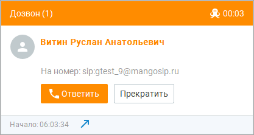
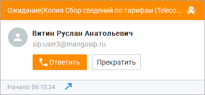
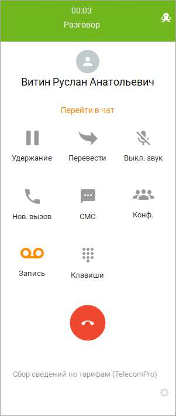

# 11.6. Карточка вызова

Вид карточки входящего вызова во время дозвона абоненту зависит от выбранного режима обзвона: При режиме "Одновременно оператору и абоненту":

При режиме "Сначала оператору, потом абоненту":

Также внешний вид карточки вызова при дозвоне зависит от источника данных: если контакт был найден во внешнем справочнике. Карточка разговора выглядит следующим образом:

После завершения вызова, в зависимости от установленного значения в поле "Поствызывная обработка" при добавлении кампании, сотруднику может быть предоставлено время для поствызывной обработки вызова. В течение этого времени новые вызовы на оператора не распределяются. Предусмотрена возможность инициировать готовность принятия следующего вызова, не дожидаясь времени поствызывной обработки. Для этого следует нажать кнопку "Не ждать" во всплывающем уведомлении.

