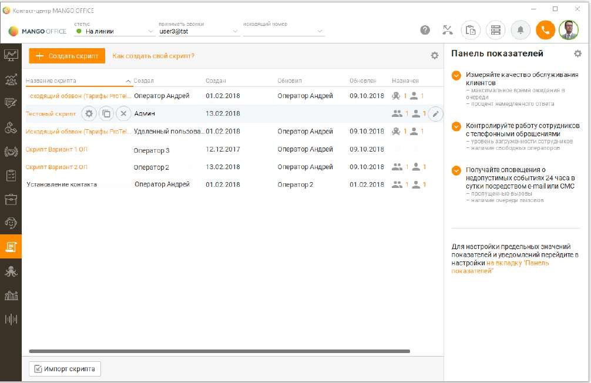
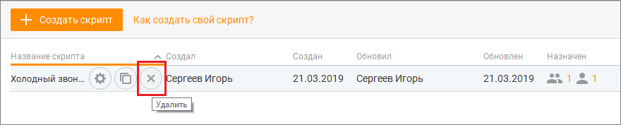
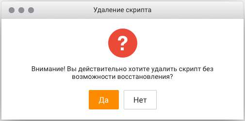

# 12.1. Список скриптов

> Трассировка: PDF §12.1 · сквозные стр. 377-379 · источники: ч.1 `kb/sources/mango-cc-manual/CC_manual_1.26.23_compressed.pdf` с.377-379.

При запуске модуль "Скрипты" открывается на списке скриптов. Вид рабочей области программы приведен на рисунке ниже.

Какие поля содержит таблица Список скриптов отображается в виде таблицы со следующими полями: 1. Название скрипта – название скрипта, заданное при создании; 2. Создал – ФИО оператора, создавшего скрипт; 3. Создан – дата и время создания скрипта; 4. Обновил – ФИО оператора, обновившего скрипт; 5. Обновлен – дата обновления скрипта; 6. Назначен – количество сотрудников, групп сотрудников или кампаний исходящего обзвона, на которые назначен текущий скрипт. Вы можете самостоятельно выбрать, какие столбцы будут отображаться на панели. Для этого

щелкните левой кнопкой мыши по пиктограмме и установите/снимите флаги напротив наименований столбов. Как открыть скрипт Для этого следует щелкнуть левой кнопкой мыши по названию скрипта. Если по скрипту был выполнен хотя бы один проход, то есть выбор хотя бы одного варианта ответа клиента или внесение хотя бы одного комментария к ответу клиента, то при щелчке по наименованию скрипта выполняется переход к просмотру прохождения скрипта. В противном случае выполняется переход к форме настройки скрипта. Как добавить скрипт Для добавления нового скрипта нажмите кнопку Добавить скрипт. Шаги по добавлению нового скрипта описаны в подразделе "Создание скрипта". Для добавления нового скрипта на базе существующего наведите курсор на строку с нужным скриптом и щелкните по пиктограмме "Копировать".

Также можно импортировать скрипт. Для этого нажмите кнопку Импорт скрипта в нижней части рабочей области. Как удалить скрипт Для этого наведите курсор на строку скрипт, который следует удалить, и щелкните по пиктограмме Удалить. Во всплывающем окне подтвердите свое согласие на удаление.

| При удалении скрипта удаляются все его версии. Статистика по версиям скрипта не |
| --- |
| удаляется. |

Удаленный скрипт может быть использован сотрудником в разговоре или вне разговора в случае, если скрипт был удален после того, как он был выбран. Выбрать удаленный скрипт сотрудник не может. Если скрипт удаляется во время внесения правок (например, другим пользователем) и сохраняются изменения, то создается новый скрипт.
