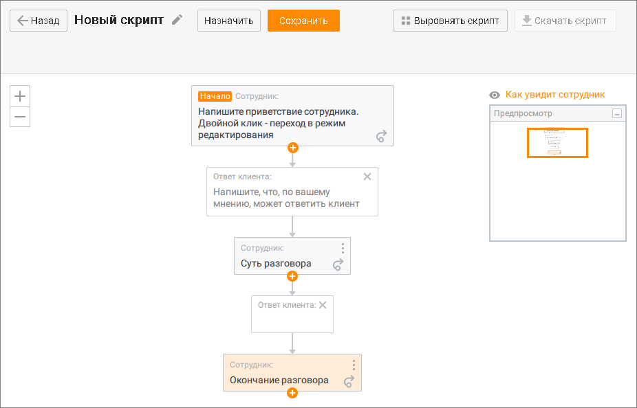
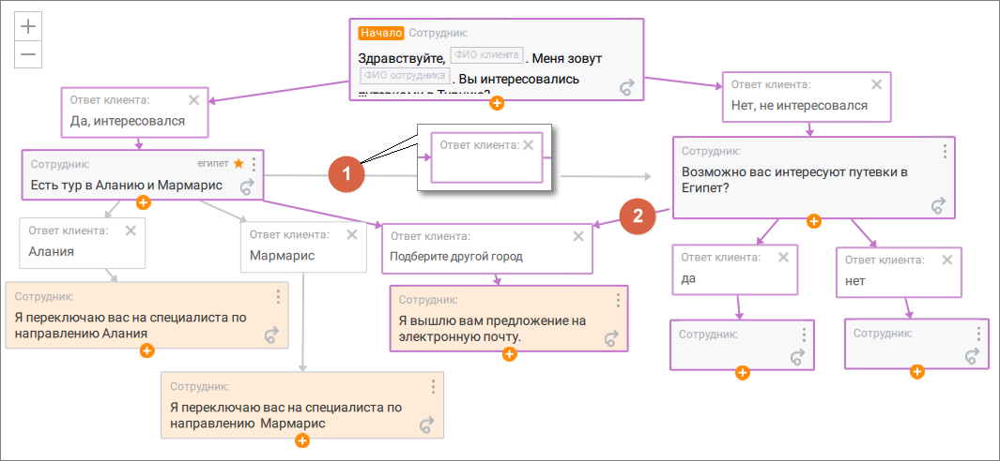
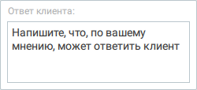
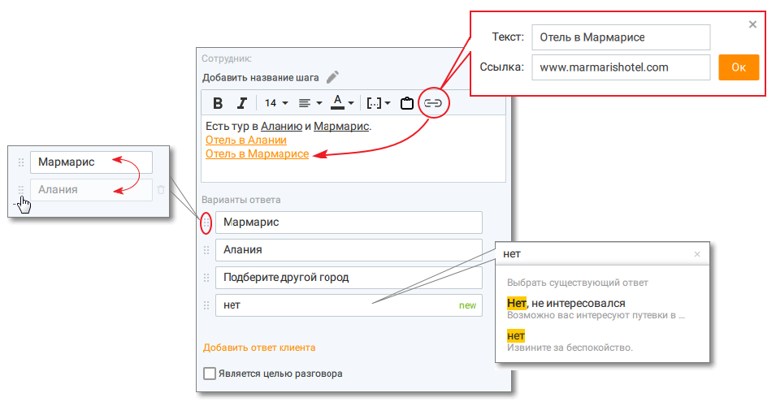
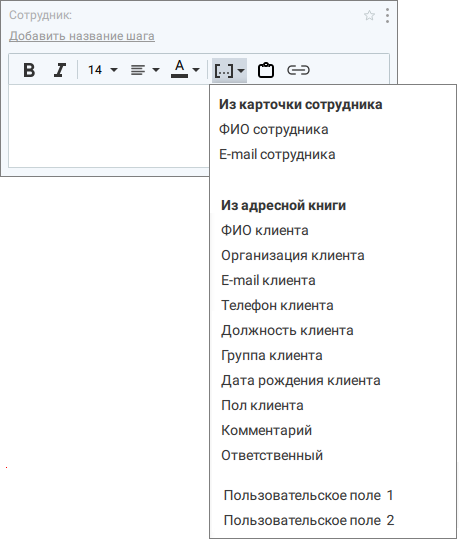
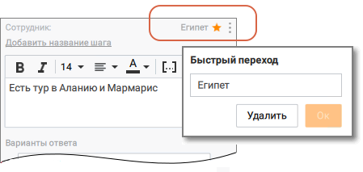
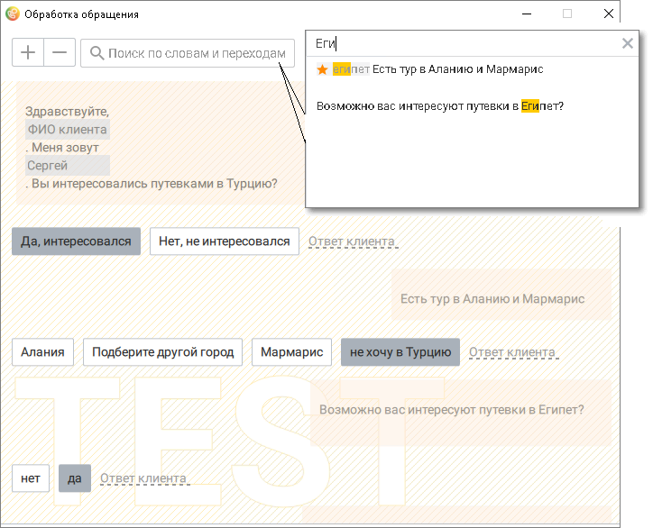
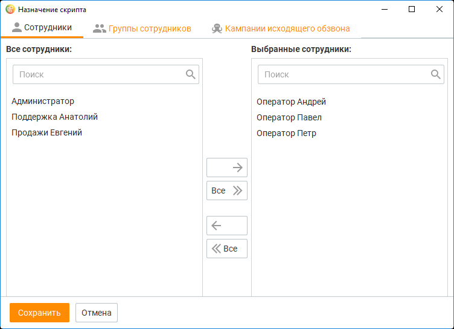
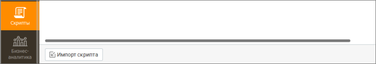
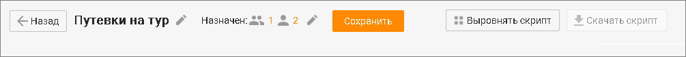

# 12.2. Создание, импорт, экспорт скрипта

> Трассировка: PDF §12.2 · сквозные стр. 379-387 · источники: ч.4 `kb/sources/mango-cc-manual/CC_manual_1.26.23-part-4.pdf` с.76-84.

Для добавления нового скрипта откройте модуль "Скрипты" и нажмите кнопку Создать скрипт. Основная часть по созданию нового скрипта заключается в настройке шаблона разговора — набора реплик сотрудников и возможных вариантов ответов клиентов. При создании нового скрипта шаблон по умолчанию содержит несколько блоков, набор и положение которых можно редактировать.

Для перемещения блоков наведите курсор на блок, зажмите левую кнопку мыши и переместите блок на нужную позицию, после чего отпустите кнопку мыши. Для удобства навигации предусмотрены кнопки изменения масштаба схемы в левой части окна и окно предпросмотра схемы в правой. Масштаб текущего окна выделяется в окне предпросмотра зеленой рамкой. При перемещении рамки изображение на экране также перемещается. Также предусмотрены "горячие" клавиши управления масштабом: ОС Windows: • комбинация "Ctrl" и "+", а также сочетание зажатой клавиши Ctrl с вращением колеса мыши в сторону увеличения аналогичны нажатию кнопки "+"; • сочетание клавиш "Ctrl" и "-", а также сочетание зажатой клавиши Ctrl с вращением колеса мыши в сторону уменьшения аналогичны нажатию кнопки "-". ОС macOS: • сочетание клавиш cmd и "+" аналогично нажатию кнопки "+"; • сочетание клавиш cmd и "-" аналогично нажатию кнопки "-". Блоки делятся на два типа: ответ сотрудника и ответ клиента. Блок с ответом клиента является промежуточным и всегда должен заканчиваться ответом сотрудника. Блок с приветствием сотрудника, с которого начинается разговор, отмечен подписью "Начало". Данный блок в сценарии существует в единственном экземпляре и не подлежит удалению.

Для добавления новых блоков щелкните по пиктограмме в блоке с ответом сотрудника. В результате данная ветвь разговора будет дополнена двумя блоками с ответами клиента и сотрудника соответственно. При этом вышестоящий блок с ответом сотрудника может включать несколько цепочек в зависимости от ответа клиента. В свою очередь, каждая из этих цепочек также может включать несколько ответвлений, и так далее, что позволяет учесть разнообразные варианты ответов клиента и настроить скрипт разговора максимально подробно.

Возможен случай, когда ответ клиента из одной ветви скрипта разговора подразумевает ответ сотрудника из другой. Для того, чтобы настроить такую связь, следует щелкнуть левой

кнопкой мыши по пиктограмме в блоке с ответом сотрудника и навести появившуюся стрелку на другой ответ сотрудника. В результате построения связи между: 1) ответ сотрудника --> ответ сотрудника – в схему между ними будет автоматически добавлен блок с ответом клиента, заполните его текстом. 2) ответ сотрудника --> ответ клиента – создается стрелка связи, новые блоки не добавляются.

Также возможны случаи, когда скрипт не содержит нужного ответа клиента. В этом случае сотрудник во время обработки обращения как в момент вызова, так и после его завершения может самостоятельно добавить ответ клиента. В дальнейшем это поможет дополнить скрипт дополнительными вариантами ответов клиентов. Предусмотрена возможность выделения нескольких блоков и связей между ними при помощи прямоугольной области, очерчиваемой мышкой. Выделение позволяет осуществить: • копирование выделенных блоков с ответами и связей в буфер обмена; • вставка блоков с ответами и связей между ними в текущий и/или в другой скрипт; • удаление выделенных блоков и связей между ними; • перетаскивание выделенных блоков и связей между ними. При двойном щелчке левой кнопкой мыши блок разворачивается для ввода текста. Форма ввода текста ответа клиента:

Ответ клиента может иметь несколько входящих связей из разных ответов сотрудника и одну исходящую в один ответ сотрудника. Завершение редактирования текста выполняется при щелчке левой кнопкой мыши за пределами блока.

Форма ввода текста ответа сотрудника:

Для данной формы предусмотрены дополнительные возможности по форматированию текста: • добавление названия шага – по названию шага может осуществляться поиск в процессе прохождения скрипта сотрудником. • выделение текста жирным шрифтом; • выделение текста курсивом; • выбор цвета текста; • использование переменной;

| добавление ссылки; |
| --- |
| изменение размера шрифта; |
| выравнивание текста; |

• поля для добавления ответа клиента. При наведение на поле появляется корзина для удаления ответа. До завершения редактирования формы удаленное поле ответа клиента можно восстановить. При вводе уже существующего в скрипте варианта ответа всплывает окно со списком аналогичных вариантов. При выборе одного из предложенных вариантов к нему будет создана связь. При вводе нового варианта ответа он помечается, как new. • флаг "Является целью разговора". При установленном флаге считается, что цель разговора достигнута, если в разговоре был использован ответ сотрудника, указанный в данном блоке. Блок с установленным флагом в общей схеме выделяется другим цветом. Допускается одновременное наличие нескольких "целевых" блоков с ответом сотрудника.

Для перемещения вариантов ответа клиента установите курсор на пиктограмме и, удерживая левую кнопку мыши в нажатом состоянии, переместите ответ на нужный уровень. Вместо переменной при обработке скрипта подставляется определенное значение в соответствии с оператором и клиентом каждого вызова. В блоке с ответом сотрудника отображается наименование переменной. Для ответа сотрудника предусмотрены следующие переменные:

В случае, когда одной переменной соответствует несколько значений (телефон, E-mail), то подставляются все значения. Первым отображается значение, содержащее основной телефон/E-mail.

Клик по кнопке приводит к вставке текста из буфера без форматирования. При редактировании скрипта пользователю доступны также создание, редактирование и удаление заголовка ответа сотрудника для быстрого перехода. 1) Клик по кнопке Звездочка открывает поле для создания заголовка быстрого перехода.

Кнопка отображается в сером цвете , если шагу не назначен заголовок для быстрого

перехода, и в желтом цвете , если заголовок назначен. Заголовок предназначен для быстрого перехода к данному шагу скрипта с любого шага. Максимальная длина заголовка 100 символов.

При проходе скрипта в один и тот же шаг можно перейти не более 10 раз. 2) Кнопка OK для сохранения заголовка быстрого перехода. 3) Кнопка Убрать быстрый переход для удаления заголовка быстрого перехода.

4) Клик по кнопке приводит к отображению меню управления шагом, где можно выбрать один из вариантов Копировать ветку или Удалить шаг.

Завершение редактирования текста выполняется при щелчке левой кнопкой мыши за пределами данного блока. После завершения редактирования скрипта следует сохранить изменения, нажав кнопку Сохранить.

| Максимальное количество скриптов – 100. Максимальное количество ответов клиентов – |
| --- |
| 100. Для изменения этих значений свяжитесь с вашим персональным менеджером. |

Предварительный просмотр скрипта Во время редактирования скрипта вы можете воспользоваться функцией предварительного просмотра созданного шаблона, чтобы увидеть его так, как он будет представлен назначенному сотруднику во время вызова. Для этого щелкните по ссылке "Как увидит сотрудник", расположенной над окном предпросмотра. В результате на экране будет отображен скрипт в том составе, в котором он был на момент щелчка по ссылке, а не в сохраненном состоянии.

Данная форма предназначена для того, чтобы сотрудник мог заранее ознакомиться со своими репликами и возможными ответами клиента. Для того, чтобы перейти к редактированию текста определенного блока, необходимо навести

на него курсор и щелкнуть по появившейся в блоке пиктограмме . После того, как был просмотрен хотя бы один ответ клиента, данная версия скрипта перестает быть новой для текущего сотрудника. В правой верхней части скрипта находятся кнопки:

• Выровнять скрипт – клик по кнопке приводит к выравниванию скрипта относительно вертикальной и горизонтальной оси; • Скачать скрипт – кнопка экспорта скрипта (подробнее см. ниже "Экспорт скрипта"). Если в скрипте имеются несохраненные изменения, кнопка неактивна. • Статистика – просмотр статистики прохождений скрипта. Кнопка отображается только для скриптов, пройденных сотрудниками хотя бы единожды. Назначение скрипта

Назначение скрипта выполняется как на шаге создания нового скрипта, так и при дальнейшем его редактировании. Для того, чтобы назначить скрипт, нажмите Назначить.

Назначение скрипта допускается: • на определенных сотрудников — скрипт отображается во всех вызовах (входящих, исходящих, звонках по заказам обратных звонков) всем выбранным сотрудникам, если вызов не является внутренним; • на группы сотрудников — скрипт отображается во всех входящих внешних вызовах, распределенных с указанных групп на их сотрудников; • на кампании исходящего обзвона с участием оператора — скрипт отображается во всех вызовах в рамках кампании. Допускается одновременный выбор назначенных как из сотрудников, так и из групп и кампаний. В случае, когда сотрудник указан в назначенных несколько раз (например, скрипт назначен на сотрудника и на группу, в состав которой входит указанный сотрудник), то скрипт отображается сотруднику только один раз. Для оперативного назначения сотрудников предусмотрен фильтр: по мере ввода символов осуществляется фильтрации текущего списка сотрудников. Импорт скрипта Нажмите кнопку Импорт скрипта в нижней части рабочей области. Выберите место хранения файла импорта с расширением .SCRIPT и нажмите кнопку Выбрать. После

успешного импорта новый скрипт отобразится в таблице доступных скриптов. В качестве автора указывается текущий пользователь.

Если скрипт импортировать не удалось, отображается окно уведомления: Не удалось импортировать скрипт. Проверьте файл и попробуйте еще раз. Экспорт скрипта Для экспорта доступны следующие данные: • Начало разговора • Сотрудник • Цель достигнута (да/нет) • Ответы сотрудников • Ответы клиентов • Другие ответы клиентов Экспортируется весь контент прохода: вопросы клиента, выбранные сотрудником ответы-кнопки, а также текстовые ответы клиентов, внесенные оператором вручную. Выберите скрипт, подлежащий экспорту, и щелкните левой кнопкой мыши по пиктограмме Настройки. Нажмите кнопку Скачать скрипт в окне настроек скрипта.

В появившемся окне Сохранить как выберите имя и путь сохранения файла, и нажмите кнопку Сохранить. После этого данные сохраняются в файл с расширением .SCRIPT. Кнопка для скачивания скрипта доступна пользователям, обладающим соответствующими правами. Подробнее см. в Приложении 2 "Роли и права доступа Контакт-центра", вкладка "Скрипты".
