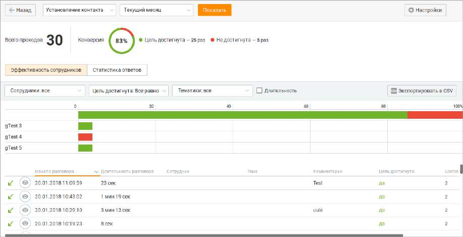
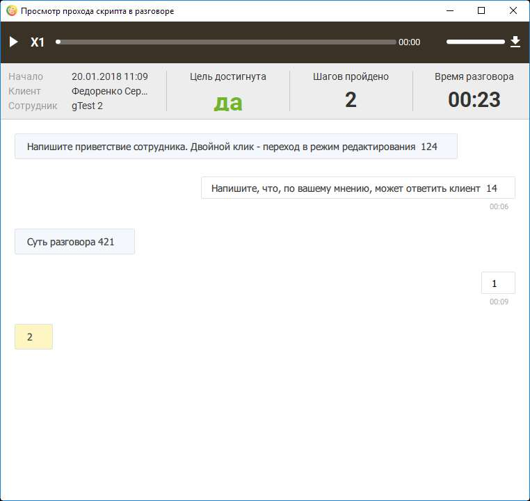

# 12.3.1. Эффективность сотрудников

> Трассировка: PDF §12.3.1 · сквозные стр. 387-390 · источники: ч.1 `kb/sources/mango-cc-manual/CC_manual_1.26.23_compressed.pdf` с.387-390.

Выбор скрипта и период, за который будут получены статистические данные, указываются в шапке отчета. При выборе другого скрипта и/или изменении периода нажмите кнопку Показать для формирования отчета по новым условиям. В верхней части окна отображается общее количество проходов выбранного скрипта вне зависимости от его версии в течение указанного периода. Круговой график конверсии отображает процентное отношение количества проходов скрипта, в которых хотя бы один сотрудник достиг хотя бы одной цели выбранной версии скрипта, к общему количеству проходов скрипта выбранной версии.

Основная часть отчета содержит статистические сведения в табличном виде по каждому назначенному сотруднику. При щелчке по графику отображается подробная информация по соответствующему сотруднику.

| Для пользователей Личного кабинета с ролью "Руководитель компании", а также ролей, |  |  |
| --- | --- | --- |
|  | созданных на ее основе, предусмотрена возможность ограничения доступа остальных |  |
|  | пользователей к просмотру записей своих разговоров. Для настройки ограничений следует |  |
| воспользоваться виджетом "Настройки личной защиты" рабочего стола. |  |  |

В нижней части отчета отображается таблица со всеми вызовами, в которых был совершен проход по текущему скрипту в указанный период. Элементы таблицы • Начало разговора -дата и время начала разговора; • Длительность разговора – длительность вызова; • Сотрудник – ФИО сотрудника, совершившего или принявшего вызов; • Клиент – номер телефона или ФИО клиента из адресной книги; • Тема – тематика вызова; • Комментарии – комментарий к вызову; • Цель достигнута – "да", если за проход скрипта достигнута хотя бы одна цель. Иначе – "нет". • Шагов пройдено (внесено других ответов клиента) – количество пройденных шагов скрипта и количество внесенных комментариев. Фильтр по сотрудникам

Для того, чтобы отобразить статистику по определенным сотрудникам, следует открыть выпадающий список "Сотрудники" и установить флаги напротив имен нужных сотрудников. Формирование отчета по измененному списку сотрудников выполняется автоматически. Фильтр по достижению цели Для того, чтобы отфильтровать статистику по достижению цели, следует открыть выпадающий список "Цель достигнута" и выбрать нужное значение. Формирование обновленного отчета выполняется автоматически. Фильтр по длительности разговора Для того, чтобы отфильтровать статистику по длительности разговора, включите настройку Длительность и укажите длительность разговора в полях От и До. Формирование обновленного отчета выполняется автоматически. Для просмотра выбранных ответов сотрудника и клиента во время разговора наведите курсор

на строку нужного вызова и щелкните по пиктограмме . В результате отобразится форма прохождения скрипта, содержащая все ответы.

При наличии записи разговора в верхней части формы содержится панель встроенного плеера.

В основной части формы отображается прохождение версии скрипта, которая была использована в разговоре. При прослушивании записи скрипт проматывается вместе с проигрыванием записи. Таким образом, на экране всегда отображается ответ сотрудника и следующий за ним ответ клиента и комментарий (при его наличии), которые соответствуют метке времени на записи вызова. При установке бегунка записи в какое-либо состояние скрипт прокручивается к соответствующему месту. Если запись началась через некоторое время после начала разговора и до начала записи сотрудник выбрал хотя бы один ответ клиента или оставил комментарий, то при инициировании проигрывания записи скрипт проматывается к тому блоку (ответ оператора + ответ клиента + комментарий), который соответствуют временной метке начала записи относительно начала разговора. Ответ сотрудника, который является целью, выделяется цветом. Для редактирования блока с ответом сотрудника или клиента следует навести курсор на

нужный блок и щелкнуть по пиктограмме . В результате выполняется переход к форме

| редактирования скрипта. |
| --- |
| Экспорт статистики |
| Для экспорта доступны следующие данные: |

| Начало разговора; |
| --- |
| Длительность разговора; |
| Сотрудник; |
| Клиент; |
| Тема; |
| Комментарии; |
| Цель достигнута; |
| Шагов пройдено |
| Внесено других ответов клиента. |
