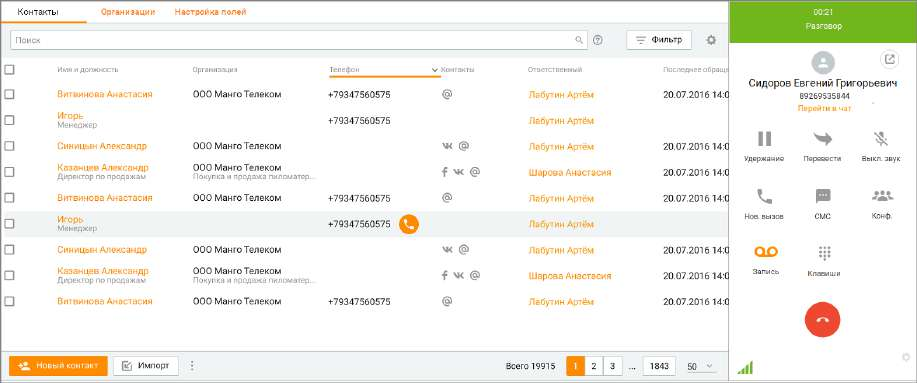

# 2.5. Панель управления телефонией

> Трассировка: PDF §2.5 · сквозные стр. 46-49 · источники: ч.1 `kb/sources/mango-cc-manual/CC_manual_1.26.23_compressed.pdf` с.46-49.

Помимо базовых возможностей телефонии (прием входящих вызовов, совершение исходящих вызовов, постановка вызовов на удержание), Контакт-центр MANGO OFFICE предоставляет дополнительные возможности управления вызовами.

| На данный раздел распространяется возможность скрытия номера клиента. Узнать больше |
| --- |
| здесь. |

Более подробно эти функциональные возможности рассмотрены в последующих подразделах. • Совершение исходящих вызовов; • Прием и классификация входящих вызовов; • Перевод вызовов;

• Постановка вызовов на удержание; • Организация конференций; • Отправка СМС; • Настройка гарнитуры во время разговора; • Оперативное создание и редактирование контактов; • Запись разговоров; • Использование DTMF-команд;

Для того, чтобы развернуть панель телефонии, нажмите на верхней панели. На рисунке ниже приведен пример развернутой панели управления телефонией в состоянии разговора.

На панели отображается информация о номере, с которого поступил вызов. В случае, когда номер принадлежит клиенту адресной книги, то вместо номера отображается имя клиента. При щелчке по имени выполняется переход к карточке клиента.

| На нижней границе панели софтфона располагается блок с информацией о звонке: номер |
| --- |
| сотрудника, название компании Исходящего обзвона, DID номер и т. д. При этом |

разделе ЛК ВАТС/Номера, подключенные к АТС поле "Комментарий" к номеру телефона или SIP-Trunk, на который пришел вызов, заполнено, то в карточке входящего вызова комментарий отображается вместо номера. Все данные собеседника, отображаемые на панели софтфона, можно скопировать: номер телефона, имя контакта, организация, должность.

| В рамках компаний исходящего обзвона предусмотрена возможность скрытия номеров |  |  |
| --- | --- | --- |
|  | клиентов от сотрудников. Данная возможность является опциональной и подключается |  |
| только через персонального менеджера. |  |  |

Для отображения клавиатурного блока на панели в ходе разговора нажмите кнопку Клавиши , чтобы ввести в тоновом режиме необходимую команду: донабор номера, перевод вызова, организация конференций. Чтобы скрыть клавиатурный блок, нажмите кнопку еще раз.

Кнопки для открепления и закрепления клавиатурного блока. Окно с открепленным блоком может быть расположено в любом месте рабочего стола, и отображается поверх всех окон.

Клик по кнопке приводит к скрытию блока.

Описание действия кнопок и приведено в подразделе Настройка гарнитуры во время разговора.

| Более подробная информация о командах для ввода с клавиатуры приведена в подразделе |  |  |
| --- | --- | --- |
|  | Использование DTMF-команд. |  |

Во время разговора в нижней части панели отображается пиктограмма анализатора,

указывающая на уровень качества связи. При наведении курсора на пиктограмму отображается подсказка.

