# Прохождение квеста – это пошаговое выполнение пользователем ключевых действий.

> Трассировка: PDF §2.5 · сквозные стр. 96-116 · источники: ч.1 `kb/sources/mango-cc-manual/CC_manual_1.26.28.1.pdf` с.96-116.

Прохождение квестов позволяет сотруднику получать Достижения. • За успешное прохождение одного квеста сотруднику даётся достижение Знаток и значок

. • За успешное прохождение всех квестов сотруднику даётся достижение Знаток и значок

. Режим обучения Пользователь может пройти квест в режиме обучения, нажав на кнопку "Обучение" в списке квестов. Пользователь может приостановить выполнение квеста на любом шаге нажатием на

кнопку , и продолжить позже. Также возможно повторное прохождение квеста в режиме обучения. Время выполнения квеста не ограничено. Режим "квест"

Нажатие на кнопку приводит к завершению прохождения квеста. Впоследствии прохождение начинается сначала. Время выполнения квеста ограничено. По истечении времени выполнения квест прерывается и считается не выполненным. На каждом шаге

выполнения квеста пользователь может вызвать подсказку нажатием на кнопку . Количество подсказок ограничено. При использовании всех подсказок, далее подсказки в рамках данной попытки прохождения квеста недоступны.

Если все ключевые действия квеста выполнены, пиктограмма меняется на , и квест считается пройденным. Квесты Контакт-центра периодически обновляются и дополняются. Примеры квестов: Квест "Клиент всегда прав"

| № | Наименование шага | Ключевое действие |
| --- | --- | --- |
| шага |  |  |
| 1 | Установите статус "Обзвон" | Установка статуса "Обзвон". Если статус "Обзвон" уже был установлен ранее, требуется повторный выбор того же статуса |
| 2 | Откройте меню профиля | Клик по кнопке "Профиль сотрудника" |
| 3 | Перейдите к настройкам | Клик в пункте "Настройки" |
| 4 | Откройте настройки софтфона | Клик в пункте меню "Софтфон" в окне настройки профиля |

| 5 | Перейдите к настройкам звука и настройте гарнитуру и микрофон | Клик по кнопке "Настройки звука" |
| --- | --- | --- |
| 6 | Проверьте микрофон и динамик, отрегулируйте громкость | Нажатие на кнопку "Далее" в окне подсказки |
| 7 | Откройте софтфон | Нажатие на кнопку вызова софтфона |
| 8 | Сделайте пробный звонок на номер своего мобильного телефона, которого нет в адресной книге | Нажатие на кнопку "Вызов" Система начинает дозвон по набранному номеру. В случае некорректно набранного номера переход к следующему шагу не происходит |
| 9 | Примите свой собственный звонок (с мобильного телефона) и завершите вызов | Завершение вызова любым способом |
| 10 | Перейдите в раздел "Обращения" | Переход в раздел "Обращения" |
| 11 | Посмотрите обращение, созданное в ответ на ваш звонок в разделе "Мои обращения" | Клик по вкладке "Мои обращения" |
| 12 | Создайте нового клиента из карточки обращения, внесите информацию о клиенте | Нажатие на кнопку "Создать клиента" |
| 13 | Перейдите к обработке обращения во вкладке "Обработка обращения" | Клик по вкладке "Обработка обращения" |
| 14 | Укажите тему обращения, добавьте комментарий, сохраните изменения | Нажатие на кнопку "Сохранить" |

Квест "Вспомнить все"

| № | Наименование шага | Ключевое |
| --- | --- | --- |
| шага |  | действие |
| 1 | Откройте планировщик задач | Клик по кнопке «Задачи» в шапке Контакт-центра |
| 2 | Создайте новую задачу | Клик по кнопке «Добавить задачу» |
| 3 | Запланируйте время звонка | Изменение значения поля "Время" |
| 4 | Выберите, кому нужно позвонить (на свой мобильный телефон или клиенту из адресной книги) | Заполнены поля «Клиент» и «Номер» |
| 5 | Выберите режим автоматического звонка галочкой в чекбоксе "автоматический набор" | Активен чекбокс «автоматический набор» |
| 6 | Сохраните задачу | Клик по кнопке «Создать задачу» |

| 7 | Дождитесь автоматического звонка и ответьте на него | Активация кнопки «Ответить» в карточке запланированного звонка |
| --- | --- | --- |
| 8 | Примите вызов с номера своего мобильного телефона, далее завершите вызов | Завершение вызова любым способом |
| 9 | Перейдите в раздел "Обращения" | Переход в раздел "Обращения" |
| 10 | Посмотрите обращение, созданное в ответ на ваш звонок в разделе "Мои обращения" | Клик по вкладке "Мои обращения" |
| 11 | Перейдите к обработке обращения во вкладке "Обработка обращения" | Клик по вкладке "Обработка обращения" |
| 12 | Укажите тему обращения, добавьте комментарий, сохраните изменения | Нажатие на кнопку "Сохранить" |

Квест "Поймай меня, если сможешь"

| № | Наименование шага | Ключевое действие |
| --- | --- | --- |
| шага |  |  |
| 1 | Перейдите в Dashboard | Переход в раздел Dashboard |
| 2 | Добавьте новый виджет | Клик по кнопке «Добавить виджет» |
| 3 | Сформируйте отчет «Количество исходящих звонков» | В поле «Показатель» указано значение «Количество исходящих звонков» |
| 4 | Выберите фильтр по сотрудникам | Клик по кнопке фильтра «По сотруднику» |
| 5 | Выберите сотрудников для сравнения результатов | Поле «Выберите сотрудника» заполнено |
| 6 | Выберите график «Рейтинг» | Выбран вид графика «Рейтинг» |
| 7 | Выберите сортировку по возрастанию | Выбрано значение сортировки "от меньшего к большему" |
| 8 | Добавьте виджет в рабочую область | Клик по кнопке «Добавить» |
| 9 | Выберите фото для своего профиля | Клик по кнопке Профиля – Пункт меню «Мой профиль» |
| 10 | Измените фотографию | Клик на иконке аватара профиля |
| 11 | Посмотрите свой результат в общем рейтинге | Сперва клик на иконку аватара пользователя в созданном виджете. Потом клик по кнопке "Далее" в окне подсказки |
| 12 | Установите плановое значение показателя | Клик по кнопке настройки виджета ("шестеренка") |
| 13 | Укажите значение показателя в поле "Задать вручную" | В поле "Задать вручную" введено значение |

| 14 | Сохраните изменения | Клик по кнопке "Применить" |
| --- | --- | --- |

2.5.2. Виджет Панель телефонии отображает только один вызов в состоянии "Разговор". Остальные принятые вызовы отображаются в виде виджетов. Расположите виджет на экране в удобном для вас месте, и система запомнит его размещение для отображения последующих вызовов. Также виджет отображается на экране в то время, когда: • свернута панель управления телефонии; • окно программы не активно; • окно программы свернуто.

Виджет позволяет: • включать/отключать микрофон; • переключаться между вызовами на удержании; • переводить вызов; • завершать вызов.

| Номер абонента в плавающем виджете можно выделить и скопировать в буфер обмена с |  |  |
| --- | --- | --- |
|  | помощью стандартных горячих кнопок. Также пользователь может скопировать все данные |  |
| софтфона, нажав правую клавишу мыши и выбрав в меню Ctrl+C (Копировать). |  |  |

2.5.3. Совершение исходящих вызовов Чтобы позвонить, введите нужный номер (способ связи) в поле клавиатурного блока. Кнопка

позволяет поочередно удалить все введенные в поле символы. Затем нажмите .

| Телефонные номера следует вводить в международном формате. Пример: 74952000000. |  |  |  |  |  |  |
| --- | --- | --- | --- | --- | --- | --- |
|  |  |  |  |  |  |  |
|  | Если вы хотите указать номер офисной АТС, которая поддерживает донабор в тональном |  |  |  |  |  |
|  | режиме, можно указать номер телефона вместе с добавочным местным номером. Для этого |  |  |  |  |  |
|  | добавочный номер необходимо указать сразу после основного, разделив их точкой или |  |  |  |  |  |
|  | запятой без пробела. Пример: 74955555.253. Перед донабором добавочного номера |  |  |  |  |  |
|  | выдерживается пауза в 5 секунд. |  |  |  |  |  |
|  |  |  |  |  |  |  |
|  | Для вызова абонента SIP введите адрес абонента (SIP ID) (например, ivanov@mangosip.ru). |  |  |  |  |  |
|  | При этом идентификатор sip: является необязательным. Однако его можно указывать перед |  |  |  |  |  |
|  | адресом абонента через двоеточие без пробела — например, при копировании контактной |  |  |  |  |  |
| информации для звонка из других источников. |  |  |  |  |  |  |

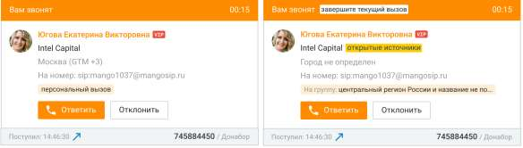

После соединения с абонентом вместо клавиатурного блока панель переходит в состоянии «Разговор».

| При однократном нажатии на пиктограмму "трубка" в поле номеронабирателя подставляется |
| --- |
| последний (в рамках текущей сессии Контакт-центра) набранный номер. |

2.5.4. Прием и классификация входящих вызовов При поступлении вызова на номер (средство связи), выбранный для обслуживания вызовов, на экране появляется всплывающее окно карточки входящего вызова.

В правом верхнем углу карточки входящего вызова отображается время дозвона (время, прошедшее с момента начала распределения текущего вызова на сотрудника). На самой карточке отображается: • контактная информация звонящего абонента (при ее наличии). Если контактная информация отсутствует, то отображается номер абонента.

| компания звонящего абонента. Если данные определены из открытых источников, об этом |
| --- |
| имеется пометка. |
| регион абонента или уведомление о том, что регион не определен. |

• номер, на который звонит абонент с шагами голосового меню, которые он прошел до поступления на оператора. При этом если в разделе ЛК ВАТС/Номера, подключенные к АТС поле "Комментарий" к номеру телефона или SIP-Trunk, на который пришел вызов, заполнено, то в карточке входящего вызова комментарий отображается вместо номера. • если звонок осуществляется на группу – отображается наименование группы, на которую поступил звонок; если входящий вызов поступил непосредственно на сотрудника, то отображается информация, что это персональный вызов. В нижней части указывается время поступления вызова, а также номер, на который звонил абонент с шагами голосового меню, которые он прошел до поступления на оператора. Если в Личном кабинете в блоке настроек "Номера, подключенные к АТС" для этого номера заполнено поле "Комментарий", то комментарий будет отображен вместо номера. Чтобы отклонить входящий вызов, нажмите кнопку Отклонить. Если вызов был распределен с группы, то он остается в очереди вызовов, дальнейшее его распределение осуществляется в соответствии с заданными настройками. Чтобы ответить на входящий вызов, нажмите кнопку Ответить. После этого карточка разговора переходит в состояние «Разговор».

| Если вы уже участвуете в вызове, то после ответа на новый входящий вызов предыдущий |
| --- |
| вызов устанавливается на удержание. |

Каждый поступивший вызов, номер которого был не определен или не найден в адресной книге, можно вручную привязать к новому или существующему контакту. Кроме того, вы можете отредактировать информацию о существующем контакте непосредственно из

карточки разговора. Подробное описание оперативного создания контактов приведено в этом разделе. 2.5.5. Перевод вызовов С помощью карточки разговора, находящейся в состоянии «Разговор», вы можете перевести вызов на другого пользователя Контакт-центра MANGO OFFICE, номер (способ связи), контакт из адресной книги или группу операторов. В процессе перевода вы можете немедленно перевести вызов на нужного абонента (т. н. перевод «Без консультации») или предварительно переговорить с абонентом, на которого переводите вызов, чтобы сообщить ему необходимую информацию (т. н. «перевод с консультацией»). Для перевода вызова наведите курсор на имя и нажмите Перевести. При наличии

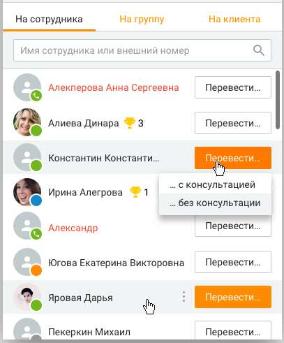

нескольких номеров нажмите на и нажмите Перевести напротив нужного номера. Укажите, необходима ли консультация Для автоматических "сотрудников-роботов" вариант перевода "с консультацией" отсутствует. Перевод вызова на сотрудника-робота может быть осуществлён только на внутренний номер робота. При выборе варианта С консультацией осуществляется дозвон на выбранный номер с целью консультации, при этом текущий вызов автоматически ставится на удержание. После завершения консультации необходимо выполнить соединение оператора с клиентом, нажав на кнопку Объединить вызовы на панели управления телефонией. Если в карточке контакта помимо основного номера имеется еще и добавочный, то при переводе с консультацией/без возможен донабор на все имеющиеся номера.

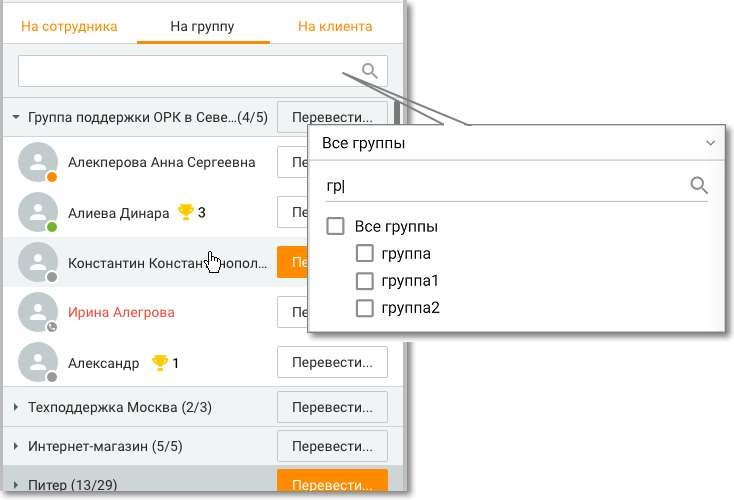

Перевод вызова может осуществляться: На сотрудника: осуществляется выбор нужного сотрудника из отсортированного по алфавиту списка. Имя сотрудника, занятого в вызове, отображается красным;

| На группу: вызов переводится на группу сотрудников. В поле поиска задается наименование |
| --- |
| или часть наименования группы, после чего в выпадающем списке отображаются группы, |
| соответствующие поисковому запросу. При раскрытии группы имена сотрудников, занятых в |
| вызовах, отображаются красным/ Напротив наименования группы указывается количество |
| свободных |

операторов;

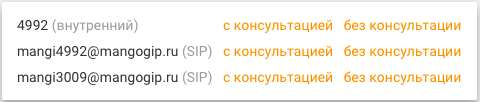

На клиента: выберите нужный контакт, используя список контактов вашей адресной книги; На номер: вы можете переводить вызовы на телефонные номера, а также на абонентов SIP, указывая соответствующий идентификатор перед именем абонента через двоеточие без пробела. Введите номер (способ связи) и нажмите Перевести. Вы можете переводить вызовы на внешние, внутренние номера и дополнительные номера сотрудников / групп.

| Телефонные номера следует вводить в международном формате. Пример: 74952000000. |  |  |
| --- | --- | --- |
|  |  |  |
|  | Если вы хотите указать номер офисной АТС, которая поддерживает донабор в тональном |  |
|  | режиме, можно указать номер телефона вместе с добавочным местным номером. Для этого |  |
|  | добавочный номер необходимо указать сразу после основного, разделив их точкой или |  |
|  | запятой без пробелов. Пример: 74955555,253. Перед донабором добавочного номера |  |
| выдерживается пауза в 5 секунд. |  |  |

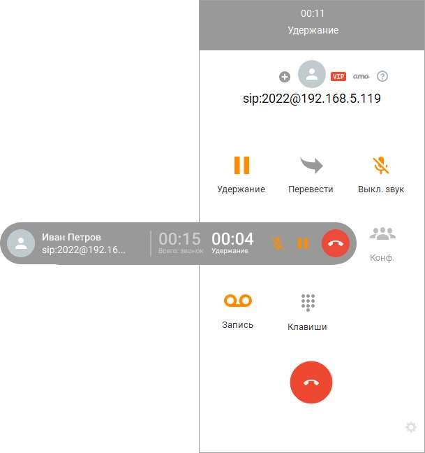

2.5.6. Постановка вызовов на удержание Вы можете поставить текущий вызов в карточке разговора на удержание — например, чтобы ответить на другой входящий вызов. Затем вы можете снять вызов с удержания и продолжить разговор с абонентом.

Чтобы поставить вызов на удержание, нажмите кнопку Удержание на панели либо на соответствующем виджете. Вызов ставится на удержание, при этом заголовок панели и виджет меняют цвет. Отображается счетчик длительности удержания.

Чтобы снять вызов с удержания, нажмите кнопку Удержание еще раз.

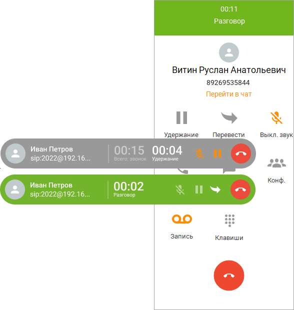

| При постановке вызова на удержание и снятии вызова с удержания длительность вызова |
| --- |
| не обнуляется. |

При наличии двух (и более) вызовов на панели управления отображается только активный вызов, при этом второй вызов, находящийся на удержании, отображается в виде виджета. При снятии с удержания второго вызова первый автоматически переходит в режим удержания, при этом на панели отображается второй вызов.

Кроме кнопки паузы, вызов можно поставить на удержание посредством DTMF-команды. Для этого при помощи клавиатурного блока введите команду ##. Более подробное описание DTMF-команд приведено в этом разделе.

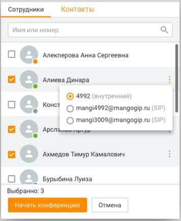

2.5.7. Организация конференций Конференции обеспечивают возможность участия в разговоре трех и более абонентов. Эта функция Контакт-центра MANGO OFFICE наиболее востребована при проведении корпоративных совещаний, одновременном взаимодействии с несколькими заказчиками или удаленными партнерами. В качестве участников конференции могут выступать сотрудники Виртуальной АТС, контакты из адресной книги и другие внешние абоненты. Максимальное количество участников конференции, а также стоимость подключения дополнительных участников, зависит от тарифного плана ВАТС. Количество участников можно изменить в инструментах ВАТС на странице "Конференция". Информацию о стоимости услуги на разных тарифных планах вы можете получить, посетив эту страницу. С помощью панели управления телефонией вы можете создавать конференции и управлять ими.

Чтобы начать конференцию, нажмите кнопку Конф. и выберите тип участников конференции.

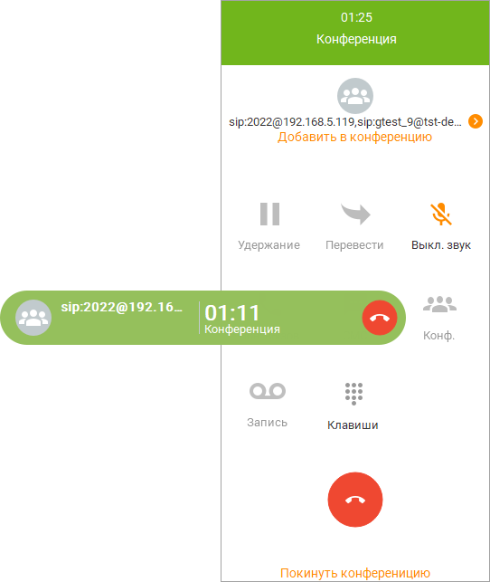

После выбора собеседника нажмите Начать конференцию. В случае успешного дозвона собеседнику разговор переходит в режим конференции.

Чтобы добавить участника в конференцию, нажмите "Добавить в конференцию" и выберите собеседника.

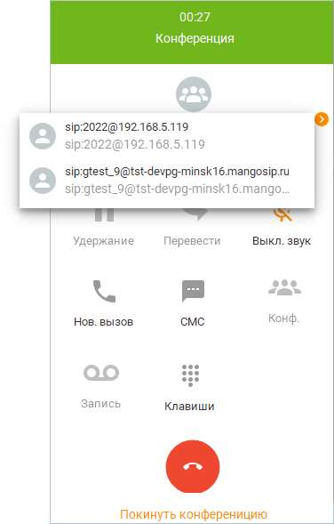

Для просмотра участников конференции нажмите . В результате на панели управления отобразится список участников.

Чтобы удалить участника из конференции, откройте список участников, наведите курсор на номер и нажмите "Х".

| Пользователь с ролью Оператор может удалять участников только из конференции, |  |  |
| --- | --- | --- |
|  | созданной им самим. Супервизор может удалять участников только из конференций, |  |
|  | созданных операторами в группах, в которых он является супервизором. Администратор |  |
| может удалять участников из любых конференций. |  |  |

Чтобы завершить конференцию, нажмите .

| Пользователь с ролью Оператор может завершать только конференцию, созданную им |  |  |
| --- | --- | --- |
|  | самим. Супервизор может завершать только конференции, созданные операторами в |  |
|  | группах, в которых он является супервизором. Администратор может завершать любые |  |
| конференции. |  |  |

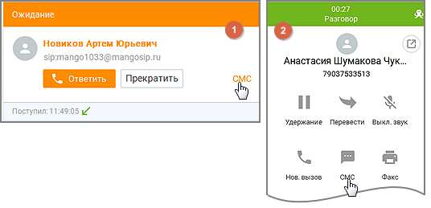

2.5.8. Отправка СМС Отправка СМС используется для связи с клиентом: подтверждение информации, напоминание, сопровождение заявки и т.д.

| Не все сотрудники имеют право отправлять сообщения — права на отправку СМС |
| --- |
| регулируются отдельно для каждой роли в Личном кабинете ВАТС. Сотрудники без права |
| отправки СМС не видят кнопок отправки в системе. Некоторые сотрудники могут отправлять |
| только шаблонные сообщения, без возможности редактирования. |

Оператор, на которого система распределила обработку звонка в рамках кампании исходящего обзвона, может инициировать отправку СМС в адрес собеседника: • 1. До поднятия трубки собеседником – из всплывающей карточки звонка, кликом по кнопке "СМС" в правом нижнем углу окна: • 2. После поднятия трубки собеседником – из карточки вызова в правой панели в

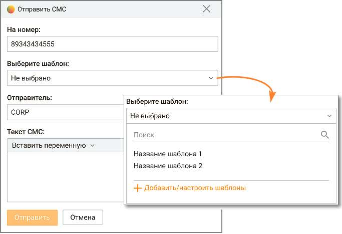

Контакт-центре, кликом по пиктограмме .

После этого на экране отображается окно Отправить СМС.

Кнопка СМС также может быть доступна: • В карточке клиента (раздел "Контакты", "Организации") • В карточке обращения (если обращение связано с контактом или номером) • В карточке сделки

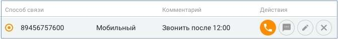

Телефонные номера следует вводить в международном формате. Пример: 74955555555. На номер – Введите номер (способ связи) и нужный текст. Максимальное количество символов – 280 при использовании символов (хотя бы одного) русской раскладки и 560 – для латинской и цифр. Отправитель – В поле "Отправитель" отображается имя, от которого будет отправлено сообщение. Выбор имени отправителя доступен при подключении услуги "Отраслевое имя отправителя СМС" или "Индивидуальное имя отправителя СМС" в Личном кабинете ВАТС. Если услуга не подключена, ее можно подключить из всплывающего при клике на пиктограмму окна.

Шаблон – Если пользователь отправляет сообщение на основе шаблона (даже если меняет в нем текст и/или переменную), отправка происходит от имени отправителя, выбранного в настройке соответствующего шаблона. Кнопка Добавить/настроить шаблоны доступна только пользователям, в роли которых прописана данная настройка. Клик по кнопке открывает форму настроек шаблонов. После ввода сообщения нажмите "Отправить". После этого Контакт-центр MANGO OFFICE регистрирует запрос на отправку СМС-сообщения.

| Если в результате подстановки переменных при отправке хотя бы одна переменная не |  |  |
| --- | --- | --- |
|  | заполнена для конкретного контакта, то отправка СМС на номер это контакта не |  |
| осуществляется. |  |  |

Для пользователя номер телефона клиента может быть скрыт настройками безопасности, тем не менее отправка смс-сообщения данному клиенту осуществляется. Вместе с отправкой СМС создается закрытое обращение со следующими атрибутами: • Имя отправителя СМС • Идентификатор сотрудника, инициировавшего отправку СМС • Получатель СМС • Текст сообщения • Дата и время инициации отправки СМС • Результат отправки СМС Закрытое СМС-обращение отображается в: • истории обращений по контакту (в карточке контакта)

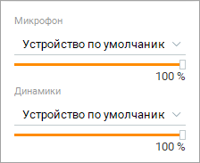

• общей истории обращений (отчет История обращений)

Ограничения на отправку СМС Если у вас доступ только к шаблонным сообщениям: • Нельзя редактировать текст сообщения • Нельзя создавать или изменять шаблоны • Нельзя вставлять переменные в текст Если у вас нет прав на отправку СМС:

• Кнопки и функция полностью скрыты Что видит руководитель Все отправленные сообщения сохраняются и доступны руководителю, включая: • Когда было отправлено • Кому • Какой текст Это помогает разбирать инциденты и контролировать расходы. 2.5.9. Настройка гарнитуры во время разговора

Чтобы настроить гарнитуру во время разговора, нажмите кнопку на панели телефонии (она расположена в нижнем левом углу панели). После этого на экране отображается всплывающее окно с регуляторами, позволяющими установить нужную чувствительность микрофона и / или громкость головного телефона (телефонов) гарнитуры.

Чтобы оперативно отключить микрофон, нажмите на кнопку .

После этого микрофон гарнитуры отключается, на что указывает вид нажатой кнопки .

Чтобы вновь включить микрофон, нажмите кнопку .

| При отключении гарнитуры на экране отображается уведомление вида "Микрофон и |
| --- |
| динамики не найдены. Проверьте подключение устройств". |

Список гарнитур, поддерживаемых Контакт-центром Mango OFFICE: • JABRA EVOLVE 20 UC Stereo • JABRA PRO 930 • JABRA UC VOICE 150 DUO • Plantronics BlackWire C320M 2.5.10. Оперативное создание контактов Вы можете работать с контактами в ходе разговора.

Чтобы создать новый контакт, нажмите кнопку и выберите действие "Создать контакт":

После этого на экране отобразится карточка нового контакта. Чтобы привязать номер к другому контакту, нажмите ссылку "Привязать к существующему". После этого на экране отображается всплывающее окно, позволяющее найти и выбрать нужный контакт. При вводе ФИО контакта работает автоподбор. 2.5.11. Запись разговоров Контакт-центр MANGO OFFICE позволяет записывать текущий разговор непосредственно из карточки разговора.

| Вы не можете записывать разговоры, участником которых не являетесь. Аналогичное |  |  |
| --- | --- | --- |
|  | ограничение действует и для прослушивания уже совершенных разговоров. |  |
|  |  |  |
|  | Пользователь с ролью Супервизор может записывать разговоры, в которых участвуют |  |
|  | операторы в группах, где он является супервизором. Для этого необходимо подключиться к |  |
|  | существующему разговору в режиме прослушивания или суфлирования, а потом включить |  |
| запись собственного вызова. |  |  |

<!-- изображение на стр. 114: байты не извлечены (PyMuPDF недоступен) -->

Чтобы начать запись разговора, нажмите кнопку . Также запись может начинаться автоматически, если в Личном кабинете подключен сервис "Запись разговоров" и в настройках установлена опция "Записывать все разговоры". На состояние записи указывает внешний вид кнопки.

<!-- изображение на стр. 114: байты не извлечены (PyMuPDF недоступен) -->

Во время разговора остановить начатую запись нельзя. Запись останавливается автоматически после завершения разговора. После завершения записи вы сможете: • прослушать разговор с использованием Истории вызовов; • прослушать разговор, открыв карточку контакта; • прослушать разговор или скачать запись в почтовом ящике / облачном хранилище Виртуальной АТС, с которой используется Контакт-центр MANGO OFFICE.

| Способ хранения записи разговоров – в облачном хранилище или на внешнем ftp-сервере – |
| --- |
| настраивается в Личном кабинете ВАТС. В Контакт-центре значение этой настройки не |
| изменяется. |

<!-- изображение на стр. 115: байты не извлечены (PyMuPDF недоступен) -->

| Наличие возможности прослушивания и скачивания записей разговоров с использованием |  |  |  |
| --- | --- | --- | --- |
|  | Личного кабинета Виртуальной АТС зависит от настроек дополнительной услуги «Запись |  |  |
|  | разговоров». Для получения более подробной информации ознакомьтесь с подразделами |  |  |
|  | «Записи разговоров» и «Управление услугами» справочной системы Личного кабинета для |  |  |
|  | Виртуальной АТС. |  |  |
|  |  |  |  |
|  | Вы также можете включить запись разговора с помощью специальной команды. |  |  |
|  | Подробнее — в подразделе Использование DTMF-команд. |  |  |

<!-- изображение на стр. 115: байты не извлечены (PyMuPDF недоступен) -->

2.5.12. Использование DTMF-команд Благодаря интеграции с Виртуальной АТС вы можете в ходе разговора оперативно использовать ее возможности с применением DTMF-команд — команд, вводимых с клавиатуры в тоновом режиме. При этом интерфейс пользователя не используется либо используется в минимальной степени (только для ввода команд с помощью клавиатурного блока), что может оказаться удобным в некоторых ситуациях. DTMF-команды можно вводить: • если вы используете встроенный софтфон Контакт-центра MANGO OFFICE) — с использованием клавиатурного блока карточки разговора или с клавиатуры компьютера; • если вы используете внешний аппаратный телефон — с помощью клавиатуры этого телефона; • если вы используете внешний софтфон — с использованием средств, предоставляемых этой программой. Чтобы донабрать номер после установления соединения (например, для соединения с добавочным номером офисной АТС компании, на номер телефона которой вы дозвонились), просто введите нужный номер. Чтобы перевести вызов без консультации, введите команду # #, затем номер сотрудника и еще раз введите #. После этого положите трубку. Чтобы перевести вызов с консультацией, введите команду # #. При этом ваш текущий собеседник устанавливается на удержание. Затем наберите номер нужного сотрудника, еще раз введите # — и ждите ответа сотрудника. • Если сотрудник не отвечает — еще раз введите команду # #, и вы вернетесь к разговору с текущим собеседником. После этого вы можете, например, набрать номер другого сотрудника и перевести звонок на него. • Если сотрудник ответил — сообщите ему нужную информацию и положите трубку телефона. После этого удерживаемый на линии собеседник соединяется с сотрудником, на которого вы переводите вызов. Чтобы создать конференцию, введите команду # * или # # на клавиатуре во время разговора. После этого Виртуальная АТС устанавливает вашего первого собеседника на удержание и выдает приглашение к вводу номера. Наберите нужный номер. Если нужный номер не отвечает, введите команду # #, чтобы вернуться к разговору. А после успешного дозвона до нужного номера для создания конференции нужно будет нажать # *. Чтобы добавить участника в конференцию, снова введите команду # * или # #. После этого Виртуальная АТС временно выводит вас из числа участников конференции. Далее действуйте так же, как при создании конференции — наберите нужный номер и т. д.

<!-- изображение на стр. 116: байты не извлечены (PyMuPDF недоступен) -->

Чтобы выйти из текущей конференции, повесьте трубку телефона. Чтобы записать текущий разговор, введите команду # 5 на клавиатуре.

| Вы также можете осуществлять запись разговоров с помощью карточки разговора. |  |  |
| --- | --- | --- |
|  | Подробнее — в подразделе Запись разговоров. |  |

<!-- изображение на стр. 116: байты не извлечены (PyMuPDF недоступен) -->
