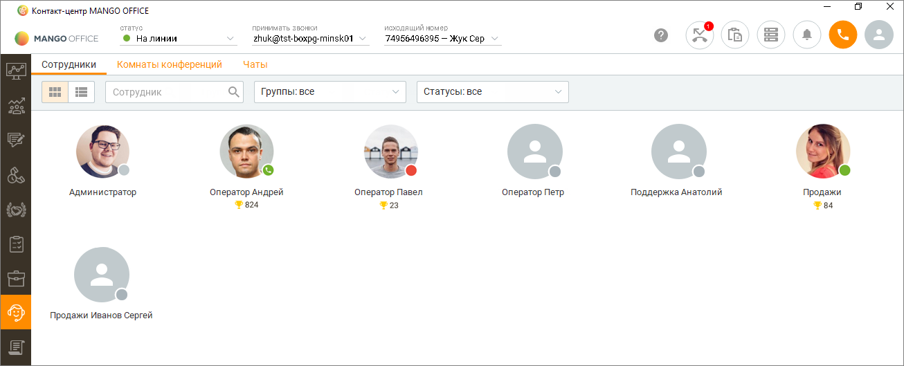
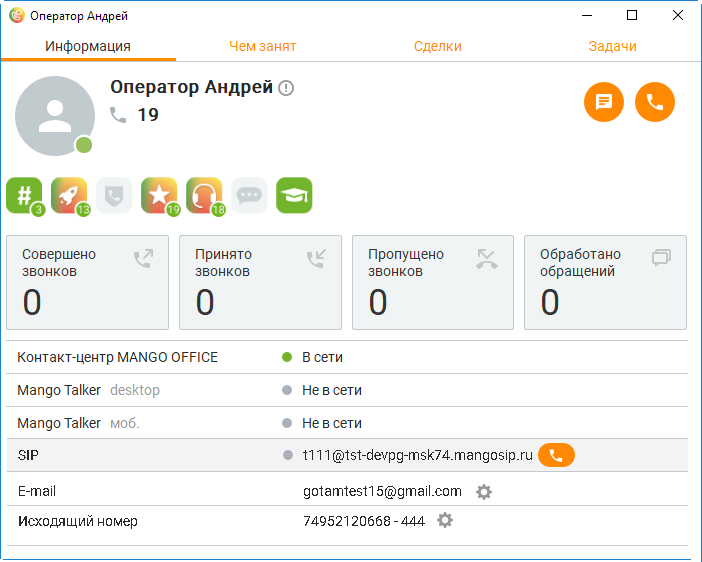
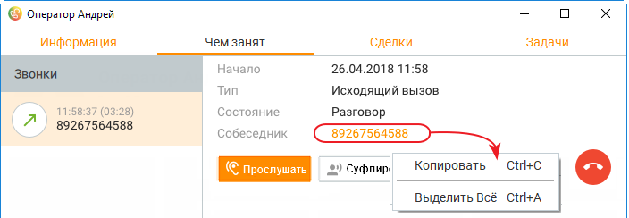

# 13.1. Сотрудники

> Трассировка: PDF §13.1 · сквозные стр. 393-397 · источники: ч.4 `kb/sources/mango-cc-manual/CC_manual_1.26.23-part-4.pdf` с.90-94.

Внешний вид рабочей области при открытой вкладке "Сотрудники" приведен на рисунке ниже:

Представление списка сотрудников допускается как в виде аватаров, так и в виде списка с разделением по группам. Переключение представления выполняется при помощи переключателей на панели фильтров.

Эта функция недоступна для ролей Супервайзер и Администратор При просмотре списка в виде аватаров сотрудники сортируются по ФИО, изменение сортировки не предусмотрено. При этом на экране отображается: • Аватар сотрудник с его фотографией (при её наличии); • ФИО сотрудника; • Сетевой статус сотрудника;

• Достижения сотрудника. В представлении в виде списка, распределенного по группам, одному сотруднику может соответствовать несколько строк – в случае, если сотрудник состоит в нескольких группах. При этом строка с ним будет отображаться во всех эти группах. При наведении курсора на название группы отображается кнопка вызова на группу. При наведении курсора на аватар либо строку с ФИО сотрудника отображаются кнопки для совершения аудио-, видео-звонка (при наличии соответствующих средств связи) или отправки текстового сообщения в чат.

Также на вкладке "Сотрудники" предусмотрены следующие функции: Поиск сотрудника Поиск осуществляется путем ввода комбинации символов в поисковое поле. При этом выполняется поиск по имени, любому телефону сотрудника и E-mail сотрудника. В результате поиска список будет содержать только тех сотрудников, данные которых содержат искомую комбинацию символов. Фильтрация по группам Выберите нужную группу или несколько групп в списке. В результате поиска список будет содержать только тех сотрудников, которые входят хотя бы в одну из указанных групп. По умолчанию отображаются все группы. Фильтрация по статусам Выберите нужный статус или несколько статусов в списке. В результате поиска список будет содержать только сотрудников указанных статусов. По умолчанию отображаются сотрудники всех статусов. При нажатии на ФИО сотрудника на экране отображается карточка сотрудника. При этом показатели личной статистики сотрудников отображаются в карточке в соответствии с правами доступа пользователя.

Карточка сотрудника содержит сведения о сотруднике и его деятельности, распределенные по вкладкам: Информация Данная вкладка отображает информацию: • ФИО сотрудника; • Список групп, прав в группе и супервизоров групп, в которые входит текущий пользователь

– пиктограмма ; • Внутренний номер (при его наличии); • Достижения сотрудника; • Краткую информацию о деятельности сотрудника за текущий день; • Текущий статус в Контакт-центре MANGO OFFICE – стандартный либо пользовательский; • Список средств связи. Чем занят Вкладка отображает обращения, находящиеся в работе, и любые текущие вызовы у просматриваемого сотрудника в режиме реального времени. В левой части окна расположен список звонков и текстовых обращения. При выборе звонка в основной области вкладки отображается подробная информация по данному вызову. При просмотре вызовов доступны функции прослушивания, суфлирования и подключения к вызову в режиме конференции, а также кнопка завершения текущего вызова. Имеется возможность копирования номера телефона (следует кликнуть по номеру правой кнопкой мыши). Если клиент есть в адресной книге, то щелчок на имя открывает карточку клиента.

В режиме конференции карточка сотрудника отображает имя собеседника (при его наличии в адресной книге) или номер. Текстовое обращение отображается при наличии у просматриваемого сотрудника в работе текстового обращения по любому текстовому каналу. После выбора обращения в основной области вкладки доступна следующая информация: • дата и время обращения – для незакрытых обращений вместо даты создания текущего обращения отображается пометка "В работе" • длительность – длительность обращения; • канал – откуда поступило обращение; • тема обращения – текст указанный в теме обращения; • собеседник – ФИО из профиля клиента либо гость, если имя определить невозможно; • кнопка Перевести обращение – перевести обращение на другого сотрудника. Кнопка доступна пользователю, на которого назначено обращение, а также пользователям, у которых имеются подконтрольные группы. • кнопка Завершить вызов – завершить текущий вызов. Кнопка отображается во время дозвона и во время разговора. Следующие кнопки доступны пользователям, у которых имеются подконтрольные группы. Отображаются только во время разговора; • Кнопка Прослушать - подключиться к вызову в режиме прослушивания; • Кнопка Суфлировать – подключиться к вызову в режиме суфлирования; • Кнопка Подключиться – подключится к вызову в режиме конференции; • Кнопка Перехватить – перевести вызов на себя. Кнопка отображается только во время дозвона.

| При выборе текстового обращения на вкладке также можно посмотреть текущую переписку |  |  |
| --- | --- | --- |
| между клиентом и сотрудником. | Л | юбая часть сообщения может быть выделена и скопирована |
| в буфер обмена стандартными средствами копирования/выделения Windows. |  |  |
| Если в ленте переписки более 100 сообщений, остальные доступны по клику на кнопке |  |  |
| Показать еще. |  |  |

В списке обращений отображается оценка обращения, если она проставлена. Для e-mail обращения область просмотра содержит: • Дата и время получения первого обращения; • Тема обращения – поле обновляется в режиме реального времени, доступно редактирование поля; • Комментарий к обращению – поле обновляется в режиме реального времени, доступно редактирование поля; • Клиент – клиент или Гость, от которого поступило обращение; • Длительность обращения – поле обновляется в режиме реального времени; • Закрыто – дата и время закрытия обращения (только для закрытых обращений);

• Кнопка i ("дополнительная информация"); - Название виджета; - Канал обращения; - Точка входа – строка отсутствует, если нет точки входа; - Поступил в компанию; - Уникальный идентификатор;

В закрытом e-mail обращении также отображается кнопка создания исходящего текстового обращения на аккаунт клиента. Задачи Вкладка отображает список запланированных задач выбранного пользователя с возможность их завершения и редактирования. В левой части окна расположен список задач, сгруппированных по датам. При выборе задачи в основной области вкладки отображается карточка задачи в режиме просмотра. Сделки Закладка Сделки предназначена для просмотра сделок текущего сотрудника, как статусом В работе, так и завершенных. А также для просмотра задач по каждой из сделок.
