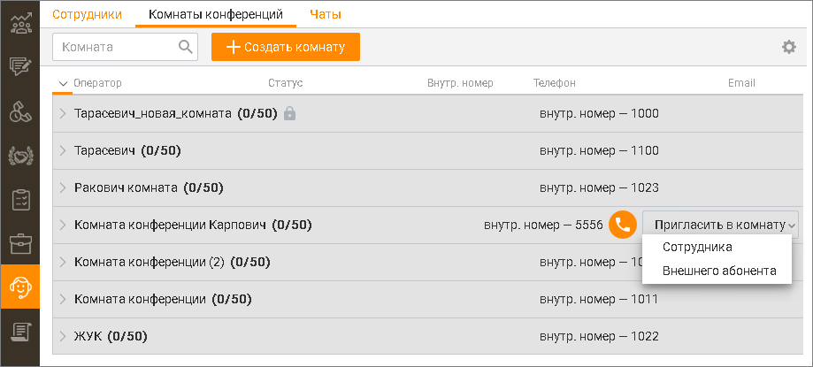

# 13.2. Комнаты конференций

Вкладка "Конференции" служит для группировки операторов по виртуальным комнатам конференций. Список и настройки комнат конференций ведется в Личном кабинете.

Каждая строка содержит: • Наименование комнаты; • Количество пользователей в комнате / общее количество мест в комнате; • При запросе ПИН-кода для доступа в комнату напротив названия комнаты отображается

пиктограмма ; • Внутренний номер для доступа в комнату.

Для создания новой комнаты нажмите кнопку Создать комнату. При этом выполняется переход в соответствующий продукт ВАТС на закладку "Комнаты конференций" страницы "Конференц-связь". Предусмотрена возможность приглашения в комнату дополнительных пользователей — как сотрудников (кроме сотрудников-роботов), так и внешних абонентов, при условии, что настройки комнаты позволяют их подключение и в комнатах есть свободные места. Для этого наведите курсор на строку с нужной комнатой, нажмите кнопку Пригласить в комнату и выберите пользователя: оператора или внешнего абонента. При приглашении сотрудника укажите: • Имя сотрудника; • Внутренний номер. При приглашении внешнего абонента укажите: • Номер абонента. При звонке в комнату со внешнего номера в отчете Истории обращений в качестве клиента отображается имя абонента Адресной книги либо его внешний номер (при отсутствии абонента в Адресной книге), в качестве точки входа – комната, куда звонит абонент. Максимальное количество участников конференции указано в Личном кабинете ВАТС в разделе Конференц-связь.
