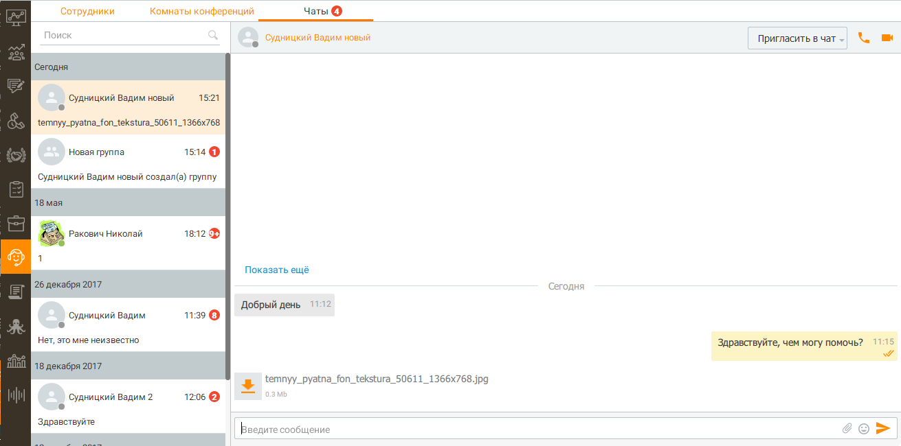
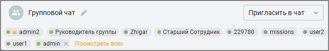
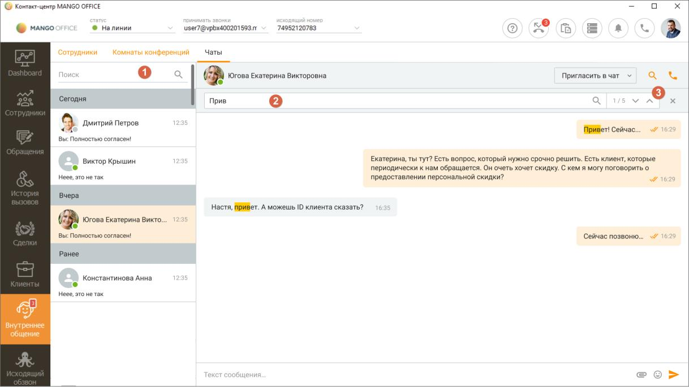
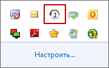

# 13.3. Чаты

> Трассировка: PDF §13.3 · сквозные стр. 398-401 · источники: ч.4 `kb/sources/mango-cc-manual/CC_manual_1.26.23-part-4.pdf` с.95-98.

Чаты предназначены для общения сотрудников при помощи приложения Контакт-центр MANGO OFFICE, и также мобильного или десктопного приложения M. TALKER. Также чаты можно использовать для обмена важными сообщениями между руководителем и оператором. Например, руководитель может помочь оператору во время работы со сложными клиентами.

| Уведомления сервисного чата MANGO Office (пользователь "mango@telecom.service") |
| --- |
| отображаются только в MANGO Talker. |

В чатах предусмотрена проверка орфографии с помощью стандартного контекстного меню, вызываемого в любом месте поля ввода сообщения чата кликом по правой кнопке мыши. Также в чате доступен предпросмотр картинок, ссылок, файлов. В чатах предусмотрена функция изменения размера шрифта для повышения удобства чтения и написания сообщений. Размер шрифта регулируется путем зажатия клавиши Ctrl и прокрутки колесика мыши. Настройки сохраняются для всех новых сообщений и остаются активными при переключении между диалогами.

| При использовании данной функции имеется следующее ограничение: чтобы изменить |
| --- |
| шрифт, сначала необходимо нажать левой кнопкой мыши на область сообщений чата, чтобы |
| данная область стала активной для ввода. |

Функция направлена на улучшение условий работы операторов, позволяя снизить нагрузку на зрение и поддерживать продуктивность в течение рабочего дня. Во внутреннем чате сотрудник может вставить в сообщение одну или несколько картинок из буфера обмена (используя сочетание клавиш Сtrl+V) или из контекстного меню. Картинку можно удалить из сообщения, используя кнопку Backspace на клавиатуре.

В левой части отображается список лент. Лента представляет собой историю общения с сотрудником или группой сотрудников. История общения отображается в блоке в правой части окна чата при щелчке по ленте. При получении текстового сообщения или файла, появляется уведомление:

Клик по ФИО отправителя приводит к открытию карточки сотрудника.

| При получении или отправке видеосообщения для некоторых типов видеофайлов в чате |
| --- |
| отображается превью. Форматы с превью: webm, mkv, flv, vob, ogv, gif, avi, mov, wmv, asf, |
| mp4, m4v, mpg, mpeg, m4v, 3gp, mxf, 3g2, flv, f4v; |

При наличии пропущенных сообщений на пункте главного меню «Внутреннее общение», на переключателе вкладки "Чаты", а также в области системных уведомлений (трее) операционной системы указывается количество лент, содержащих не просмотренные события. Напротив имени контакта сотрудника указывается персональное количество пропущенных сообщений. Впоследствии вы можете добавить в чат дополнительно одного или нескольких сотрудников. Для этого нажмите кнопку Пригласить в чат и выберите сотрудников из списка. Добавлять новых пользователей может любой участник беседы. Если изначальная беседа происходит между двумя сотрудниками, то при добавлении новых сотрудников текущий чат будет свернут и откроется новый групповой чат. История чата с несколькими сотрудниками доступна им только с момента их добавления в чат. При большом количестве участников группового чата статусы отображаются только для участников, показанных под заголовком чата.

Пользователь, создавший групповую беседу, является её администратором, на что указывает пиктограмма напротив его имени. Администратору доступна возможность удаления других

собеседников из чата. Для этого следует щелкнуть по пиктограмме напротив имени

сотрудника. Пользователь, удаленный из группы, больше не может принимать участия в беседе. При этом сама беседа не удаляется. Пользователь может просматривать все сообщения до момента удаления. Для удаления чата следует щелкнуть по названию чата правой кнопкой мыши и выбрать пункт "Удалить чат" в контекстном меню. При этом выполняется удаление данного чата со всей историей сообщений со всех приложений Контакт-центр MANGO OFFICE и M. TALKER пользователя без возможности восстановления . У остальных пользователей, участвующих в беседе, удаление чата и истории не выполняется. Каждому пользователю, который участвует в групповом чате, доступна возможность

изменения названия чата. Для этого следует щелкнуть по пиктограмме , указать новое название и нажать Enter либо щелкнуть по названию чата правой кнопкой мыши и выбрать пункт "Переименовать" в контекстном меню. Поиск сообщений в чатах

В чатах внутреннего общения Контакт-центра доступны два варианта поиска: 1. Поиск по списку чатов. После ввода искомого термина в поисковой строке (1) и клике на пиктограмму "лупа", в левом вертикальном меню списка чатов останутся только чаты, содержимое которых включает искомый термин. 2. Поиск в чате. После ввода искомого термина в поисковой строке (2) и клике на пиктограмму "лупа", в текущем чате будут отмечены все вхождения искомого термина. А общее количество вхождений отобразится справа от поисковой строки (3). Отправка, прием и хранение сообщений

Сообщение отправляется при нажатии кнопки Отправить или клавиши Enter. Предусмотрена возможность отправки многострочных сообщений при помощи комбинаций Ctrl+Enter и Shift+Enter. Для того, чтобы добавить к текстовому сообщению "смайл", в процессе редактирования

сообщения щелкните по пиктограмме и выберите нужное изображение.

Для того, чтобы отправить файл, щелкните по пиктограмме либо перетяните файл в поле отправки сообщения при помощи функции drag-and-drop. Допускается отправка файлов любого формата объемом не более 2 Гб. Состояние файла отображается в чате, как один из вариантов: отправляется, ошибка, отправлен, доставлен, просмотрен. Информация о наличии не просмотренных событий отображается в панели задач операционной системы, а также в области системных уведомлений (трее).

<!-- изображение на стр. 401: байты не извлечены (PyMuPDF недоступен) -->

Копирование сообщений

| Любая часть сообщения может быть выделена и скопирована в буфер обмена стандартными |
| --- |
| средствами копирования/выделения Windows. |

Также в приложении предусмотрено контекстное меню, вызываемое в любом месте полной ленты щелчком по правой кнопке мыши. Меню содержит пункты: • Ответить – ответить на текущее сообщение; • Изменить – отредактировать текущее сообщение; • Копировать сообщение — копирование текущего сообщения; • Копировать все — копирование всех подгруженных сообщений; • Переслать – переслать текущее сообщение другому сотруднику; • Удалить – удалить текущее сообщение. При этом выполняется копирование следующих данных: • имя отправителя; • дата и время отправки сообщения; • текст всего сообщения.
