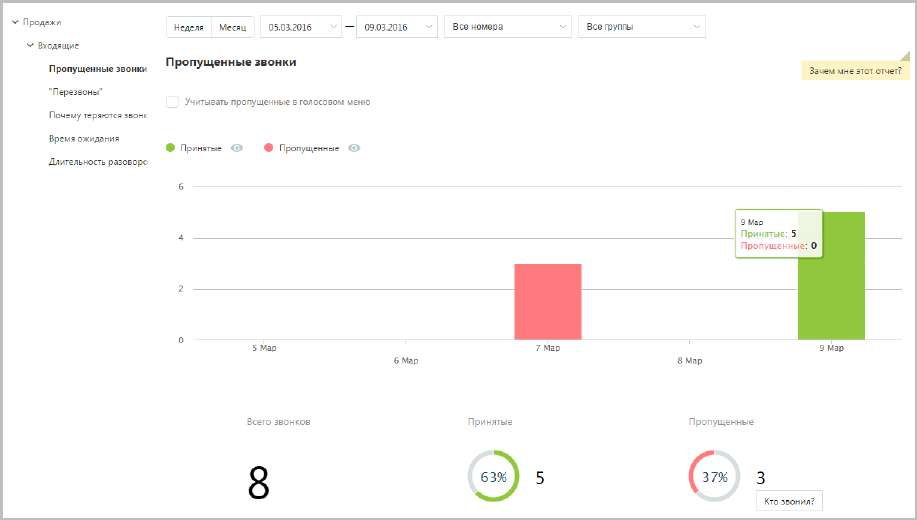

# 15.1.1.1. Пропущенные звонки

Отчет «Пропущенные звонки» в графическом виде отображает информацию о входящих звонках по датам выбранного диапазона через выбранные линии с участием выбранных групп.

Если флаг Учитывать звонки, пропущенные в голосовом меню не установлен, то из подсчета общего числа пропущенных звонков исключаются вызовы, пропущенные в IVR меню. Для того, чтобы скрыть/отобразить принятые или пропущенные вызовы на графике, щелкните по кнопкам Принятые и Пропущенные соответственно. Данные о количестве звонков приведены в нижней части окна в виде инфографики, включающей три диаграммы.
