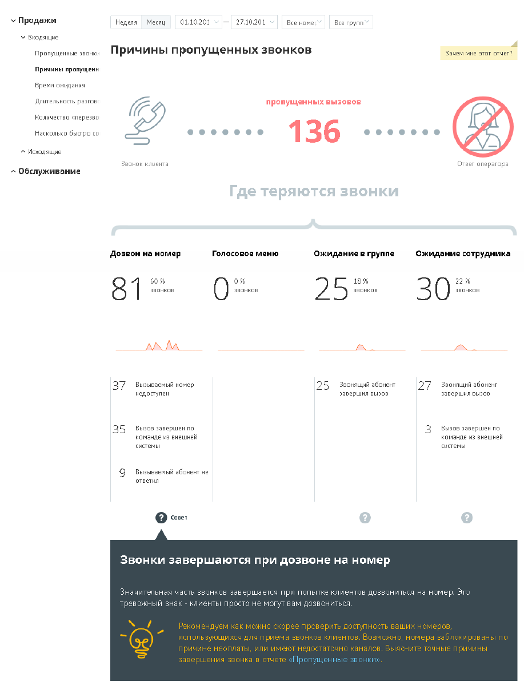

# 15.1.1.2. Причины пропущенных звонков

Отчет «Причины пропущенных звонков» отображает информацию о количестве и процентном соотношении внешних входящих пропущенных вызовов за определенный период в зависимости от причины, по которой они были пропущены.

Отчет условно состоит из трех частей. В первой части приведено общее количество пропущенных вызовов в соответствии с условиями фильтрации. Во второй части отчета указывается количество и процентное соотношение пропущенных вызовов в зависимости от стадии вызова. Каждая стадия сопровождается мини-графиком, отражающим распределение пропущенных звонков по дням на протяжении выбранного периода. При наведении курсора на линию графика отображается всплывающее окно,

содержащее информацию о дате и количестве пропущенных вызовов в соответствующий день. Третья часть отражает распределение звонков, пропущенных на каждой стадии дозвона, по причинам пропуска вызова.
