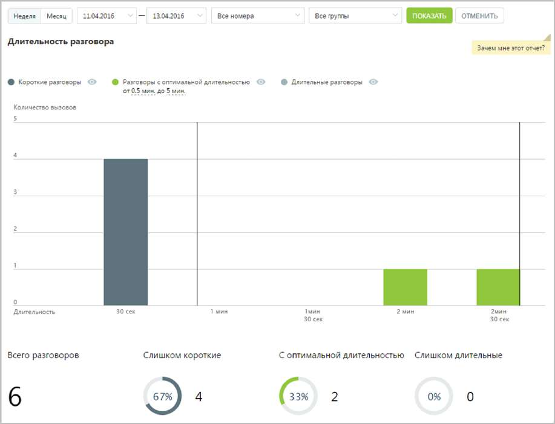
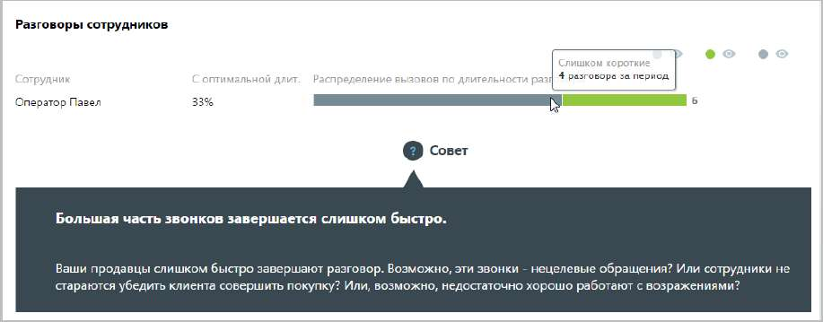

# 15.1.1.4. Длительность разговора

> Трассировка: PDF §15.1.1.4 · сквозные стр. 426-428 · источники: ч.1 `kb/sources/mango-cc-manual/CC_manual_1.26.23_compressed.pdf` с.426-428.

Отчет «Длительность разговора» отображает информацию о количестве входящих звонков на группу сотрудников, распределенных в зависимости от длительности разговора за определенный период. По умолчанию оптимальной длительностью разговора с клиентом считается период от 30 секунд до 5 минут. При необходимости измените этот период самостоятельно, установив другое значение в поле С оптимальной длительностью от… до после формирования отчета.

Отчет позволяет увидеть детализацию по звонкам не только для группы в целом, но и для каждого сотрудника группы в отдельности.

Для того, чтобы скрыть/отобразить различные категории вызовов зависимости от указанной длительности, нажмите кнопку нужного цвета.

Воспользуйтесь кнопками Время ожидания ответа и Время обслуживания звонка для того, чтобы скрыть/отобразить соответствующие показатели на графике.
