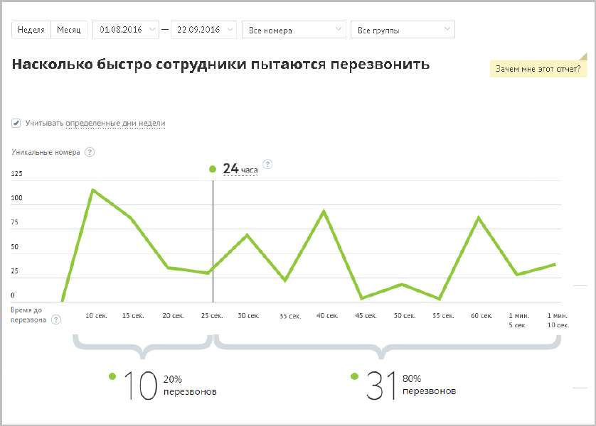

# 15.1.1.6. Насколько быстро сотрудники пытаются перезвонить

Отчет «Насколько быстро сотрудники пытаются перезвонить» отображает информацию о количестве перезвонов на пропущенные звонки с уникальных номеров в зависимости от времени. Отчет помогает установить, укладываются ли ваши сотрудники в требуемое время, отведенное на перезвон по пропущенному звонку.

Линейная диаграмма представляет собой визуализацию динамики изменения количества первых попыток перезвонов на уникальные номера клиентов, с которых в течение выбранного промежутка времени при выбранных значениях фильтров поступали и были пропущены звонки. Чтобы установить время (в часах), в течение которого с момента пропуска звонка ваши сотрудники должны ему перезвонить, щелкните по соответствующему полю и введите нужное количество часов. При наведении на любую точку участка ломаной на экране отобразится всплывающее окно, содержащее следующие данные: • указание временного промежутка, которому соответствует участок ломаной; • количественная информация по попыткам перезвона за данный временной промежуток. Под диаграммой отображается два числовых показателя: • Перезвонили вовремя (слева) – количество уникальных номеров, с которых пропускались входящие звонки, время до первой попытки перезвона по которым с момента пропуска звонка не превышает установленного, а также процентная доля таких звонков от всех уникальных номеров; • Перезвонили позже (справа) – количество уникальных номеров, с которых пропускались входящие звонки, время до первой попытки перезвона по которым с момента пропуска звонка превышает установленное, а также процентная доля таких звонков от всех уникальных номеров.
