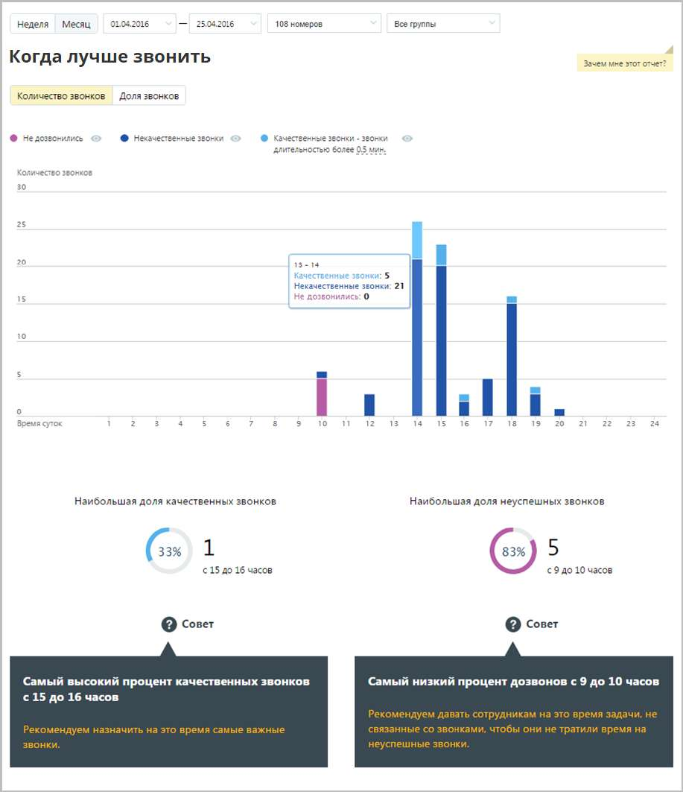

# 15.1.2.2. Когда лучше звонить

Отчет «Когда лучше звонить» отображает информацию о количестве исходящих звонков в течение дня, распределенных в зависимости от качества обслуживания. Качественным вызовом считается принятый вызов с определенной длительностью. Отчет позволяет получить детальную информацию о количестве вызовов за день, а именно: • отображение динамики изменений количества вызовов определенных типов в течение дня; • информацию о времени, на которое приходится наибольшая доля качественных и неуспешных звонков соответственно.

В случае, если переключатель "Количество звонков/Доля звонков» установлен в значение "Количество звонков", то на странице отчета отображается диаграмма, содержащая абсолютные значения количества звонков, совершенных в течение того или иного часа.

В случае, если переключатель установлен в значение "Доля звонков", на странице отчета отображается нормированная диаграмма, содержащая распределение долей звонков по категориям за тот или иной час. Для того, чтобы скрыть/отобразить различные категории вызовов зависимости от указанной длительности, нажмите кнопку нужного цвета. При изменении длительности звонка, считающегося качественным, отчет будет сформирован заново автоматически.
