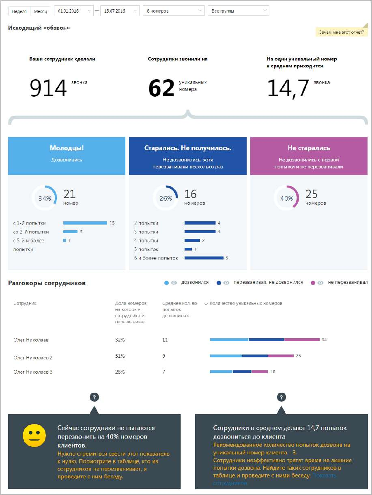

# 15.1.2.3. Исходящий обзвон

> Трассировка: PDF §15.1.2.3 · сквозные стр. 434-436 · источники: ч.1 `kb/sources/mango-cc-manual/CC_manual_1.26.23_compressed.pdf` с.434-436.

Отчет «Исходящий обзвон» отображает информацию о количестве попыток дозвонов до клиентов операторами вашей компании. В отчете представлены как средние данные по выбранным группам, так и детализация по каждому сотруднику, в них состоящему.

Отчет условно состоит из трех частей. В первой части приведено: • общее количество внешних исходящих вызовов; • общее количество уникальных номеров, на которые совершались внешние исходящие звонки; • среднее количество попыток дозвона на уникальный номер.

Во второй части отчета данные по звонкам распределены на три колонки, в каждой из которых указывается количество, процентное соотношение и диаграмма, отражающая распределение номеров: • Дозвонились – количество номеров из числа уникальных, на которые были совершены исходящие звонки и хотя бы одна попытка дозвона была успешной (состоялся разговор); • Старались. Не получилось – количество номеров из числа уникальных номеров, на которые было совершено строго больше одной попытки дозвониться, при этом ни одна попытка дозвона не была успешной (разговор не состоялся). • Не старались – количество номеров из числа уникальных номеров, на которые была совершена строго одна неуспешная попытка дозвониться (при этом успешных попыток не было). Третья часть отражает детализацию вызовов по сотрудникам, которые совершали исходящие вызовы. Таблица содержит следующие столбцы: • Доля номеров, на которые сотрудник не перезванивал – процентная доля уникальных номеров, на которые сотрудник совершил только одну попытку дозвона (причем неуспешную), от числа всех уникальных номеров, на которые звонил сотрудник; • Среднее кол-во попыток дозвониться – среднее количество попыток дозвона, предпринятых сотрудником для каждого уникального номера; • Количество уникальных номеров – диаграмма, отражающая количество уникальных номеров, на которые сотрудник совершал исходящие звонки, в разбиении на категории "Звонил и дозвонился", "Звонил более одного раза и не дозвонился", "Звонил ровно один раз и не дозвонился". При наведении курсора на диаграмму отображается всплывающее окно с количественной информацией по номерам для данного сотрудника в данной категории. Для того, чтобы скрыть/отобразить различные категории вызовов, щелкните по кнопке нужного цвета.
