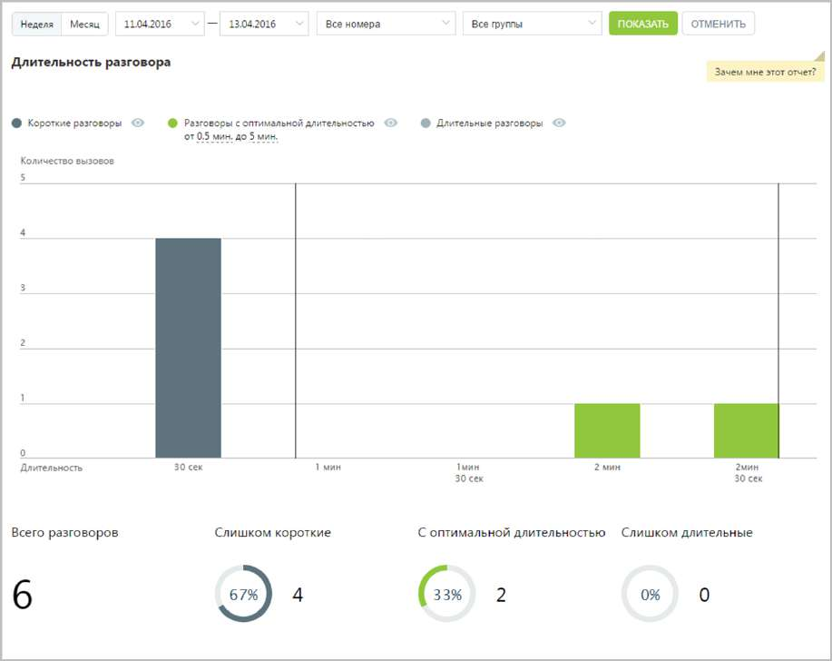
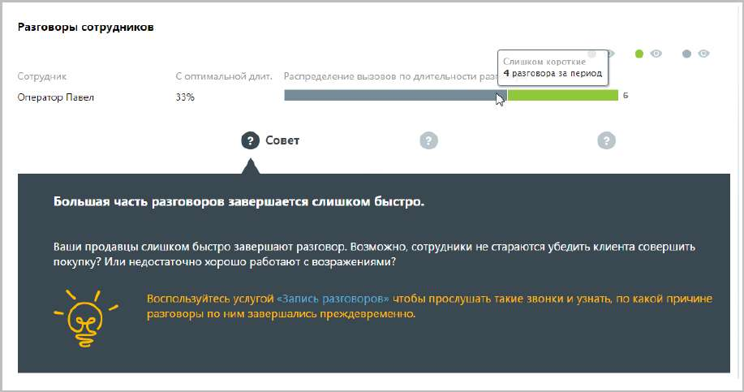

# 15.1.2.4. Длительность разговоров

> Трассировка: PDF §15.1.2.4 · сквозные стр. 436-438 · источники: ч.1 `kb/sources/mango-cc-manual/CC_manual_1.26.23_compressed.pdf` с.436-438.

Отчет «Длительность разговора» отображает информацию о количестве исходящих вызовов, распределенных в зависимости от длительности разговора за определенный период. По умолчанию оптимальной длительностью разговора с клиентом считается период от 30 секунд до 5 минут. При необходимости измените этот период самостоятельно, установив другое значение в поле С оптимальной длительностью от… до после формирования отчета.

Отчет позволяет увидеть детализацию по звонкам не только для группы в целом, но и для каждого сотрудника группы в отдельности.

Для того, чтобы скрыть/отобразить различные категории вызовов зависимости от указанной длительности, нажмите кнопку нужного цвета.

