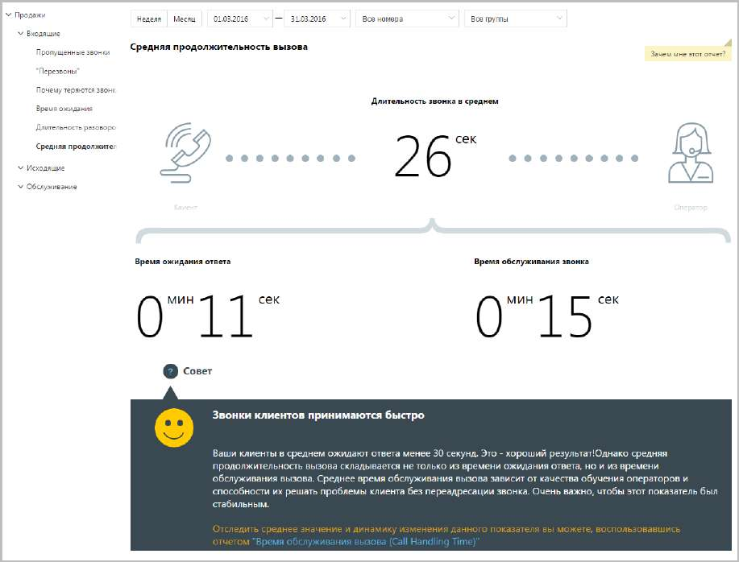
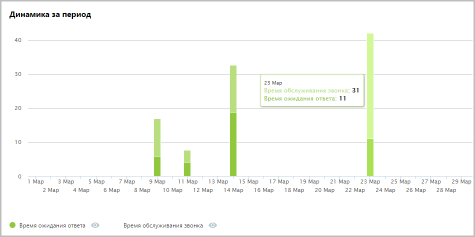

# 15.2.1.2. Средняя продолжительность звонка

> Трассировка: PDF §15.2.1.2 · сквозные стр. 439-440 · источники: ч.1 `kb/sources/mango-cc-manual/CC_manual_1.26.23_compressed.pdf` с.439-440.

Отчет «Средняя продолжительность звонка» в графическом виде отображает информацию о средней продолжительности звонка. Показатель имеет две составляющие — среднее время ожидания ответа и среднее время обслуживания вызова.

В верхней части отчета приведены данные о средней продолжительности вызовов в виде инфографики. В зависимости от значения показателя «Время ожидания ответа» формируется текст совета.

В нижней части окна отображается детальная информация по заданному периоду.

Используйте кнопки Время ожидания ответа и Время обслуживания звонка для того, чтобы скрыть/отобразить соответствующие показатели на графике.
