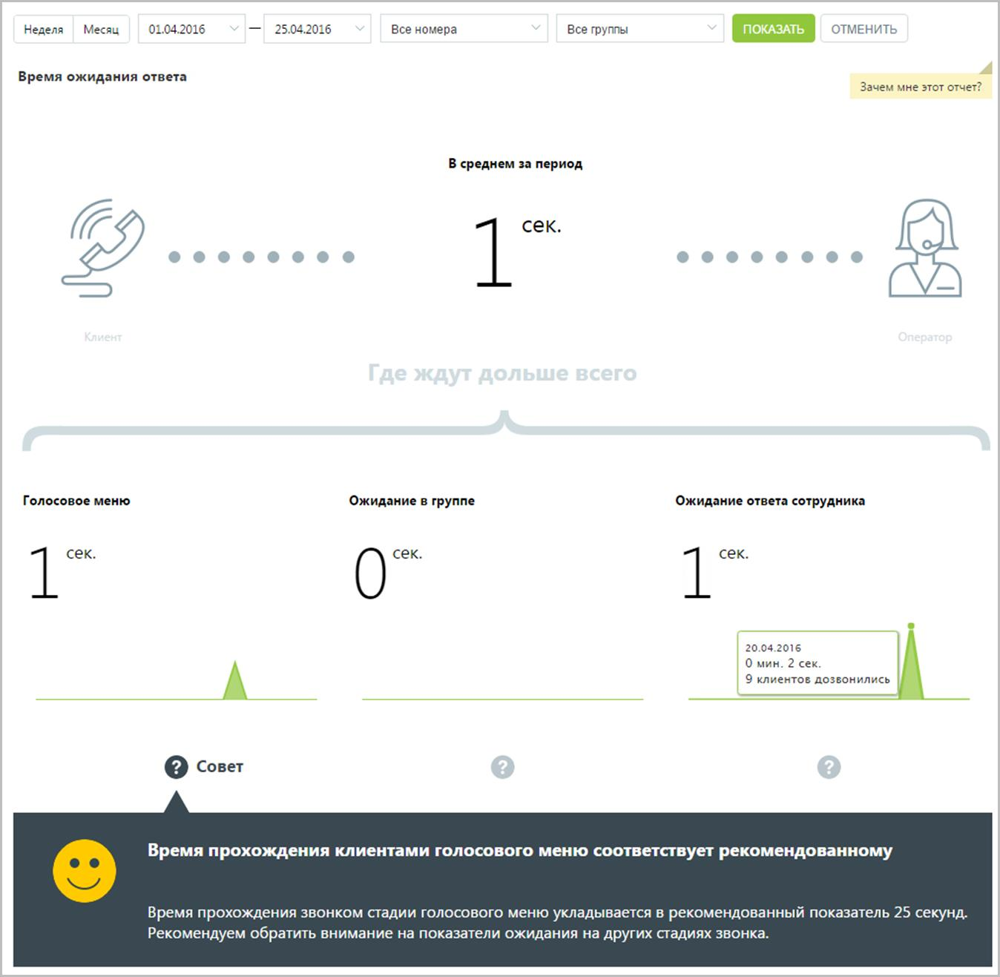

# 15.2.1.3. Время ожидания ответа

> Трассировка: PDF §15.2.1.3 · сквозные стр. 440-441 · источники: ч.1 `kb/sources/mango-cc-manual/CC_manual_1.26.23_compressed.pdf` с.440-441.

Отчет «Время ожидания ответа» отображает информацию о времени ожидания обслуживания вызова на разных стадиях: голосовое меню, дозвон на группу и дозвон на оператора. По умолчанию оптимальным временем ожидания в голосовом меню считается время не более 25 секунд, ожидание в очереди на группу — от 0 до 60 секунд, ожидание ответа оператора не должно превышать 5 секунд.

Щелкните по пиктограмме "?", чтобы посмотреть совет для каждой стадии обработки вызова.
