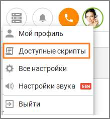

# 2.5.1.2. Доступные скрипты

> Трассировка: PDF §2.5.1.2 · сквозные стр. 52 · источники: ч.1 `kb/sources/mango-cc-manual/CC_manual_1.26.23_compressed.pdf` с.52.

Во время редактирования скрипта доступна функция предварительного просмотра созданного шаблона, чтобы увидеть его так, как он будет представлен назначенному сотруднику во время вызова. Для этого щелкните на фото в профиле и выберите пункт Доступные скрипты.

В результате на экране будет отображен скрипт в том составе, в котором он был на момент щелчка по ссылке, а не в сохраненном состоянии. Данная форма предназначена для того, чтобы сотрудник мог заранее ознакомиться со своими репликами и возможными ответами клиента. После того, как был просмотрен хотя бы один ответ клиента, данная версия скрипта перестает быть новой для текущего сотрудника.
