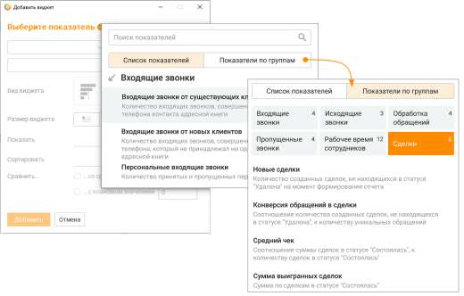
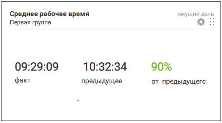
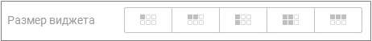

# 3.1. Создание и настройка виджета

> Трассировка: PDF §3.1 · сквозные стр. 119-126 · источники: ч.1 `kb/sources/mango-cc-manual/CC_manual_1.26.28.1.pdf` с.119-126.

Для добавления на вкладку Dashboard нового виджета нажмите кнопку Добавить виджет. При создании нового виджета необходимо настроить показатели данных для быстрого формирования отчета о текущем состоянии системы.

Кнопка добавления виджета доступна только после выбора показателя.

Настройка показателей данных для виджета Поиск показателей доступен по наименованию групп показателей, наименованию показателей и текстам подсказки. Вкладка Список показателей отображает все показатели данных, без группировки. Вкладка Показатели по группам группирует показатели по следующим признакам: Входящие звонки • входящие звонки • персональные входящие звонки • входящие звонки от новых клиентов • входящие звонки от существующих клиентов • входящие звонки дольше ... мин. Исходящие звонки • исходящие звонки существующим клиентам • исходящие звонки новым клиентам • исходящие звонки • исходящие звонки дольше ... мин. Обработка обращений • время обработки обращения (среднее) • время ожидания ответа (среднее). • обработанные обращения • закрытые обращения

| Время обработки обращений – время, в течение которого пользователь обрабатывал |  |  |
| --- | --- | --- |
|  | внешние вызовы и/или текстовые обращения в период с момента первой авторизации до |  |
| последней деавторизации по каждому дню отдельно за выбранный период. |  |  |

Пропущенные звонки • попыток дозвона (среднее) • скорость перезвона (средняя) • успешно перезвонили • пропущенные вызовы

Рабочее время сотрудников • время обработки текстовых обращений (суммарно) • исходящие разговоры (суммарно) • входящие разговоры (суммарно) • время "на линии" (суммарно) • рабочее время (суммарно) • рабочий день (по статусам) • загруженность (среднее) • время обработки текстовых обращений (среднее) • исходящие разговоры (среднее) • входящие разговоры (среднее) • время «на линии» (среднее) • рабочее время (среднее) • принято персональных звонков • пропущено персональных звонков Сделки • звонки клиентам без сделок • новые сделки • выигранные сделки • проигранные сделки • сумма выигранных сделок • средний чек • конверсия продаж • конверсия обращений в сделки Правила расчета показателей данных виджета

| № | Показатель | Группа | Способ подсчета |
| --- | --- | --- | --- |
| 1 | Входящие звонки | Входящие звонки | Значение соответствует сумме показателей "Количество принятых групповых вызовов" и "Количество пропущенных групповых вызовов" в отчете Производительность сотрудников |
| 2 | Персональные входящие звонки | Входящие звонки | Значение соответствует сумме показателей "Количество принятых персональных вызовов" и "Количество пропущенных персональных вызовов" в отчете Производительность сотрудников |
| 3 | Входящие звонки от новых клиентов | Входящие обращения | Количество входящих (принятых персональных и групповых) звонков, совершенных с номера телефона, который не принадлежал ни одному контакту ни одной адресной книги на продукте (желтые страницы в текущем показателе не учитываются) на момент завершения вызова |
| 4 | Входящие звонки от существующих клиентов | Входящие обращения | Количество входящих (принятых персональных и групповых) звонков, совершенных с номера телефона контакта любой адресной книги на продукте, кроме желтых страниц, на момент инициации вызова |
| 5 | Входящие звонки дольше ... мин. | Входящие звонки | Количество входящих звонков заданной продолжительности. Результативными звонками считаются звонки с длительностью больше указанного пользователем значения. Значение зависит от бизнес процесса. |
| 6 | Исходящие звонки | Исходящие звонки | Значение соответствует значению показателя "Количество совершенных вызовов" в отчете Производительность сотрудников |
| 7 | Исходящие звонки новым клиентам | Исходящие звонки | Количество исходящих звонков, совершенных на номер телефона, который не принадлежал ни одному контакту ни одной адресной книги на продукте (желтые страницы в текущем показателе не учитываются) на момент инициации вызова |

| 8 | Исходящие звонки существующим клиентам | Исходящие звонки | Количество исходящих звонков, совершенных на номер телефона контакта любой адресной книги на продукте, кроме желтых страниц, на момент инициации вызова |
| --- | --- | --- | --- |
| 9 | Исходящие звонки дольше ... мин. | Исходящие звонки | Количество исходящих звонков заданной продолжительности. Результативными звонками считаются звонки с длительностью больше указанного пользователем значения. Значение зависит от бизнес процесса. |
| 10 | Пропущенные вызовы | Пропущенные звонки | Количество историй перезвона во всех статусах по операторам, которые с точки зрения отчета Производительность сотрудников пропустили групповой вызов (последний пропустивший групповой вызов оператор) |
| 11 | Успешно перезвонили | Пропущенные звонки | Количество историй перезвона со статусом Перезвонили по операторам, которые осуществили исходящий состоявшийся |
| 12 | Скорость перезвона (средняя) | Пропущенные звонки | Средняя по перезвонам скорость перезвона по пропущенным звонкам согласно соответствующему показателю в отчете Пропущенные вызовы |
| 13 | Попыток дозвона (среднее) | Пропущенные звонки | Среднее количество попыток дозвона согласно соответствующему показателю в отчете Пропущенные вызовы |
| 14 | Закрытые обращения | Обработка обращений | Количество обращений в отчете История обращений |
| 15 | Обработанные обращения | Обработка обращений | Количество обращений, закрытых с результатом "Обработано", в отчете История обращений |
| 16 | Время ожидания ответа (среднее) | Обработка обращений | Среднее время ожидания ответа на обращение в отчете История обращений. В показателе не учитываются обращения, созданные сотрудником. |
| 17 | Время обработки обращения (среднее) | Обработка обращений | Среднее время обработки обращения в отчете История обращений. В показателе не учитываются обращения, созданные сотрудником. |
| 18 | Рабочее время (среднее) | Рабочее время сотрудников | Среднее значение по сотрудникам за "рабочий" день выбранного периода на основании значения показателя "Суммарное рабочее время" в отчете Производительность сотрудников по операторам выбранных групп или по сотрудникам |
| 19 | Время на линии (среднее) | Рабочее время сотрудников | Среднее значение по сотрудникам за "рабочий" день выбранного периода на основании значения показателя "Суммарное время На линии" в отчете Производительность сотрудников по операторам выбранных групп или по сотрудникам |
| 20 | Входящие разговоры (среднее) | Рабочее время сотрудников | Среднее значение по вызовам за выбранный период на основании значения показателя "Средняя продолжительность разговора (Все принятые вызовы)" в отчете Производительность сотрудников по операторам выбранных групп или по сотрудникам |
| 21 | Исходящие разговоры (среднее) | Рабочее время сотрудников | Среднее значение по вызовам за выбранный период на основании значения показателя "Средняя продолжительность разговора (Исходящие вызовы)" в отчете Производительность сотрудников по операторам выбранных групп или по сотрудникам |
| 22 | Время обработки текстовых обращений (среднее) | Рабочее время сотрудников | Среднее значение по сотрудникам за "рабочий" день выбранного периода на основании значения показателя "Время обработки текстовых обращений" в отчете Рабочее время сотрудника по операторам выбранных групп или по сотрудникам |
| 23 | Загруженность (среднее) | Рабочее время сотрудников | Среднее значение по сотрудникам за "рабочий" день выбранного периода на основании значения показателя "Уровень загруженности" в отчете Рабочее время сотрудника по операторам выбранных групп или по сотрудникам |
| 24 | Рабочий день по статусам | Рабочее время сотрудников | График соответствует графику "Рабочий день по статусам" в отчете Рабочее время сотрудника по выбранному сотруднику |
| 25 | Рабочее время (суммарно) | Рабочее время сотрудников | Суммарное значение по сотрудникам за "рабочий" день выбранного периода на основании значения показателя "Суммарное рабочее |

|  |  |  | время" в отчете Производительность сотрудников по операторам выбранных групп или по сотрудникам |
| --- | --- | --- | --- |
| 26 | Время на линии (суммарно) | Рабочее время сотрудников | Суммарное значение по сотрудникам за "рабочий" день выбранного периода на основании значения показателя "Суммарное время На линии" в отчете Производительность сотрудников по операторам выбранных групп или по сотрудникам |
| 27 | Входящие разговоры (суммарно) | Рабочее время сотрудников | Суммарное значение по сотрудникам за "рабочий" день выбранного периода на основании значения показателя "Суммарное время принятых групповых вызовов" в отчете Производительность сотрудников по операторам выбранных групп или по сотрудникам |
| 28 | Исходящие разговоры (суммарно) | Рабочее время сотрудников | Суммарное значение по сотрудникам за "рабочий" день выбранного периода на основании значения показателя "Суммарное время совершенных вызовов" в отчете Производительность сотрудников по операторам выбранных групп или по сотрудникам |
| 29 | Время обработки текстовых обращений (суммарно) | Рабочее время сотрудников | Суммарное значение по сотрудникам за "рабочий" день выбранного периода на основании значения показателя "Время обработки текстовых обращений" в отчете Рабочее время сотрудника по операторам выбранных групп или по сотрудникам |
| 30 | Пропущено персональных звонков | Рабочее время сотрудников | Значение соответствует показателю "Количество пропущенных персональных вызовов" в отчете Производительность сотрудников за выбранный период по выбранному оператору |
| 31 | Принято персональных звонков | Рабочее время сотрудников | Значение соответствует показателю "Количество принятых персональных вызовов" в отчете Производительность сотрудников за выбранный период по выбранному оператору |
| 32 | Звонки клиентам без сделок | Показатели по сделкам | Количество исходящих звонковых обращений на уникальные номера, не связанных со сделками, плюс количество исходящих звонковых обращений, на базе которых были созданы сделки |
| 33 | Новые сделки | Показатели по сделкам | Количество созданных за выбранный период сделок, которые на момент формирования отчета не находятся в статусе "Удалена" |
| 34 | Выигранные сделки | Показатели по сделкам | Количество сделок, которые были переведены в статус "Состоялась" за выбранный период и на момент формирования отчета эти сделки в статусе "Состоялась" |
| 35 | Проигранные сделки | Показатели по сделкам | Количество сделок, которые были переведены в статус "Не состоялась" за выбранный период и на момент формирования отчета эти сделки в статусе "Не состоялась" |
| 36 | Сумма выигранных сделок | Показатели по сделкам | Сумма сделок, которые были переведены в статус "Состоялась" за выбранный период и на момент формирования отчета эти сделки в статусе "Состоялась" |
| 37 | Средний чек | Показатели по сделкам | Сумма сделок, которые были переведены в статус "Состоялась" за выбранный период и на момент формирования отчета эти сделки в статусе "Состоялась" разделенная на количество сделок, которые были переведены в статус "Состоялась" за выбранный период и на момент формирования отчета эти сделки в статусе "Состоялась" (среднее арифметическое) |
| 38 | Конверсия продаж, % | Показатели по сделкам | Количество сделок, которые были переведены в статус "Состоялась" за выбранный период и на момент формирования отчета эти сделки в статусе "Состоялась" разделенное на Количество созданных сделок за выбранный период, которые на момент формирования отчета не находятся в статусе "Удалена". Показатель округляется до целого значения процента. |
| 39 | Конверсия обращений в сделки, % | Показатели по сделкам | Количество созданных сделок за выбранный период, которые на момент формирования отчета не находятся в статусе "Удалена" разделенное на количество уникальных обращений за выбранный период. В сделках в отчете "Воронка продаж" этот показатель |

|  |  |  | называется "Уникальные клиенты". Число показателя округляется до целого. Примечание: при подсчете показателя связь обращений и сделок не учитывается. |
| --- | --- | --- | --- |

Настройка источников данных виджета 1. Период отображения данных • Сегодня – начиная с 00:00:00 текущей календарной даты • Вчера – начиная с 00:00:00 до 23:59:59 предыдущей календарной даты • Последние 2 дня – последние 48 часов, до 23:59:59 предыдущей даты • Текущая неделя – начиная с 00:00:00 понедельника текущей недели • Текущий месяц – начиная с 00:00:00 первого числа текущего месяца • Произвольный период – любой период длительностью не более 30 дней. Не применим для показателей "Пропущенные вызовы", "Успешно перезвонили", "Скорость перезвона (средняя)", "Попыток дозвона (среднее)". 2. Выбор сотрудника или группы, по которым будут отображаться данные • По группе – отображается список групп, которые доступны для просмотра текущим пользователем. Не применим для показателя "Рабочий день по статусам". • По сотруднику – отображается список сотрудников, которые доступны для просмотра текущим пользователем. Не применим для показателей "Скорость перезвона (средняя)" и "Попыток дозвона (среднее)" и "Рабочий день по статусам" если в виджете выбрано более одного сотрудника. Можно выбрать несколько сотрудников или несколько групп. Настройка внешнего вида виджета 1. Вид графика виджета • Гистограмма – данные отображаются в виде горизонтальных полос разных цветов • Сравнение – данные отображаются, как числа • Диаграмма – данные отображаются в виде кольца с сегментами разного цвета • Рейтинг – данные отображаются на горизонтальном графике. При наведении курсора на сотрудника отображается всплывающее окно с фото и именем сотрудника, а также значением соответствующего показателя. По клику на имени открывается карточка сотрудника.

Допускается выбор только одного из предложенных вариантов. 2. Группировка данных виджета В зависимости от выбранного показателя и вида графика виджета доступна группировка данных по одному из следующих каналов: • по группам; • по сотрудникам; • по точкам входа; • по тематикам; • по каналам; • по результату; • по воронкам. Допускается выбор только одного из предложенных вариантов.

3. Сортировка данных виджета В зависимости от вида графика виджета доступна сортировка данных: • От большего к меньшему; • От меньшего к большему; • По алфавиту. Допускается выбор только одного из предложенных вариантов. 4. Сравнить Возможен выбор одного из вариантов сравнения значений показателей: • с предыдущим периодом (для графика вида "Сравнение") или со средним арифметическим (для графиков вида "Гистограмма" и "Рейтинг"); • с плановым значением. Допустимые форматы ввода планового значения вручную зависят от выбранного показателя. • целое положительное число – для различных количественных показателей, для показателей процента загруженности; • время (ЧЧ:ММ:СС) – для различных показателей длительности разговоров, пребывания в статусах и пр. Среднее значение отображается на графиках вида "Гистограмма" и "Рейтинг" по всем выбранным группам/сотрудникам за выбранный период. Значения меньше и больше среднего трактуются как хуже, так и лучше, в зависимости от показателя. Цвет части сектора "хуже" среднего – красный, цвет части сектора "лучше" среднего -зеленый.

рис.1 Значение для сравнения формируется автоматически – "среднее".

рис.2 Значение для сравнения задается вручную – "план" На графике вида "Среднее" – данные отображаются, как числа.

| Если выбрана одна группа или один сотрудник, и в качестве среднего выбрано среднее |
| --- |
| арифметическое, то среднее значение не отображается. |

5. Размер виджета В зависимости от вида графика виджета доступно отображение окна в следующих вариантах: • 1х1 • 1х2 • 2х1 • 2х2 • 1х3

Допускается выбор только одного из предложенных вариантов. Как скопировать уже существующий виджет Вы также можете добавить новый виджет путем копирования уже существующего. Для этого

щелкните по кнопке и откройте виджет, который хотите скопировать. Далее нажмите кнопку Дублировать. Копия виджета будет размещена на свободном поле вкладки Dashboard. При необходимости копию виджета можно отредактировать. Подробнее о редактировании в разделе "Редактирование виджета"

<!-- изображение на стр. 126: байты не извлечены (PyMuPDF недоступен) -->

Создаваемый виджет может быть полностью идентичен ранее созданному виджету
