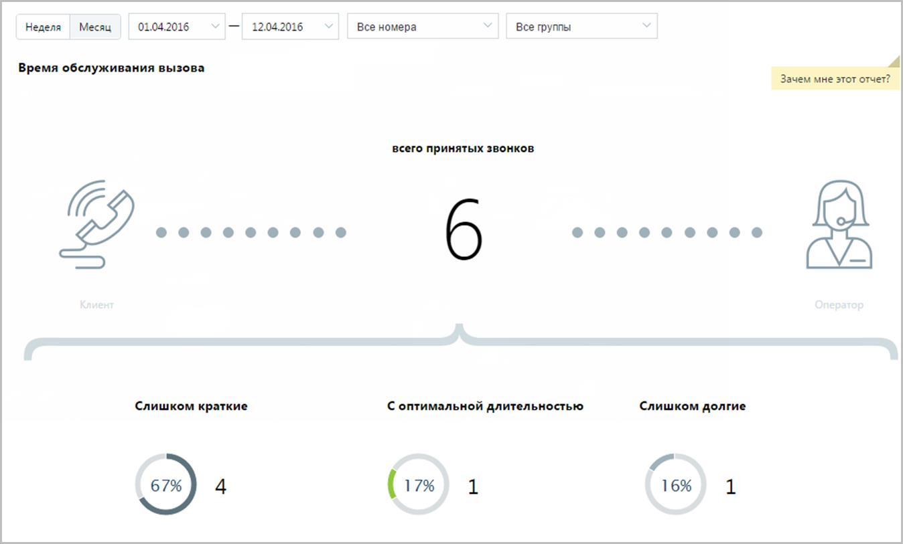
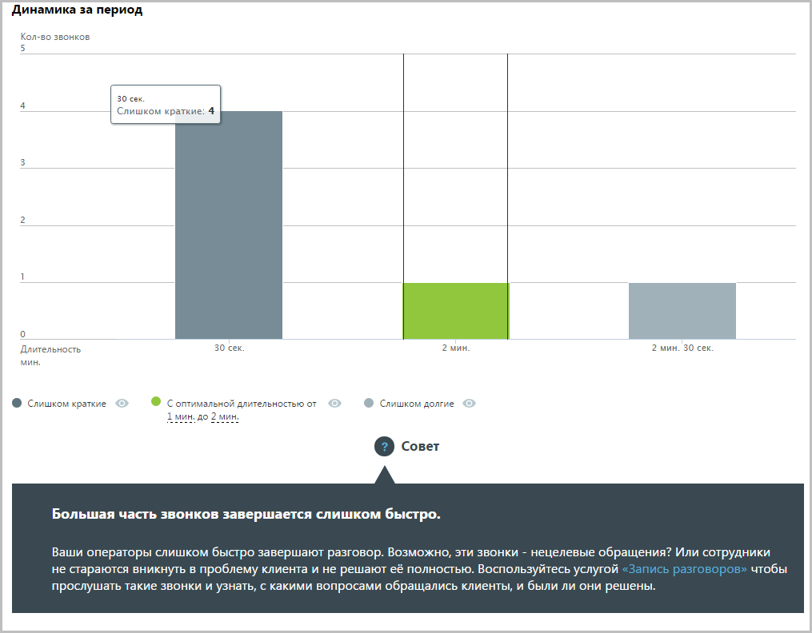

# 15.2.1.4. Время обслуживания вызова

> Трассировка: PDF §15.2.1.4 · сквозные стр. 441-443 · источники: ч.5 `kb/sources/mango-cc-manual/CC_manual_1.26.23-part-5.pdf` с.37-39.

Отчет «Время обслуживания вызова» содержит информацию о количестве входящих вызовов, обслуженных за определенный период. По умолчанию оптимальной длительностью обслуживания вызова считается период от 30 секунд до 2 минут. При необходимости измените этот период самостоятельно, установив другое значение в поле С оптимальной длительностью от… до после формирования отчета. В верхней части отчета приведены данные о принятых звонках в виде инфографики.

В нижней части окна отображается детальная информация о количестве вызовов, относящихся к определенному периоду.

Используйте кнопки Слишком короткие, С оптимальной длительностью и Слишком долгие для того, чтобы скрыть/отобразить соответствующие показатели на графике.
