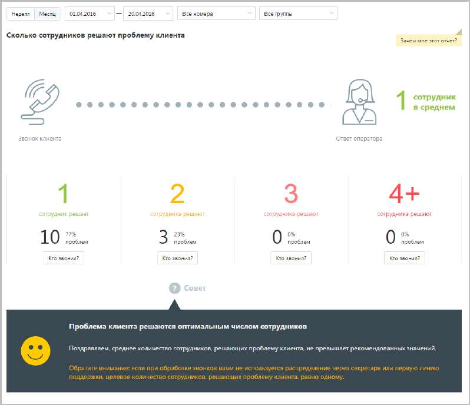

# 15.2.1.5. Сколько сотрудников решают проблему клиента

> Трассировка: PDF §15.2.1.5 · сквозные стр. 443 · источники: ч.1 `kb/sources/mango-cc-manual/CC_manual_1.26.23_compressed.pdf` с.443.

Отчет «Сколько сотрудников решают проблему клиента» отображает информацию о количестве сотрудников, участвующих в решении вопроса клиента.

По умолчанию оптимальным количеством сотрудников, участвующих в разговоре, является количество от одного до двух.
