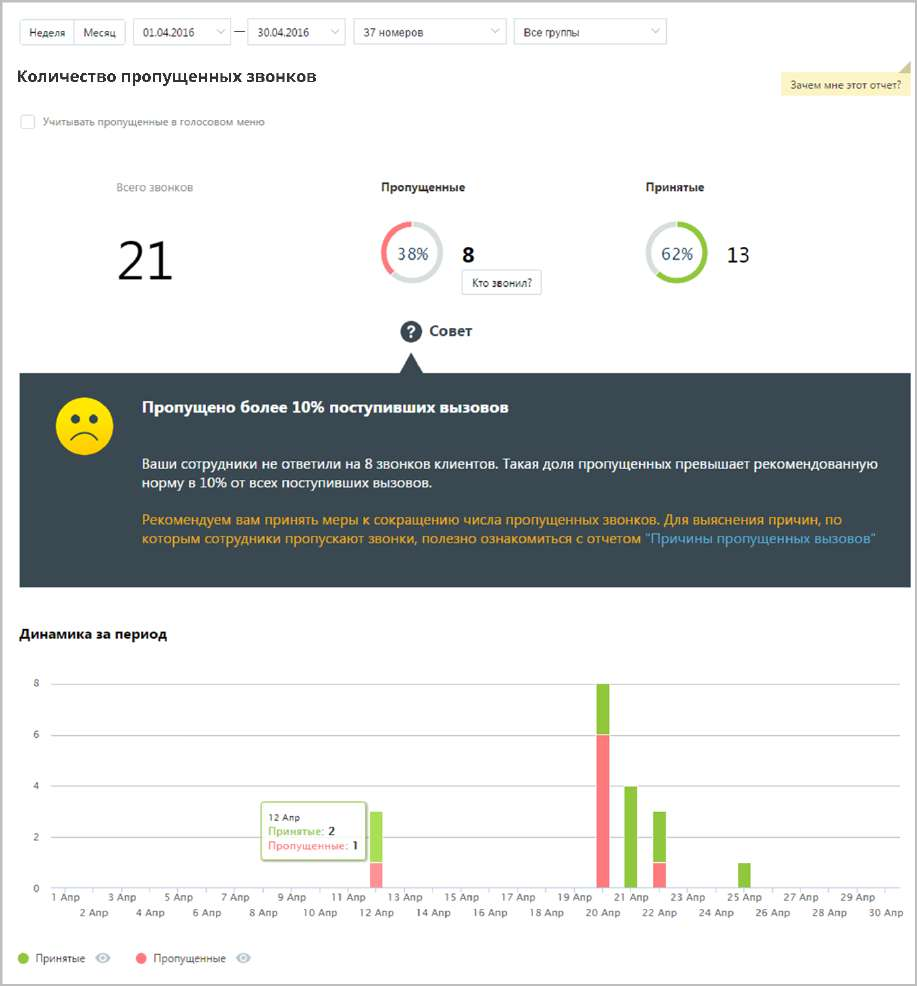

# 15.2.2.1. Количество пропущенных звонков

> Трассировка: PDF §15.2.2.1 · сквозные стр. 444-446 · источники: ч.1 `kb/sources/mango-cc-manual/CC_manual_1.26.23_compressed.pdf` с.444-446.

Отчет «Количество пропущенных звонков» отображает информацию о количестве и процентном соотношении принятых и пропущенных вызовов за определенный период. При выключенной настройке Учитывать звонки, пропущенные в голосовом меню вызовы, пропущенные в IVR меню, исключаются из подсчета общего числа пропущенных звонков.

Данные о количестве и процентном соотношении звонков приведены в верхней части окна в виде инфографики, включающей три диаграммы. Для получения детальной информации о пропущенных вызовах нажмите ссылку «Кто звонил». В результате будет выполнен переход на страницу отчета «Пропущенные звонки». Динамические изменения количества звонков за указанный период приведены в виде графика в нижней части отчета. Для получения более детальной информации о количестве вызовов в течение дня наведите курсор на любой столбец графика. Используйте кнопки Принятые и Пропущенные, чтобы скрыть/отобразить принятые или пропущенные вызовы на графике.

