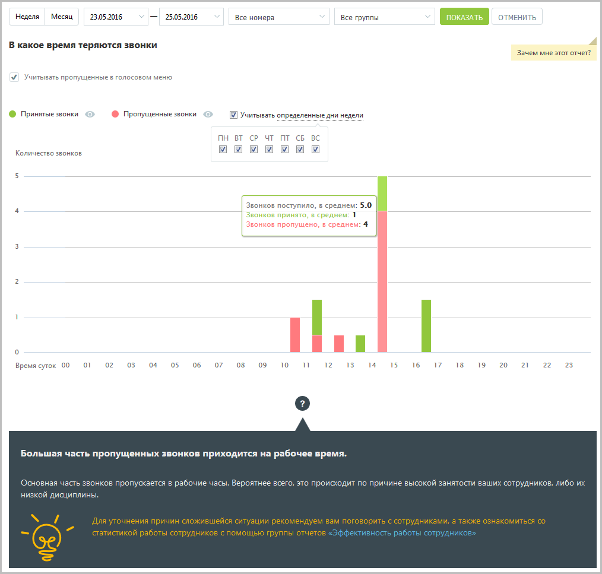

# 15.2.2.3. В какое время теряются звонки

Отчет «В какое время теряются звонки» в графическом виде отображает информацию о процентном соотношении количества принятых и пропущенных звонков в зависимости от времени суток. Таким образом, отчет поможет выявить часы, в течение которых пропускается больше всего вызовов, и принять меры по снижению количества пропущенных звонков в эти часы. Пример сформированного отчета приведен на рисунке ниже. Для получения более детальной информации о количестве вызовов в течение дня наведите курсор на любой столбец графика.

При выключенной настройке Учитывать звонки, пропущенные в голосовом меню вызовы, пропущенные в IVR меню, исключаются из подсчета общего числа пропущенных звонков. Используйте кнопки Принятые и Пропущенные, чтобы скрыть/отобразить принятые или пропущенные вызовы на графике. Для того, чтобы исключить из указанного периода определенные дни недели, данные по которым не должны фигурировать в отчете, щелкните по ссылке «Учитывать определенные дни недели» и снимите нужные флаги.
