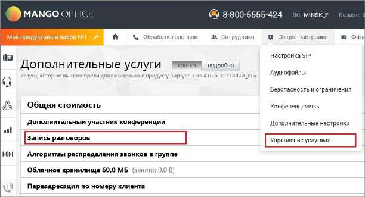

# 16. Речевая аналитика

Речевая аналитика распознает записанные разговоры и производит поиск (вручную или автоматически) необходимой информации в разговоре. Рабочая область раздела Речевая аналитика содержит следующие вкладки: Отчеты Настройки Заявки Тегирование разговоров Текстовые коммуникации ИИ Помощники Пользователю доступны следующие функции: • Поиск в распознанных записях разговоров заданных слов и выражений (см. Руководство пользователя Речевой аналитики) • Автоматическое проставление тематики звонка • Текстовая расшифровка разговора • Аналитика текстовых коммуникаций выбранных сотрудников • Составление отчетов • Формирования чек-листов и получение статистики по чек-листам • Получение уведомлений • Подача заявок на распознавание, для улучшения качества распознавания

| Для работы Речевой аналитики в Личном кабинете пользователя ВАТС должна быть |  |  |  |
| --- | --- | --- | --- |
|  | подключена услуга Запись разговоров. (Не относится к пользователям, использующим |  |  |
|  | оффлайновые источники аудиозаписей или аналитику текстовых коммуникаций). |  |  |

