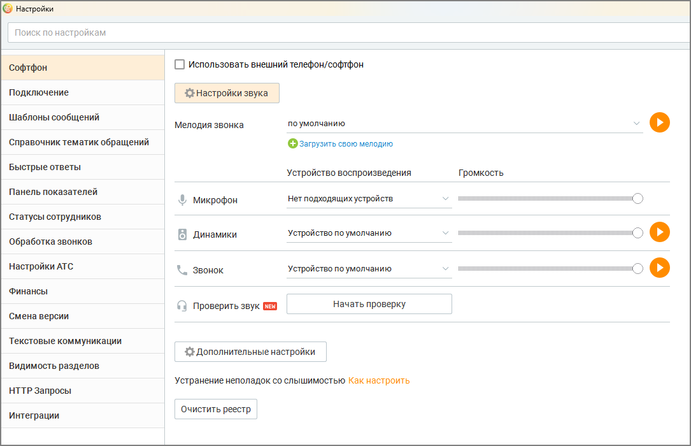
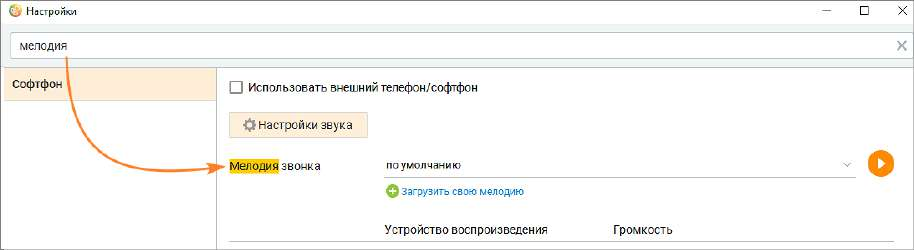

# 2.5.1.3. Настройки

> Трассировка: PDF §2.5.1.3 · сквозные стр. 52-54 · источники: ч.1 `kb/sources/mango-cc-manual/CC_manual_1.26.23_compressed.pdf` с.52-54.

Окно Настройки позволяет создавать новые учетные записи и осуществлять настройку Контакт-центра MANGO OFFICE в соответствии с ролью пользователя и кругом его обязанностей.

| Настройки, хранящиеся локально на компьютере пользователя, хранятся отдельно для |  |  |
| --- | --- | --- |
|  | каждой учетной записи. Если под учетной записью вход с компьютера осуществляется |  |
|  | впервые, то значения настроек устанавливаются по умолчанию, а при их изменении – |  |
| сохраняются на компьютере пользователя для соответствующей учетной записи. |  |  |

Окно содержит вкладки, позволяющие выбрать нужную группу настроек: • ВАТС — информация о настройках, управление Виртуальной АТС, с которой используется Контакт-центр MANGO OFFICE; • Телефония e-mail — выбор линии АТС для исходящих звонков; • Исходящие обращения – настройка аккаунтов, через которые оператор обращается к клиенту при инициации исходящего текстового обращения; • Автосекретарь – настройка правил Автосекретаря; • Пользовательские — пользовательские настройки программы; • Справочник тематик обращений — редактирование списка тематик обращений, применяемых при обработке вызова; • Быстрые ответы — редактирование списка быстрых ответов, применяемых при обработке обращений; • Панель показателей — настройка показателей производительности; • Софтфон — выбор устройств, использующихся в качестве микрофона и динамиков (гарнитуры) для осуществления разговоров, прослушивания записей разговоров и т. д; • Шаблоны сообщений — настройка сообщений, отправляемых пользователям по каналам СМС и WhatsApp; • Статусы сотрудников — добавление пользовательских статусов; • Подключение — настройки подключения программы; • Обработка звонков — настройки телефонных номеров; • Настройки АТС — настройки АТС; • Финансы — настройки и инструменты для работы с текущим Лицевым счетом; • Смена версии — смена версии и тарифа текущего продукта;

• Текстовые коммуникации — многоканальные виджеты; • Видимость разделов – отображение разделов Контакт-центра MANGO OFFICE. • HTTP-запросы — работа с внешними базами данных; • Интеграции — настройка интеграций с внешними сервисами. Строка полнотекстового поиска обеспечивает поиск по наименованию вкладок и их содержимому.

Также настройки Контакт-центра MANGO OFFICE можно открыть, щелкнув правой кнопкой мыши по иконке приложения в области системных значков уведомлений (трее).

Изменения, выполненные на одной вкладке, сохраняются при переходе на другую. Для сохранения изменений нажмите Сохранить в нижней части окна настроек. В случае закрытия окна при наличии несохраненных настроек на экране отобразится предупреждающее сообщение вида:

