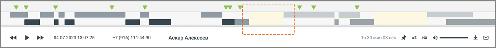
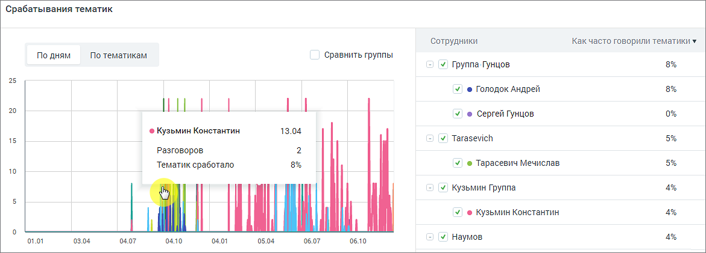
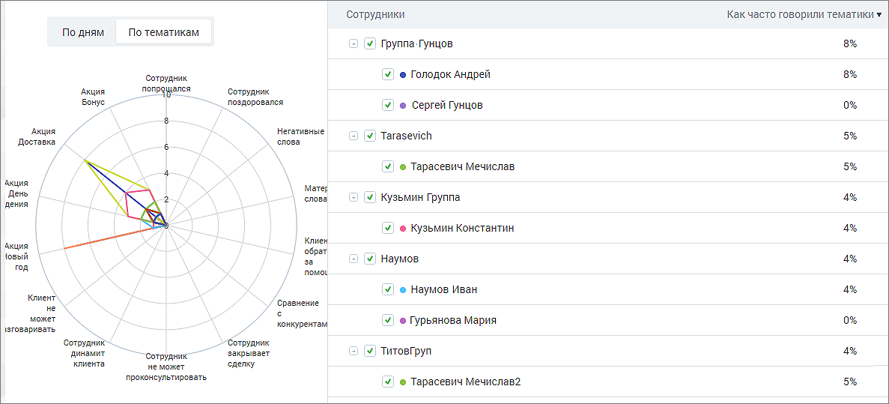
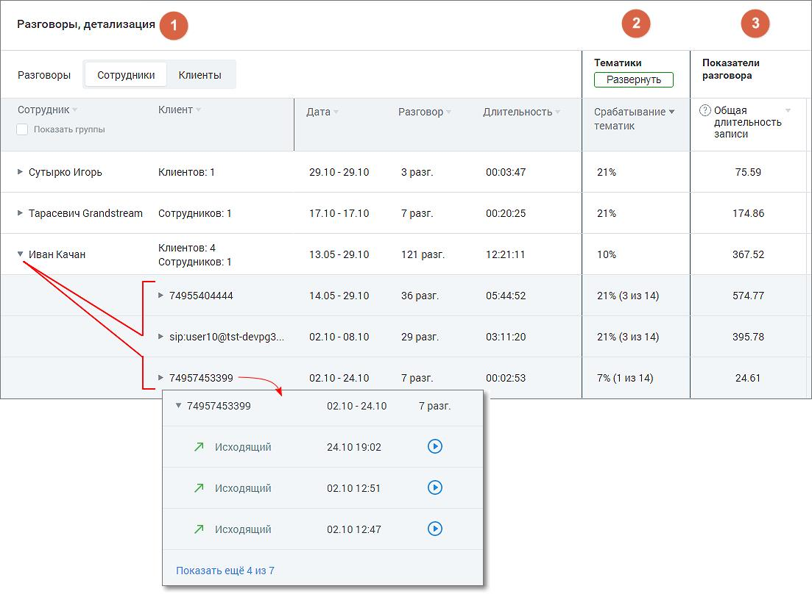
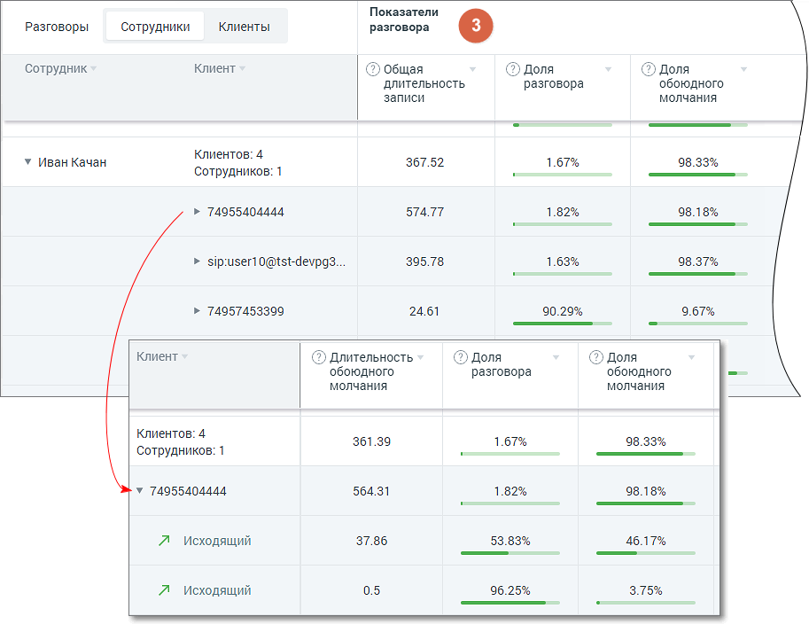
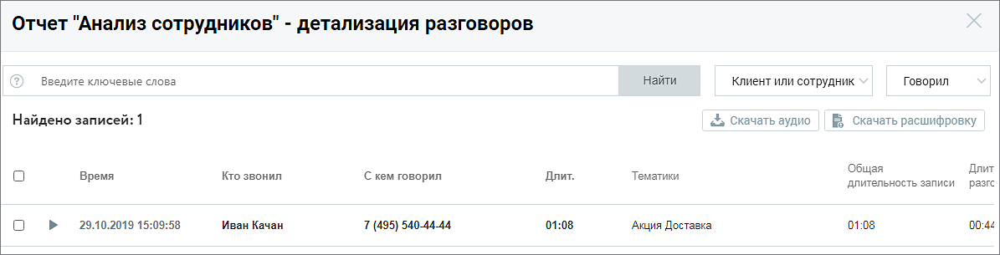

# 16.1.2. Отчет "Анализ сотрудников"

> Трассировка: PDF §16.1.2 · сквозные стр. 454-461 · источники: ч.5 `kb/sources/mango-cc-manual/CC_manual_1.26.23-part-5.pdf` с.50-57.

Отчет Анализ сотрудников состоит из трех блоков: 1. Блок фильтров 2. Блок визуализации «Срабатывание тематик» 3. Блок таблицы «Разговоры, детализация» Блок фильтров

При формировании отчета пользователям доступна фильтрация: Период – произвольный, текущий день, текущая неделя, текущий месяц, с прошлого месяца, с позапрошлого месяца, текущий год, весь период; Кого анализируем – список всех сотрудников, сгруппированный по группам. Если ни один сотрудник не выбран, отчет формируется по всем сотрудникам; Показатели – все тематики (в том числе неактивные), а также характеристики разговора. Подробнее здесь; Источник записи – выбор типа записи разговора: телефонные разговоры/ офлайн-записи /текстовые коммуникации. Направление звонка – входящий, исходящий, внутренний; Эмоции разговоров (по клиентам, по сотрудникам, по клиентам и сотрудникам) – дополнительная настройка для фильтрации разговоров в зависимости от выбранной эмоции: негативно, позитивно, нейтрально. В таблице отчета отображаются соответствующими пиктограммами-смайликами. Эмоции определяются на основании звуков (тембра, громкости). Номер ВАТС – выбор номеров линии ВАТС (максимальное количество – 100); Номер клиента – выбор произвольного номера клиента; Длительность звонка – по умолчанию установлена произвольная длительность звонка.

Каналы коммуникации – выбор из выпадающего списка доступных в разделе «Текстовые коммуникации» ЛК ВАТС каналов коммуникации. Варианты: Чат на сайте, ВКонтакте, Telegram, Max, WhatsApp, Авито. При выборе типа записи разговора «офлайн-записи» или «телефонные разговоры» фильтр недоступен. Группы каналов – выбор из выпадающего списка созданных в разделе «Текстовые коммуникации» ЛК ВАТС групп каналов коммуникации. При выборе типа записи разговора «офлайн-записи» или «телефонные разговоры» фильтр недоступен.

| Внутри фильтра действует принцип фильтрации – ИЛИ (когда одно из условий истинно). |
| --- |
| Между фильтрами действует принцип фильтрации – И (когда все условия истинны). |

Длительность тишины – используя этот фильтр руководитель может контролировать сотрудников на предмет тишины в разговорах, для выявления слабых мест в работе операторов. Фильтр применим только к новым записям. • Если не выбрана величина "от" – отфильтруются все разговоры, где длительность тишины была до указанного времени. • Если не выбрала величина "до" – отфильтруются разговоры, где длительность тишины была более указанного времени. Длительность тишины также отображается на плеере расшифровки разговора.

Изменение какого-либо из дополнительных фильтров не приводит к автоматическому обновлению данных в отчете. Для обновления данных нажмите кнопку «Сформировать отчет». Блок визуализации срабатывания тематик Отчет предоставляет данные по количеству сработавших тематик в разговорах сотрудника/группы, которым были присвоены выбранные тематики. Отчет доступен в срезах По дням и По тематикам. Каждый цвет кривой на графике соответствует определенному сотруднику.

Рис.1. Срез «По дням» • По оси У графика «По дням» отображается сколько тематик сработало, то есть процентное значение срабатывания выбранных в "Показателях" тематик. Если чекбокс «Сравнить группы» проставлен, то график отображает данные по группам сотрудников. Иначе – по отдельным сотрудникам. • По оси Х отображается временной период в разбивке по дням относительно выбранного периода в фильтре "Период".

| ПРИМЕР 1: |
| --- |
| • В поле "Показатели" выбрано 3 тематики. |
| • За указанную дату по сотруднику "Игорь Петров" было распознано 50 разговоров. |
| • На 40 распознанных разговоров была проставлена каждая из выбранных тематик, а на |
| оставшиеся 10 не проставилась ни одна тематика. Таким образом количество тематик, |
| которые проставились на указанные разговоры = 120 (из возможных 150). |
| Значение параметра "Тематик сработало" будет равняться: 120 / 150 * 100% = 80% |

По клику на графике отображается всплывающее окно с информацией по сотруднику на выбранную дату. Если чекбокс «Сравнить группы» проставлен, то всплывающее окно содержит данные по группе сотрудников на выбранную дату. Столбец «Как часто говорили тематики» рассчитывается как среднее значение по всем значениям параметра «Тематик сработало» за установленный период.

Рис.1. Срез «По тематикам» Внутри окружности графика «По тематикам» располагается графическое отображение вхождения сработавших тематик в разговоры выбранных сотрудников (сколько тематик сработало, столько цветных фигур отображается на графике). Столбец «Как часто говорили тематики» рассчитывается как среднее значение по всем значениям параметра «Тематик сработало» для конкретного сотрудника.

| ПРИМЕР 2: |
| --- |
| • Значение "Тематик сработало" по сотруднику "Игорь Петров" за 01.01 = 50%, а за 02.01 = |
| 70% |
| Соответственно, значение "Как часто говорили тематики" по сотруднику "Игорь Петров" за |
| выбранные 2 дня равняется [(50% + 70%) / 2)] = 60% |

Блок таблицы Разговоры, детализация Табличная часть отчета состоит из трех разделов: • Разговоры • Тематики • Показатели разговора

| Для типа записи разговора «Текстовые коммуникации» в качестве показателей |
| --- |
| отображаются только данные разговоров по тематикам. |

1. Раздел «Разговоры, детализация» Детализация разговоров предоставляется в срезах Сотрудники/Клиенты. В таблице отчета данные выводятся с возможностью группировки согласно установленных фильтров.

Таблица содержит следующие столбцы (рассмотрим пример для среза «Сотрудники»): • Сотрудник – имя сотрудника ВАТС. • Клиент - количество уникальных внешних номеров (не привязанных ни к одному из сотрудников ВАТС) с которыми у выбранного сотрудника за выбранный период состоялся успешный звонок. По каждому номеру доступна детализация звонков с записями разговоров (если на ВАТС подключена услуга записи разговоров). • Дата – диапазон дат в которые у выбранного сотрудника имеются распознанные разговоры. • Разговор – суммарное количество распознанных разговоров выбранного сотрудника за выбранный период. • Длительность – суммарная длительность всех распознанных разговоров выбранного сотрудника за выбранный период в формате ЧЧ:ММ:СС.

По клику на пиктограмму аудиозаписи или пиктограмму текстового канала

коммуникации (например ) открывается окно записи разговора.

| Если чекбокс «Показать группы» проставлен, столбец Сотрудник содержит двухуровневый |
| --- |
| иерархический список (группа/ сотрудник): т.е. сотрудники сгруппированы по группам. |
| Данные в отчете в этом случае формируются и для группы в целом. |

2. Раздел «Тематики»

В развернутом виде раздел таблицы содержит следующие столбцы: • Соответствие тематикам – показатель вида (N из M), где N – количество проставленных на данный разговор тематик, а M – общее количество тематик, выбранных в блоке фильтрации; • Столбцы с наименованиями тематик – все тематики, выбранные в блоке фильтрации, с пометкой о срабатывании. В детализации звонков пометка о срабатывании отображается по каждому звонку. При расчете данных в столбцах используются следующие величины: N – количество проставленных на данный разговор тематик M – общее количество тематик, выбранных в блоке фильтрации

– параметр, равный N/M*100%;

- параметр, равный среднему арифметическому данных в строке по всем выбранным тематикам;

- параметр, равный отношению количества меток "Сработала" (по вертикали) к общему количеству меток ("Сработала " + "Не сработала "). 3. Раздел «Показатели разговора»

Раздел таблицы содержит следующие столбцы: • Общая длительность записи • Длительность разговора • Длительность обоюдного молчания • Доля разговора • Доля обоюдного молчания • Количество перебиваний сотрудником • Количество перебиваний клиентом • Доля обоюдного разговора • Доля разговора сотрудника • Доля разговора клиента • Скорость разговора сотрудника • Скорость разговора клиента Чтобы узнать правило расчета каждого из показателей, наведите курсор на пиктограмму возле наименования показателя. Подробнее о значениях показателей узнайте здесь. Для фильтрации данных отчета по возрастанию/убыванию следует щелкнуть по наименованию столбца. Детализация разговоров

По клику на пиктограмму открывается окно детализации звонка:

Окно детализации разговоров содержит следующие данные о звонках: • Дату и время звонка • Кто звонил • С кем говорил • Эмоции клиента • Эмоции сотрудника • Длительность разговора • Список тематик, которые присвоены звонку • Общая длительность записи • Длительность обоюдного молчания • Доля разговора/обоюдного молчания • Количество перебиваний сотрудником/клиентом • Доля обоюдного разговора/сотрудника/клиента • Скорость разговора сотрудника/клиента В окне детализации разговоров пользователю доступны следующие действия: поиск по записям, прослушивание, просмотр расшифровки разговора (при наличии), скачивание аудиозаписи и расшифровки разговора.
