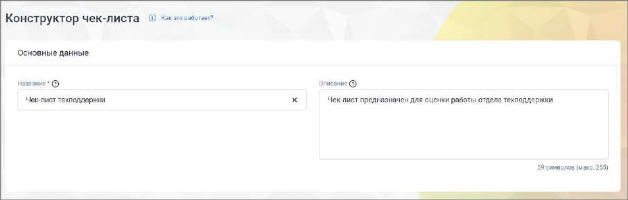
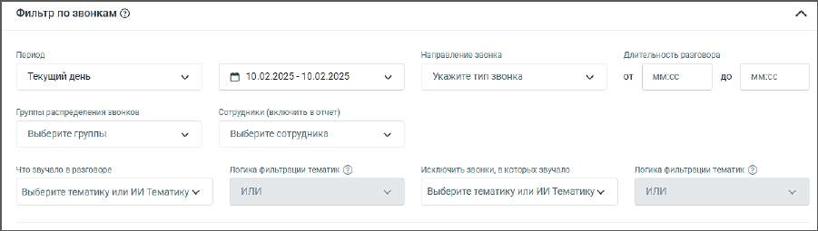
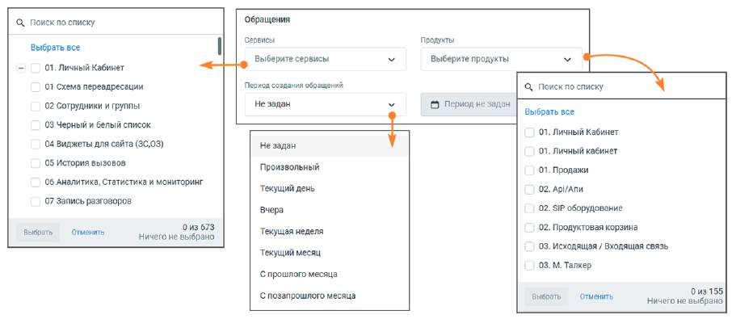
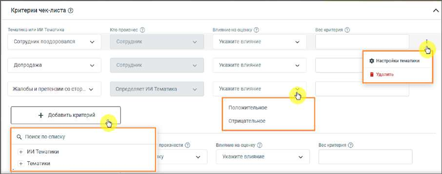
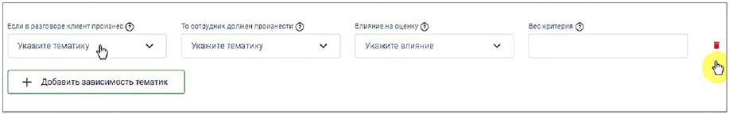
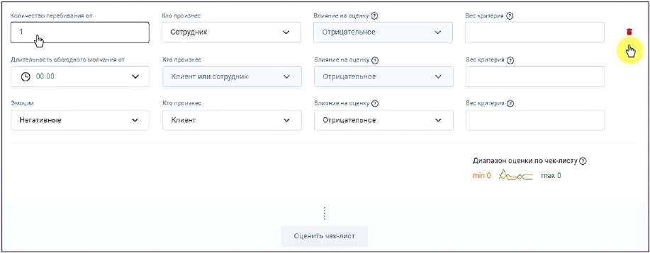

# 16.1.4.1. Конструктор чек-листов

Возможно создание не более 20-ти чек-листов. Для создания нового чек-листа необходимо нажать на кнопку Создать чек-лист. Вы можете выбрать один из трёх вариантов: «Чек-лист для отдела продаж», «Чек-лист для отдела поддержки» или «Пустой чек-лист». Готовые шаблоны уже содержат ключевые критерии для оценки качества работы менеджеров, что помогает сразу выявлять типовые ошибки и точки роста. Выбранный шаблон можно сразу использовать для анализа или адаптировать под свои задачи, изменив, добавив или удалив пункты.

«Пустой чек-лист» позволяет создать список с нуля, если требуется полностью индивидуальный подход.

Основные данные: • Название – название, под которым чек-лист будет отображаться в списке чек-листов, не более 65 символов. Название должно быть уникальным в рамках списка чек-листов ЛК ВАТС. Поле обязательно для заполнения; • Описание – описание чек-листа, не более 255 символов;

Фильтр по звонкам: • Период – в какой период были осуществлены звонки, которые должны войти в отчет. Выпадающее меню, с вариантами периода: произвольный, текущий день, вчера, текущая неделя, текущий месяц, с прошлого месяца, с прошлого месяца; • Календарь – для указания временного промежутка, когда были осуществлены разговоры, которые должны войти в отчет. После выбора дат, нужно подтвердить выбор кнопкой «Выбрать»; • Длительность разговора – какой длительности должны быть разговоры, которые должны войти в отчет; o Если в ячейке не указана цифра «от», то будут анализироваться все разговоры без учета нижней границы; o Если в ячейке не указана цифра «до», то будут анализироваться все разговоры без учета верхней границы; o Если в ячейке не указаны цифра «от» и «до», то будут анализироваться все разговоры, без учета этого фильтра; • Тип звонка – какого типа звонки должны войти в отчет. Выпадающее меню с вариантами: исходящий, входящий, внутренний. После выбора показателей нужно подтвердить выбор кнопкой Выбрать; • Сотрудники – по разговорам каких сотрудников будет строиться отчет. Выпадающее меню, в котором можно выбрать одного, нескольких или всех сотрудников;

• Группы сотрудников – при выборе каких-либо групп в отчетах будут отображаться только разговоры сотрудников, принадлежащих к выбранным группам. Если ни одно группа не выбрана, отчет формируется по всем группам; • Звонки, в которых звучали тематики – выбор одной или нескольких тематик для оценки по чек-листу; • Исключить звонки с тематиками – звонки, которым проставились выбранные тематики, не будут участвовать в оценке по чек-листу; • Логика фильтрации – для включающего и исключающего тематики фильтра необходимо задать один из вариантов логики: o «И» – ищет диалоги, где встречается тематика 1 И тематика 2 И остальные выбранные тематики; o «ИЛИ» – ищет диалоги, где встречается хотя бы одна из выбранных тематик.

Фильтры по обращениям: • Сервисы – поле выбора категорий сервисов. Выпадающий список включает все сервисы ЛК ВАТС. Содержит элементы для поиска и массового выбора. • Продукты – поле выбора категорий продуктов. Выпадающий список включает все продукты ЛК ВАТС. Содержит элементы для поиска и массового выбора. • Период создания обращений – выпадающий список с вариантами периода. Доступные варианты: o Не задан, o Произвольный, o Текущий день, o Вчера, o Текущая неделя, o Текущий месяц, o С прошлого месяца, o С позапрошлого месяца. Фильтры по CRM Инструмент фильтрации звонков по этапам сделок позволяет оценивать эффективность работы сотрудников не только по содержанию разговора, но и в контексте хода сделки.

| Функция доступна при подключённой в ЛК ВАТС интеграции «Расширенный пакет |  |  |
| --- | --- | --- |
|  | Битрикс24». В настройках интеграции должен быть отмечен чекбокс «Передавать данные в |  |
| Речевую аналитику». |  |  |

В выпадающем списке блока фильтров вы можете выбрать: • Тип воронки (например, «Продажи», «Поддержка»); • Этап сделки (например, «Первичный контакт», «Закрыто успешно»). После выбора параметров в таблице результатов отображается колонка «CRM», где для каждого разговора указываются статус сделки и её текущий этап в Битрикс24. Благодаря этим данным можно сразу увидеть, как конкретные звонки влияют на продвижение сделок и оценить эффективность работы менеджеров на разных стадиях продаж. Критерии чек-листа:

Доступные критерии: 1) Тематики и ИИ Тематики При создание нового чек-листа в блоке Критериев по умолчанию отображаются три тематики-

критерия. Клик по пиктограмме в строке выделенного чек-листа открывает выпадающее меню: • Настройки тематики – переход в раздел Создание и редактирование тематик; • Удалить – удаление тематики из чек-листа. Клик по кнопке Добавить критерий открывает список всех доступных тематик и ИИ тематик с возможностью выбора одного из них. В список критериев добавляется строка с выбранной тематикой или запросом и полями для ввода и выбора данных: • Кто произнес – в каком канале звучала тематика или запрос: сотрудник, клиент, клиент или сотрудник; • Влияние на оценку – задается влияние тематики или запроса на общую оценку (положительное или отрицательное);

• Вес критерия – оценка в баллах, как повлияет срабатывание критерия, на общую оценку, максимум можно вводить 4 цифры; Отображение поля «Кто произнес» для выбранных тематик и запросов: • Если в расширенных настройках Тематики пользователь указал вариант «клиент или сотрудник», то в чек-листе есть возможность выбрать или клиента, или сотрудника или оставить обоих. • Если тематика или запрос настроены на «клиент» или «сотрудник», то у пользователя в чек- листах не будет возможности выбрать – в ячейке будет указан или «клиент», или «сотрудник» по умолчанию. • Если у пользователя не было расширенных настроек, то данную ячейку пользователь заполняет в интерфейсе конструктора чек-листов самостоятельно. 2) Зависимость тематик

Эта настройка устанавливает зависимость ответа сотрудника от запроса клиента. У пользователя есть возможность выбрать тематики запроса и ответа, а также влияние критерия на оценку и вес критерия. Клик по кнопке "Добавить зависимость тематик" добавляет строку с полями для ввода/выбора данных. 3) Характеристики разговора

Также при создании чек-листа в блоке по умолчанию отображаются критерии – характеристики разговора: • Количество перебиваний – влияние на оценку автоматически проставлено как «отрицательное», вес не указан o Количество перебиваний от __ – количество перебиваний в разговоре сотрудником или клиентом (выбирается в следующем поле); o Кто произнес – для кого считается количество перебиваний. Варианты: сотрудник, клиент, клиент или сотрудник; o Влияние на оценку – по умолчанию проставлено как «отрицательное», изменение невозможно; o Вес критерия – оценка в баллах, как повлияет срабатывание критерия, на общую оценку, максимум можно вводить 4 цифры;

• Длительность обоюдного молчания – по умолчанию проставлено как «отрицательное», изменение невозможно; o Длительность обоюдного молчания от__ вводится в формате ММ:СС. Пользователь может ввести цифру самостоятельно, либо выбрать из выпадающего меню, с шагом 10 секунд. o Кто произнес – имеется в виду «для кого считается длительность молчания». Вариант: сотрудник или клиент, изменение невозможно; o Влияние на оценку – по умолчанию проставлено как «отрицательное», изменение невозможно; o Вес критерия – оценка в баллах, как повлияет срабатывание критерия, на общую оценку, максимум можно вводить 4 цифры. После ввода веса каждого критерия, под таблицей автоматически считается и отображается диапазон оценок по чек-листу – максимальная и минимальная возможные оценки сотрудников. Для подсчета статистики по чек-листу нажмите кнопку «Оценить чек-лист». После нажатия кнопки все поля критериев будут недоступны для редактирования. Чтобы отредактировать критерии после подсчета статистки, прокрутите страницу чек-листа вверх и нажмите кнопку «Изменить чек-лист». Статистика по данному чек-листу будет сброшена, чек-лист перейдет в статус «черновик» до момента следующей оценки.
