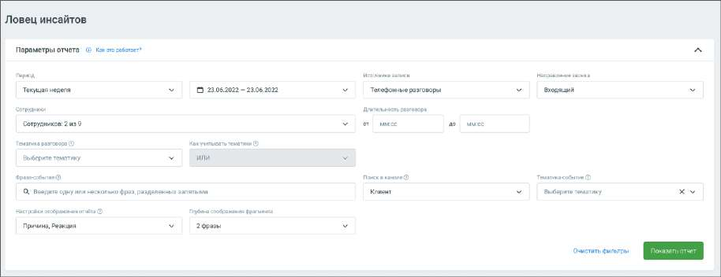
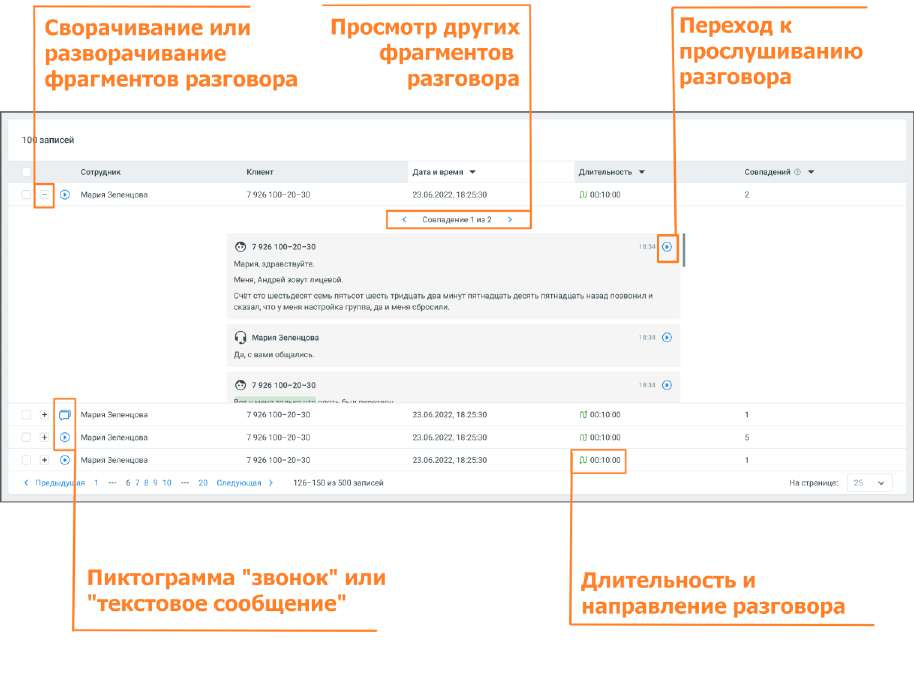

# 16.1.5. Ловец инсайтов

Данные отчета позволяют прослеживать – как фраза или тематика разговора повлияла на ход разговора. Таким образом отчет Ловец инсайтов позволяет в наглядном виде ознакомиться с причинами, которые не позволяют сотруднику работать на максимуме своей эффективности. Отчет состоит из двух блоков: 1) Блок параметров 2) Блок результатов Блок параметров

При формировании отчета пользователям доступна фильтрация: Период – в какой период состоялись диалоги, которые должны войти в отчет. Выпадающее меню, с вариантами периода: произвольный, текущий день, текущая неделя, текущий месяц, с прошлого месяца, с позапрошлого месяца; Источники записи – выбор типа записи разговора: телефонные разговоры, текстовые коммуникации; Направление звонка – входящий, исходящий, внутренний звонок или текстовое сообщение; Сотрудники – список всех сотрудников, сгруппированный по группам. Если ни один сотрудник не выбран, отчет формируется по всем сотрудникам; Длительность разговора – продолжительность разговора; Тематика разговора – выбор одной или нескольких тематик, которые звучали в разговоре. Как учитывать тематики – выбор логики для тематик, с помощью которой будут фильтроваться звонки. И – в отчёт попадут разговоры, где прозвучала каждая из выбранных тематик. ИЛИ – в отчёт попадут разговоры, где прозвучала хотя бы одна из выбранных тематик; Фраза-событие – триггер, т.е. слово или фраза, характеризующие важное для бизнеса событие, причины и реакции которых необходимо проанализировать. Для уточнения поиска используйте символы ! и " ", как указано в пункте Правила и советы по настройке тематик; Поиск в канале – выбор канала Клиент или Сотрудник, в котором необходимо найти событие. Тематика-событие – выбор тематики, характеризующей важное для бизнеса событие, причины и реакции которой необходимо проанализировать. В выпадающем окне доступны тематики, настроенные для выбранного ранее канала.

Настройки отображения отчёта: Причина – это фрагмент разговора сотрудника или клиента, который звучал до искомого события. Реакция – это фрагмент разговора, который звучал после события. Если не выбран ни один из показателей, в отчете отобразится только контекст события; Глубина отображения фрагмента – количество фраз, которые отобразятся в Блоке результатов отчета; Клик по кнопке Очистить фильтры очищает выбранные параметры фильтрации. Клик по кнопке Показать отчет отображает блок результатов. Блок результатов Блок содержит подробную информацию о срабатывание триггера, с отображением причины и результата срабатывания.

Блок результатов содержит следующие данные: • Клиент и сотрудник, участники разговора • Источник записи • Длительность и направление разговора • Дата и время разговора • Количество совпадений с триггером в разговоре. Если в разговоре триггер сработал несколько раз, то для навигации по срабатываниям используйте пиктограммы влево <, и вправо > • Фрагменты разговора, в которых сработал триггер. В каждом фрагменте есть пиктограмма, которая открывает плеер или осциллограмму разговора: o с первой фразы причины триггера (для настроек отображения – Причина и Реакция)

o с фразы, где имеется триггер (для настроек отображения – Реакция)
