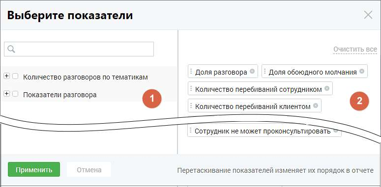

# 16.1.6. Показатели отчетов

> Трассировка: PDF §16.1.6 · сквозные стр. 476-477 · источники: ч.1 `kb/sources/mango-cc-manual/CC_manual_1.26.23_compressed.pdf` с.476-477.

Для построения отчетов устанавливаются показатели, по которым будет формироваться отчет.

Окно выбора показателей содержит две группы: 1. В группе «Количество разговоров по тематикам» отображаются все тематики продукта: предустановленные и созданные пользователем, включая неактивные. По этим показателям можно проанализировать корректность речи сотрудника и речь клиента. 2. Группа «Показатели разговора» включает в себя следующие характеристики звонка: Общая длительность записи – показывает общую длительности записи с момента подъема трубки до окончания разговора; Длительность разговора – показывает суммарное количество времени, когда хотя бы один из участников разговора говорил; Длительность обоюдного молчания – показывает, сколько времени сотрудник тратит на поиск информации, требующейся клиенту, а также насколько быстро сотрудник может ответить на вопросы клиента; Доля разговора – отношение длительности разговора к общей длительности записи. Позволяет понять, какую долю от общего времени записи собеседники были заняты разговором; Доля обоюдного молчания – отношение длительности обоюдного молчанию к длительности записи. Позволяет понять, какую долю от общего времени записи клиент ожидает ответа сотрудника; Количество перебиваний сотрудником – позволяет понять, сколько раз сотрудник перебил клиента; Количество перебиваний клиентом - позволяет понять, сколько раз клиент перебил сотрудника. Если у какого-то сотрудника этот показатель сильно отличается от остальных, то, вероятно, способ донесения сотрудником информации не соответствует ожиданиям клиента;

Доля обоюдного разговора – доля разговора, когда клиент и сотрудник говорили одновременно. Позволяет понять стиль общения сотрудника с клиентом; Доля разговора сотрудника – доля разговора, когда говорил только сотрудник. Позволяет понять, ведет ли сотрудник беседу, или её ведет клиент; Доля разговора клиента – доля разговора, когда говорил только клиент. Позволяет понять, ведет ли сотрудник беседу, или её ведет клиент; Скорость разговора клиента (количество слов в секунду); Скорость разговора сотрудника (количество слов в секунду) – позволяет анализировать, как сотрудник подстраивается под скорость речи клиента. Сравнив этот показатель среди всех сотрудников можно понять, кто слишком быстро говорит, а кто говорит чересчур медленно. Данные выбранных чекбоксов в таблице «Показатели разговора» отчета «Анализ сотрудников» отображаются, как столбцы. Выбранные показатели отображаются на правой стороне окна показателей (блок 2). Для

удаления показателя из списка выбранных нажмите пиктограмму удаления в строке показателя. Для сохранения внесенных изменений нажмите на кнопку «Применить».

Если нажать кнопку «Отменить» или пиктограмму , изменения не будут внесены, а выборка показателей вернется к последней сохраненной версии.
