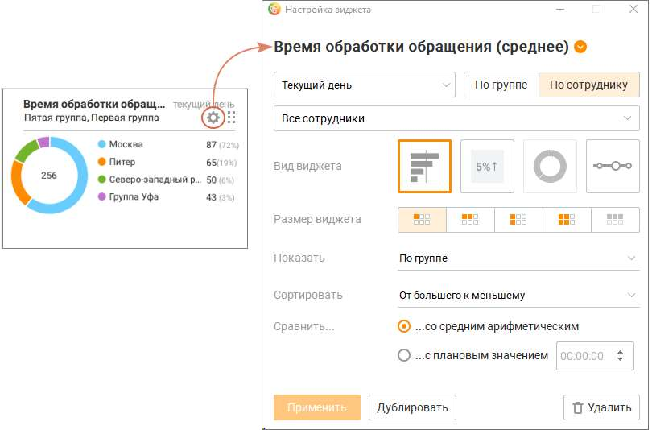

# 3.3. Удаление виджета

> Трассировка: PDF §3.3 · сквозные стр. 127-128 · источники: ч.1 `kb/sources/mango-cc-manual/CC_manual_1.26.28.1.pdf` с.127-128.

Пользователь может удалить любой ранее добавленный виджет на Dashboard.

Чтобы удалить виджет, нажмите пиктограмму в правом верхнем углу окна.

В открывшемся окне нажмите кнопку Удалить. Во всплывающем окне подтвердите свое согласие на удаление.

| При удалении настройки виджета нигде не сохраняются. Восстановить удаленный виджет |
| --- |
| невозможно. |

