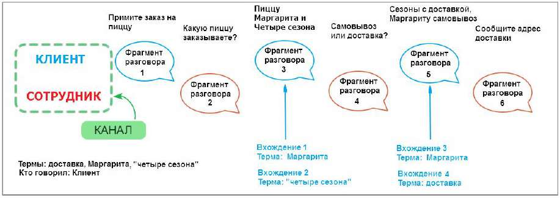
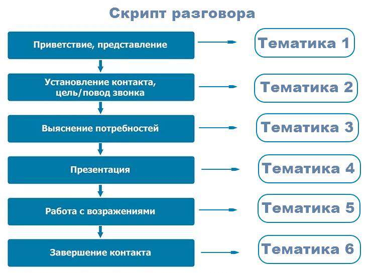
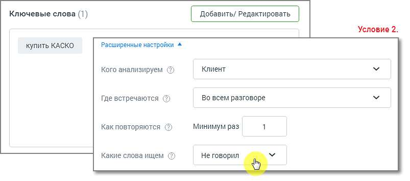
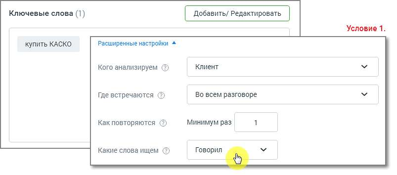
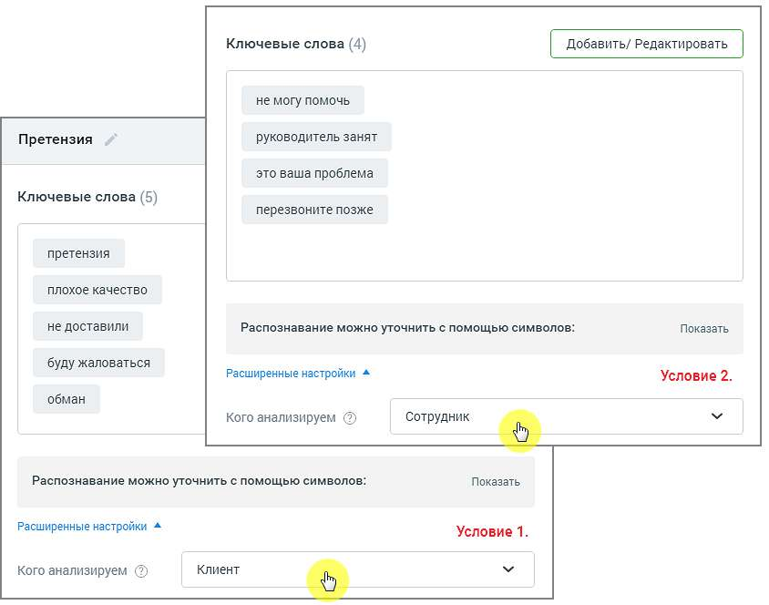

# 16.2.3. Правила и советы по настройке тематик

> Трассировка: PDF §16.2.3 · сквозные стр. 484-489 · источники: ч.1 `kb/sources/mango-cc-manual/CC_manual_1.26.23_compressed.pdf` с.484-489.

Терма – ключевое слово или словосочетание, которое необходимо найти в тексте записи разговора. При вводе терм допускается использование следующих символов: • Кавычки (" " или «») – для поиска точного соответствия поисковому запросу; • Дефис (тире) – для составных слов; • Буквы (кириллица, латиница); • Цифры; • Пробел; • Восклицательный знак (!).

Виды терм

Простое слово. Например, слово окно. Допустим, пользователь ищет это слово в речи клиента. Вхождение засчитывается, когда слово окно (с учетом словоформ: окна, окон и т. д.) будет найдено в каком-то из фрагментов разговора клиента. Если слово окно будет найдено 5 раз в одном фрагменте или слово окно будет найдено в 5-ти разных фрагментах, то количество вхождений слова окно будет равно 5. Словосочетание Например словосочетание купить окно. Допустим, пользователь ищет это словосочетание в речи клиента. Вхождение засчитывается, когда одновременно слово купить и слово окно (с учетом словоформ) встретятся во фрагменте разговора клиента. Например, если клиент сказал Хочу купить ваше пластиковое окно, терма купить окно засчитается. Словосочетание в точном соответствии Например “купить окно” (отличается от обычной фразы ТОЛЬКО кавычками). Допустим, пользователь ищет в речи клиента словосочетание “купить окно”. Вхождение засчитается только в том случае, когда во фрагменте речи клиента встретится фраза купить окно (с учетом словоформ). Например, если клиент сказал Хочу купить ваше пластиковое окно, терма “купить окно” НЕ засчитается. А если клиент сказал Я очень хочу купить окна, терма “купить окно” засчитается. Слово или словосочетание без учета словоформ Например !окно (отличается от обычной фразы ТОЛЬКО символом «!») Допустим, пользователь ищет это слово в речи клиента Вхождение засчитывается, когда слово окно (без учета словоформ) будет найдено в каком-то из фрагментов разговора клиента. Например, если в каком-то из фрагментов разговора клиент скажет Я купил одно окно в этой организации. Чтобы закрепить все словоформы словосочетания, необходимо использовать символ «!» перед первым словом словосочетания – !купить окно. Вхождение засчитывается, если в каком-то из фрагментов разговора клиент скажет Я хочу купить одно окно в этой организации.

| Важно: Закрепить одно слово в словосочетании нельзя. Терма вида купить !окно является |
| --- |
| некорректной. |

Для поискового запроса !окно, найденные слова "окна", "окон" НЕ засчитываются как вхождение. Слово или словосочетание в точном соответствии, без учета словоформ «!купить окно» – используйте кавычки и символ ! для закрепления словоформы поискового запроса в точном соответствии. !«купить окно» – второй вариант для закрепления словоформы поискового запроса в точном соответствии. Вхождение засчитывается, если в каком-то из фрагментов разговора клиент скажет Я хочу купить окно с установкой. 1. Создавайте простые тематики, чтобы одна тематика решала максимум одну задачу. Лучше задать несколько узконаправленных тематик, нежели одну общую.

| ПРИМЕР |
| --- |
| Известны основные конкуренты компании, их преимущества, отличия и т. д. Клиенты в разговоре с |
| сотрудниками сравнивают продукты компании с продуктами конкурентов, и руководителю важно |
| понимать, с какими конкурентами сравнивают. Знать параметры – по каким компания выигрывает, |
| по каким проигрывает. Таким образом можно запланировать изменения в продукте/ ценовой |
| политике/ позиционировании на рынке и т. д. |
| Решение: Создаем отдельные тематики для каждого из конкурентов с условиями Клиент, Говорил, |
| Во всем разговоре и смотрим, как их упоминание меняется в динамике по времени. |
| На основании полученных данных в работу компании вносятся изменения: меняется ценовая |
| политика, корректируются позиционирование продукта, уникальное торговое предложение, |
| скрипты продаж. |

2. Создавайте несколько тематик для решения одной задачи. По данным отчетов вы сможете увидеть, на каком этапе разговора у сотрудников возникают проблемы.

3. Создавая тематики на негативные сценарии, используйте фильтр НЕ ГОВОРИЛ Помните, что тематики “отрицательной” направленности – Недобросовестные сотрудники, Отказ в услуге и т. д. – могут повлиять на результаты расчета рейтинга сотрудника/группы. 4. При настройке тематик не задавайте противоречащие друг другу условия. Пример двух противоречащих условий в одной тематике:

5. Создавайте тематику из нескольких условий, только если это необходимо для решения конкретной задачи. Например, если в одном разговоре требуется проанализировать отдельно два канала – сотрудник и клиент – на соответствие разным условиям.

