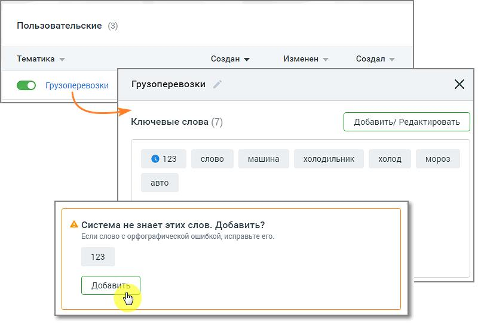
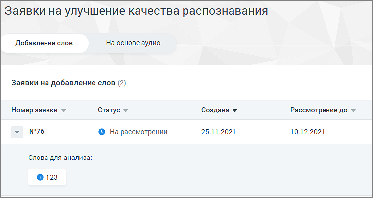

# 16.5.1. Добавление слов

> Трассировка: PDF §16.5.1 · сквозные стр. 501-502 · источники: ч.5 `kb/sources/mango-cc-manual/CC_manual_1.26.23-part-5.pdf` с.97-98.

Чтобы отправить заявку на добавление слова, которое не знакомо «Речевой аналитике», следует в разделе «Тематики» выбрать тематику, в которой имеются незнакомые слова, и открыть карточку тематики.

Внизу карточки тематики будет присутствовать уведомление о незнакомом слове и предложение добавить его в систему. Нажмите кнопку Добавить. Заявка отобразится в окне раздела «Заявки на улучшение качества распознавания», на вкладке «Добавление слов».

Окно заявки содержит следующие данные: • Номер заявки • Статус заявки – на рассмотрении, исправления приняты, исправления отклонены. • Дата создания заявки • Дата, до которой будет рассмотрена заявка Также в окне можно ознакомиться с предлагаемым для анализа словом.
