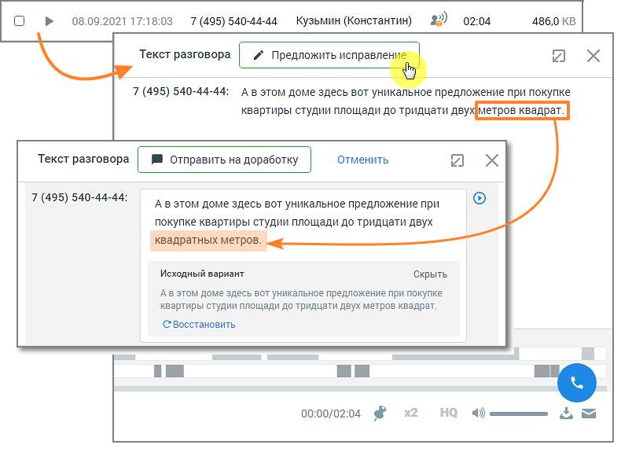
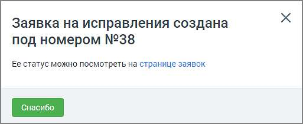
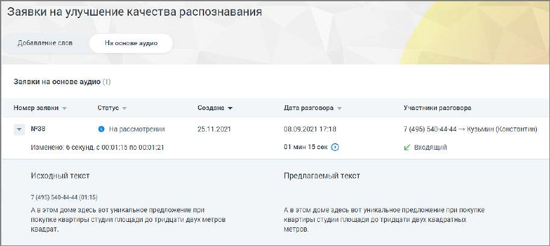

# 16.5.2. На основе аудио

Чтобы отправить заявку на улучшение качества распознавания на основе аудиозаписи, в окне расшифровки записи разговора следует нажать кнопку Предложить исправления.

Далее внесите в текст требуемое исправление и нажмите кнопку Отправить на доработку. На экране отобразится окно системного уведомления:

Клик по ссылке открывает окно раздела «Заявки на улучшение качества распознавания», на вкладке «На основе аудио».

Окно заявки содержит следующие данные: • Номер заявки • Статус заявки – на рассмотрении, исправления приняты, исправления отклонены. • Дата создания заявки • Дата разговора и его длительность • Участники разговора и информация о звонке (входящий или исходящий) Также в окне можно ознакомиться с исходным и предлагаемым к замене текстом.
