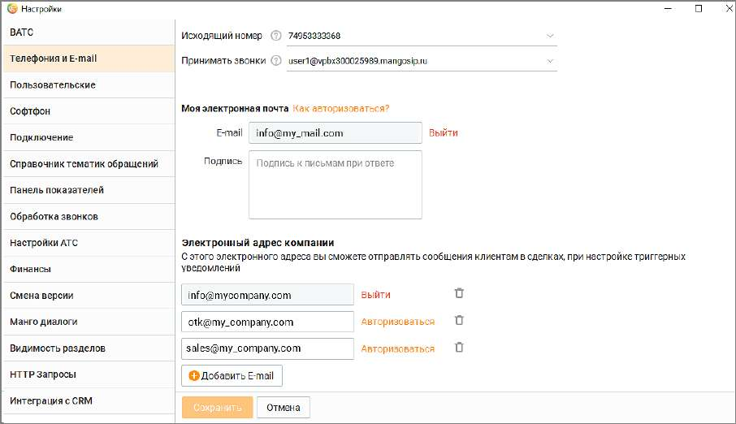
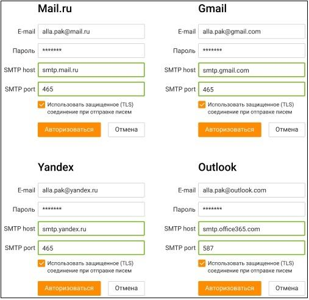
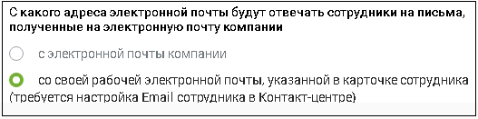

# 2.5.1.3.2. Телефония и E-mail

> Трассировка: PDF §2.5.1.3.2 · сквозные стр. 56-59 · источники: ч.1 `kb/sources/mango-cc-manual/CC_manual_1.26.23_compressed.pdf` с.56-59.

Данная вкладка предназначена для выбора исходящей линии АТС и адреса электронной почты сотрудника.

Исходящий номер телефона Выбранный номер будет отображаться на определителе номера у человека, которому звонит сотрудник. Также номер служит для определения региона звонка для расчета стоимости связи. Напротив каждого номера отображается комментарий (при его наличии), указанный в Личном кабинете на странице настроек "Номера, подключенные к АТС". Принимать звонки Номера сотрудника (номера телефонов и SIP), на которые он может принимать входящие вызовы. Задаются в карточке сотрудника в Личном кабинете пользователя ВАТС. (См. Справочник ВАТС, Вкладка «Телефония»). В списке отображаются только номера, отмеченные как "активные". Настройка доступна пользователям с правом: Изменять порядок, активность и расписание средств приема звонков, а также изменять алгоритм приема звонков по внутреннему номеру. Моя электронная почта Адрес электронной почты может находиться в одном из трех состояний: 1) отсутствует – адрес электронной почты сотрудника не указан ни в настройке "Телефония и E-mail" в Контакт-центре, ни в Карточке сотрудника в ВАТС (раздел Ваш персонал/Сотрудники); 2) добавлен, но не авторизован – действительный адрес электронной почты сотрудника внесен в поле "Моя электронная почта" и сохранен нажатием кнопки "Сохранить". В этом случае E-

mail добавляется в Карточке сотрудника в Контакт-центре с пометкой и в Карточку сотрудника в Личном кабинете ВАТС (если в Карточке сотрудника в Личном кабинете ВАТС уже был добавлен E-mail, то он заменится на новый);

| При изменении или добавлении нового E-mail в Карточке сотрудника в Личном кабинете |  |  |
| --- | --- | --- |
|  | ВАТС, новый E-mail так же отобразится в Карточке сотрудника и в настройке "Телефония и |  |
| E-mail" в Контакт-центре. |  |  |

3) авторизован – если пройдена процедура авторизации адреса электронной почты в Контакт- центре.

| Если после авторизации почты сотрудника в Контакт-центре E-mail будет изменен в |  |  |
| --- | --- | --- |
|  | Карточке-сотрудника в Личном кабинет ВАТС, то в Контакт-центре E-mail так же изменится, |  |
| и процедуру авторизации будет необходимо пройти заново. |  |  |

| Если сотрудник назначен на обработку обращений по каналу e-mail, он получает системное |
| --- |
| уведомление о необходимости авторизации. |

Для авторизации e-mail заполните поле Моя электронная почта и щелкните по ссылке Авторизоваться. В окне авторизации заполните поля: • E-mail – адрес электронной почты; • Пароль – пароль к электронной почте; • SMTP host - сервер исходящей почты для вашего домена; • SMTP port – протокол шифрования для вашего домена; Параметры SMTP host и SMTP port можно узнать в разделе "Настройки" на сайте вашего почтового клиента. Если вы используете один из следующих почтовых сервисов, то для обработки исходящих писем заполните поля SMTP-host и SMTP-port следующими данными:

| При авторизации не рекомендуется удалять галочку из чекбокса "Использовать |
| --- |
| защищенное соединение (TLS) при отправке писем" |

E-mail сотрудника может использоваться в качестве адреса отправителя в письмах, отправляемых сотрудником из Контакт-центра (в ответах на входящие обращения или в новых исходящих обращениях к клиенту). Для этого должны быть выполнены условия: • E-mail сотрудника должен быть авторизован в Контакт-центре; • В настройках виджета в канале коммуникации E-mail указано:

| Если e-mail сотрудника не авторизован в Контакт-центре, или в настройках виджета в |  |  |
| --- | --- | --- |
|  | Личном кабинете установлено "Отвечать с электронной почты компании", то письма из |  |
| Контакт-центра будут отправляться с e-mail компании, указанного в настройках виджета. |  |  |

Подпись при ответе с этой электронной почты в Контакт-центре Данная настройка появляется после авторизации e-mail сотрудника. Если Вы хотите добавлять при каждом ответе во встроенном редакторе писем подпись к письму, то заполните поле необходимой информацией и нажмите кнопку "Сохранить".

| В этом поле указывается подпись к письму при ответе в Контакт-центре с почты |  |  |
| --- | --- | --- |
|  | сотрудника. Подпись к письму, подставляемая при ответе с почты компании, указывается в |  |
| настройках канала коммуникации E-mail в виджете в Личном кабинете. |  |  |

<!-- изображение на стр. 59: байты не извлечены (PyMuPDF недоступен) -->

Узнайте больше о переписке с клиентом по е-mail здесь. Электронный адрес компании Поле Адрес компании и остальные элементы настройки нескольких электронных адресов компании используются для отправки триггерных уведомлений. Клик по кнопке Добавить E-mail открывает новое поле добавления электронной почты. Клик

<!-- изображение на стр. 59: байты не извлечены (PyMuPDF недоступен) -->

по пиктограмме удаляет добавленный ранее адрес электронной почты. Порядок авторизации аналогичен описанному выше в блоке "Моя электронная почта".
