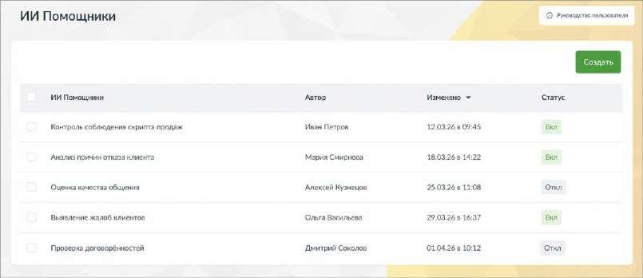
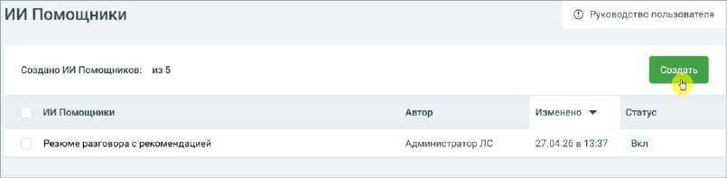
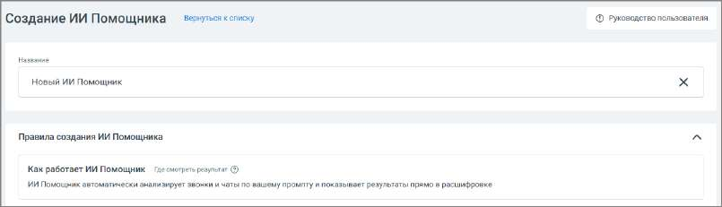
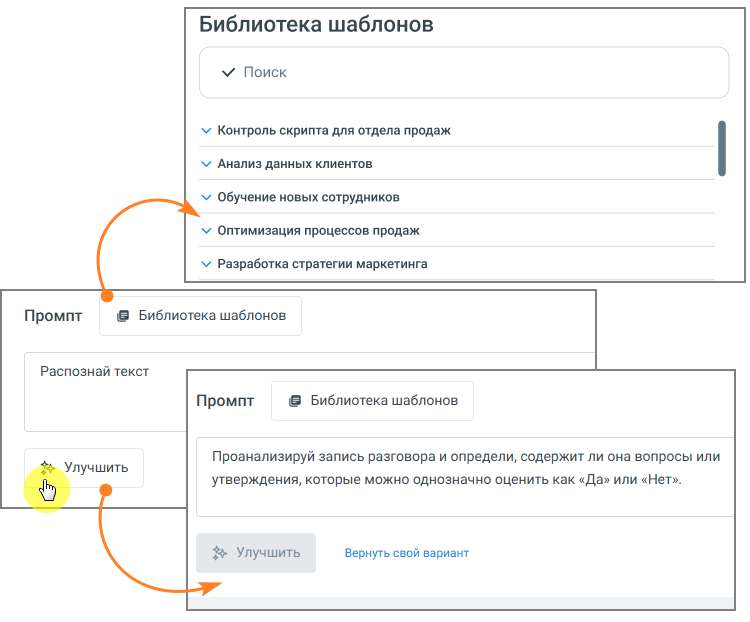
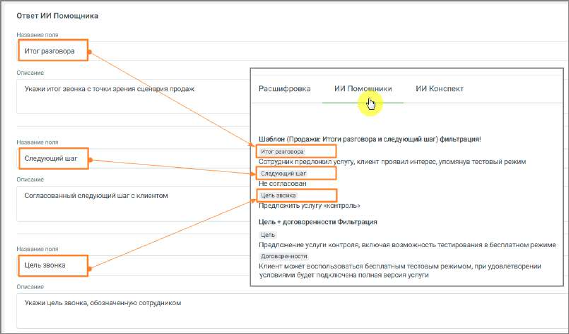
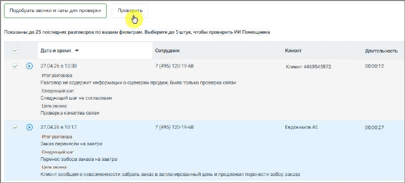
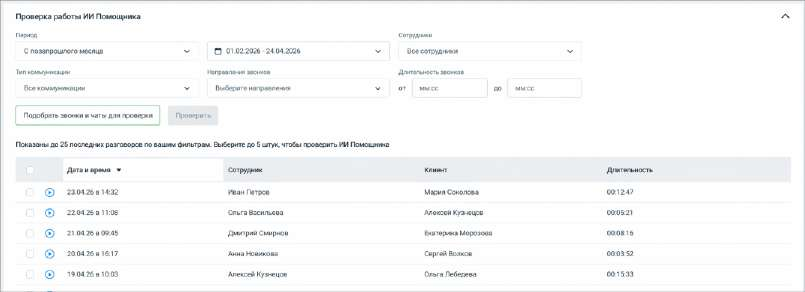
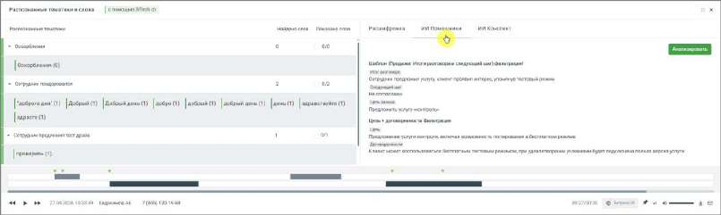

# 16.7. ИИ Помощники

ИИ Помощники – это инструмент, который позволяет автоматически анализировать разговоры по заданным вами правилам и получать не только краткое содержание, но и полезные выводы и рекомендации.

В отличие от стандартных ИИ Конспектов, ИИ Помощники можно настраивать под конкретные задачи бизнеса. Вы сами определяете, что именно нужно искать и как интерпретировать разговор. С помощью ИИ Помощников вы можете: • контролировать соблюдение скриптов • выявлять проблемы в диалогах с клиентами • получать рекомендации по улучшению работы сотрудников • анализировать разговоры с разных точек зрения одновременно Один и тот же разговор может быть обработан несколькими помощниками, и каждый из них даст свой результат. Как создать ИИ Помощника 1. Перейдите в раздел ИИ Помощники 2. Нажмите кнопку Создать

3. Откроется форма создания нового ИИ Помощника

Настройка ИИ Помощника 1. Название – введите название помощника. Рекомендуется указывать название по задаче, например: • контроль скрипта • анализ жалоб • проверка качества общения 2. Промпт – определяет, какой именно результат будет получать пользователь. По сути, это описание задачи для анализа разговора. Чтобы результат был полезным: • формулируйте задачу конкретно • указывайте, что именно нужно определить или сформулировать • задавайте формат ответа (например, кратко, с примерами, с оценкой и т.д.) Один и тот же разговор может анализироваться по-разному в зависимости от промпта, поэтому рекомендуется создавать отдельные ИИ Помощники под разные задачи. • введите текст задания для анализа разговора • при необходимости нажмите Улучшить, чтобы система помогла уточнить формулировку • можно использовать Библиотеку шаблонов и выбрать нужный промт

Примеры промта: • «Проанализируй диалог сотрудника с клиентом. Определи цель звонка, итог разговора, был ли согласован следующий шаг (какой именно) и на какую дату/время, а также наличие отказа и его причины словами клиента.» • «Ты оцениваешь диалог сотрудника контактного центра и клиента. В данном диалоге сотрудник пытался продать товар или услугу. Проанализируй диалог и дай свои рекомендации – что сотрудник мог бы улучшить в работе для повышения вероятности продажи. Отвечай емко и по существу. К каждой рекомендации делай отсылку к элементу диалога где обнаружена зона роста с указанием времени. Сделай максимум 5 ключевых рекомендаций не больше чем на 300 слов.» 3. Ответ ИИ Помощника – результат работы ИИ Помощника можно настроить под нужный уровень детализации. Возможны два подхода: • единый общий вывод по разговору • структурированный ответ, разбитый на несколько частей Разделение на части удобно, если требуется анализ по нескольким аспектам - например, в плеере отдельно выделить содержание разговора, принятые решения и последующие действия. На примере ниже показан вариант настроек структурированного ответа в блоке настроек, а также итоговое отображение ответа в плеере звонка.

4. Звонки и чаты для анализа – здесь задаётся, какие разговоры будет анализировать помощник. Можно указать: • сотрудников или группы • номера • тип коммуникации (звонки, чаты) • направление звонков • длительность разговора Это позволяет применять помощника только к нужным диалогам. Проверка работы ИИ Помощника Перед использованием рекомендуется проверить работу: 1. Выберите период и фильтры 2. Нажмите Подобрать звонки и чаты для проверки 3. Выберите до 5 разговоров 4. Нажмите Проверить Вы увидите, как помощник анализирует реальные диалоги.

Тестирование позволяет заранее проверить, как ИИ Помощник будет анализировать реальные разговоры, до его сохранения и включения в работу. Это даёт пользователю следующие преимущества: • позволяет убедиться, что помощник правильно понимает задачу • помогает выявить неточности или ошибки в формулировке промпта • даёт возможность сравнить результат на нескольких разговорах • снижает риск получения некорректных или бесполезных выводов после запуска • экономит время, исключая необходимость последующей переработки настроек В результате пользователь получает более точный и предсказуемый анализ разговоров сразу после включения помощника. Для сохранения данных нажмите кнопку Создать. После этого помощник начнёт автоматически анализировать подходящие разговоры. Где смотреть результаты Чтобы посмотреть результат анализа: 1. Настройте фильтры

2. Откройте запись разговора 3. Нажмите кнопку прослушивания 4. В плеере перейдите во вкладку ИИ Помощники

Здесь отображаются: • ответы всех активных помощников • результаты анализа по каждому из них Один разговор может содержать несколько ответов - по числу активных помощников. Особенности работы • каждый помощник работает независимо • один разговор может содержать несколько ответов - по числу активных ИИ Помощников

• по умолчанию обрабатываются разговоры от 20 секунд, если иная длительность не задана в фильтре • результаты отображаются вместе с расшифровкой, ИИ Конспектом и тематиками из любых отчетов • помощники анализируют разговоры автоматически после их расшифровки Рекомендации • создавайте отдельных помощников под разные задачи • формулируйте промпт максимально конкретно • проверяйте результат на тестовых звонках перед использованием • при необходимости используйте кнопку Улучшить для доработки запроса

