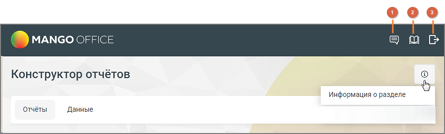
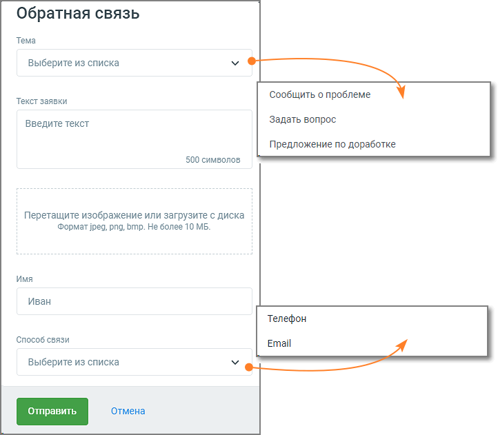
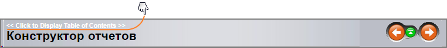
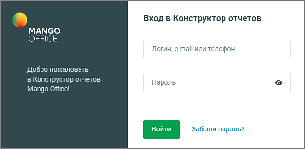

# 17. Конструктор отчетов

> Трассировка: PDF §17 · сквозные стр. 514-516 · источники: ч.6 `kb/sources/mango-cc-manual/CC_manual_1.26.23-part-6.pdf` с.9-11.

Инструмент Конструктор отчетов позволяет настраивать любые формы пользовательской отчетности без необходимости привлечения технических специалистов. Конструктор отчетов подключается в Личном кабинете пользователя ВАТС, в разделе "Контакт-центр" → "Дополнительные сервисы". Доступен для подключения на следующих тарифах: • КЦ Бизнес • КЦ Бизнес PRO • КЦ Корпорация Также Конструктор отчетов можно подключить в тестовом режиме. Активация бесплатного пробного периода доступна на всех тарифах, перечисленных выше. Пробный период составляет 10 дней с момента активации услуги (включая день подключения). После окончания периода начинается списание оплаты за использование. При отмене пробного периода, все данные Конструктора отчетов сохраняются. Кликнув по иконке (i) справки в правом верхнем углу страницы Конструктора можно ознакомиться с информацией о разделе.

В хедере страниц Конструктора отчетов размещены иконки: 1. Форма обратной связи Клик по иконке открывает форму обратной связи. Опишите свой запрос и нажмите кнопку Отправить. На странице Конструктора отобразится надпись "Заявка отправлена". Сотрудник MANGO OFFICE свяжется с вами по указанному способу связи.

2. Руководство пользователя Клик по иконке открывает Руководство пользователя Конструктора отчетов. Для удобства навигации по разделам Конструктора можно нажать ссылку в верхней части окна Руководства.

Блок стрелок "влево|вправо" осуществляет переходы по страницам Руководства. 3. Выход из аккаунта После клика по иконке выхода из аккаунта система завершает текущую сессию пользователя и возвращает пользователя на страницу авторизации. Интерфейс Конструктора отчетов состоит из двух разделов: • Отчеты • Данные Для доступа к Конструктору отчетов необходима авторизация на странице https://reports.mango-office.ru/.

В качестве данных авторизации используются: • Логин сотрудника, e-mail, номер телефона — для доступа к учетной записи пользователя. Данные указываются в карточке сотрудника. • Пароль — пароль доступа к учетной записи Нажмите кнопку "Войти", чтобы получить доступ к Конструктору отчетов. Если утерян пароль, воспользуйтесь функцией автоматического восстановления.

| Доступ к Конструктору отчетов регулируется в зависимости от роли сотрудника и |  |  |  |
| --- | --- | --- | --- |
|  | разрешений, установленных в Личном кабинете пользователя ВАТС в разделе Инструменты |  |  |
|  | → Отчеты Контакт-Центра → Конструктор отчетов. | О доступах к Конструктору |  |
| отчетов, установленных по умолчанию, узнайте здесь. |  |  |  |

