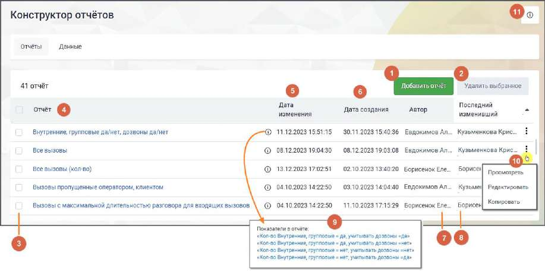

# 17.2. Отчеты

После успешной авторизации пользователь попадает в раздел "Отчеты". Страница содержит список всех доступных отчетов, с возможностью их просмотра, редактирования или удаления. Также на странице доступно создание новых отчетов.

| Разрешения, применяемые при работе c "Конструктором отчетов" находятся в разделе ЛК |  |  |
| --- | --- | --- |
|  | ВАТС Безопасность и Ограничения → Настройки доступа → (выбрать роль) → Инструменты |  |
| → Отчеты Контакт-Центра. |  |  |

Список отчетов представлен в виде таблицы. Каждая строка таблицы соответствует конкретному отчету и содержит название отчета, даты его создания и изменения. 1) Добавить отчёт – клик по кнопке открывает форму создания отчета

2) Удалить выбранное – клик по кнопке открывает окно подтверждения удаления. После подтверждения выбранные отчеты удаляются из списка. 3) Выбор отчетов для удаления – общий чекбокс позволяет выбрать все отчеты, а чекбоксы в каждой строке позволяют выбрать конкретные отчеты для действий. 4) Название отчета – клик по названию открывает страницу отчета для просмотра. 5) Дата изменения отчета – дата и время последнего изменения данного отчета в формате ДД.ММ.ГГГГ ЧЧ.ММ.СС. 6) Дата создания отчета – дата и время создания данного отчета в формате ДД.ММ.ГГГГ ЧЧ.ММ.СС. 7) Автор – в этой колонке отображается имя пользователя или сотрудника, который создал данный отчет. Это позволяет легко определить, кто был инициатором создания конкретного документа. Данное поле является статическим и не подлежит изменению, так как фиксирует исходную информацию о создателе отчета. 8) Последний изменивший – имя пользователя или сотрудника, который последним вносил изменения в отчет. Это полезно для отслеживания ответственности за последние обновления документа, особенно в случае совместной работы над отчетами. Поле обновляется автоматически при каждом редактировании отчета и фиксирует автора последнего изменения. 9) Пиктограмма "i" – клик по пиктограмме открывает окно с показателями отчета. Клик по показателю открывает страницу редактирования показателя.

10) Клик по пиктограмме открывает контекстное меню действий с отчетом. • Вариант "Редактировать" отображается только для тех сотрудников, у которых есть права на редактирование данного отчета. • Вариант "Копировать" отображается только для тех сотрудников, у которых есть права на создание отчетов. 11) Клик по пиктограмме открывает справочную информацию о разделе. В Конструкторе отчетов имеются следующие предустановленные отчеты: Отчеты, доступные для пользователей, зарегистрированных до 1.01.2025 года

| Название отчёта | Показатель 1 | Показатель 2 | Показатель 3 | Группировка |
| --- | --- | --- | --- | --- |
| Отчёт №1 | Уровень | Количество | Средняя | По группе, |
|  | обслуживания SL | входящих | продолжительность | сотруднику, дате |
|  | 20 | вызовов с SL 20 | разговора с клиентом |  |
|  |  |  | (все вызовы) |  |
| Отчёт №2 | Общее | Количество | Количество | По дате, |
|  | количество | успешных | принятых | сотруднику |
|  | принятых | исходящих | персональных |  |
|  | эффективных | вызовов | вызовов |  |
|  | вызовов |  |  |  |

Отчеты, доступные для пользователей, зарегистрированных после 1.01.2025 года Для всех пользователей, подключивших Конструкторе отчетов после 1 января 2005 года, при первом входе в Личный кабинет Конструктора создается отчет по всем показателям из списка "Показатели, доступные для пользователей, зарегистрированных после 1.01.2025 года"
